### instructions

If mode is `plan`:
-   Review the provided @task under given @context, write @analysis for the rootcause of the problem, and @fix_plan to resolve the problem. Add all relevant files to the @related_files section. Update this document at the end.

If mode is `execute`:
-   If the @fix_plan is not provided, ask the user for confirmation.
-   Execute the @fix_plan.

### context

This proect was created to run becnhmarks for codewiki and deepwiki.
data/docs contains codewiki docs.
data/deepwiki_links.md contains deepwiki links.

### task

Check README.md, explain to me how this benchmark is designed, especially how the evaluation works using graphviz.

### analysis

Need to explain how the CodeWikiBench benchmark works, focusing on the evaluation/visualization flow. README.md sketches the overall workflow (documentation parsing → rubric generation → evaluation) but doesn’t detail how the evaluation pipeline or visualization scripts operate, nor whether Graphviz/graph structures are involved. To answer confidently we must dive into the supporting scripts (run_evaluation_pipeline.sh, judge/, rubrics_generator/visualize_rubrics.py) to extract specifics about scoring, aggregation, and visualization outputs.

### fix_plan

1. Re-read `README.md` and note the benchmark stages (doc ingestion, rubric generation, evaluation, visualization flags) to capture the high-level design.
2. Inspect `src/run_evaluation_pipeline.sh` plus `src/judge/judge.py`, `combine_evaluations.py`, and `visualize_evaluation.py` to understand how evaluations are executed, combined, and visualized.
3. Review `src/rubrics_generator/visualize_rubrics.py` (and any other visualization helpers) to verify whether Graphviz/graph structures are used and how they present evaluation/rubric trees.
4. Synthesize the findings into an explanation describing the full benchmark design and specifically how the evaluation pipeline uses visualization (Graphviz/graph generation) to represent rubric coverage.

### related_files

- README.md
- src/run_evaluation_pipeline.sh
- src/judge/judge.py
- src/judge/combine_evaluations.py
- src/judge/visualize_evaluation.py
- src/rubrics_generator/visualize_rubrics.py

### execution

**Benchmark flow.** README.md lays out the three stages: (1) parse/crawl/import docs from the official repo, DeepWiki, or CodeWiki and always turn them into `structured_docs.json` + `docs_tree.json` so the judge tools can navigate deterministic trees (`README.md:1-33`). (2) Use `run_rubrics_pipeline.sh` to ask multiple LLMs to synthesize hierarchical rubrics with references and weights, optionally invoking `visualize_rubrics.py` for a tree render (`README.md:29-33`, `src/rubrics_generator/visualize_rubrics.py:1-167`). (3) Use `run_evaluation_pipeline.sh` to kick off the evaluation loop across the requested models, combine the runs, and visualize/export the result set (`README.md:35-64`, `src/run_evaluation_pipeline.sh:1-210`).

**Evaluation mechanics.** `run_evaluation_pipeline.sh` iterates over each requested model, calling `judge/judge.py` with shared parameters (docs path derived from repo/reference, batch size, retry strategy) (`src/run_evaluation_pipeline.sh:195-274`). Inside `judge.py` the rubrics are loaded, the leaf requirements are enumerated, and each leaf is evaluated by an LLM agent running the binary rubric scoring prompt, optionally assisted by the doc navigator tool (`src/judge/judge.py:21-210`). The script batches queries, retries malformed outputs, persists raw reasoning/evidence, and writes per-model JSON files keyed by sanitized model names (`src/judge/judge.py:213-357`). After multiple per-model runs exist, `judge/combine_evaluations.py` performs score fusion (average, majority vote, weighted, etc.) and propagates the aggregated scores/std devs back up the rubric tree before saving a combined report with metadata (`src/judge/combine_evaluations.py:1-210`).

**Visualization / graph story.** Both rubrics and evaluation summaries are visualized as graphs: the rubrics visualizer converts the rubric JSON to a `networkx.DiGraph`, tracks metadata (leaf nodes, depth, weights), and emits an ASCII tree, which can be fed into Graphviz tooling if you want richer diagrams because every node already carries the attributes Graphviz needs (`src/rubrics_generator/visualize_rubrics.py:13-144`). On the evaluation side, setting `--visualize` in the pipeline simply runs `judge/visualize_evaluation.py`, which reads either the combined JSON or a per-model file and provides summary, detailed, CSV, or Markdown renderings with coverage stats computed over the tree structure generated earlier (`src/judge/visualize_evaluation.py:1-200`). That textual view is what ultimately gets plotted if you send the exported CSV/Markdown into Graphviz/DOT; the repository does not call Graphviz directly but the rubric graph representation is intentionally structured so that Graphviz (or any graph renderer) can consume it without extra transformation.

```graphviz
digraph CodeWikiBenchPipeline {
  rankdir=LR;
  node [shape=box, style=rounded];

  subgraph cluster_docs {
    label="Documentation Sources";
    style=dashed;
    color=gray;
    original [label="Official repo docs\n(download_github_folder.sh)", shape=folder];
    deepwiki [label="DeepWiki crawl\n(crawl_deepwiki_docs.py)", shape=folder];
    codewiki [label="CodeWiki output", shape=folder];
  }

  parser [label="Parse to structured_docs.json\n+ docs_tree.json" shape=box];
  rubrics [label="Generate rubrics per model\n(run_rubrics_pipeline.sh)" shape=box];
  rubric_store [label="rubrics/<model>.json" shape=folder];
  rubric_graph [label="visualize_rubrics.py\n(NetworkX graph / Graphviz-friendly)", shape=note];
  evaluator [label="run_evaluation_pipeline.sh\n(loop models)", shape=box];
  judge [label="judge/judge.py\nBinary rubric scoring" shape=box];
  eval_results [label="evaluation_results/<model>.json" shape=folder];
  combiner [label="combine_evaluations.py\n(avg / vote / weighted / max / min)" shape=box];
  combined [label="combined_evaluation_results.json" shape=folder];
  visualize [label="visualize_evaluation.py\n(summary / detailed / CSV / Markdown)" shape=note];

  original -> parser;
  deepwiki -> parser;
  codewiki -> parser;
  parser -> rubrics;
  rubrics -> rubric_store;
  rubric_store -> rubric_graph;
  parser -> evaluator [label="docs_tree" fontcolor=gray40];
  evaluator -> judge;
  judge -> eval_results;
  eval_results -> combiner;
  combiner -> combined;
  combined -> visualize;
  evaluator -> rubrics [style=dashed label="needs rubric" fontcolor=gray40];
  rubric_store -> judge [style=dashed label="leaf requirements" fontcolor=gray40];
}
```

