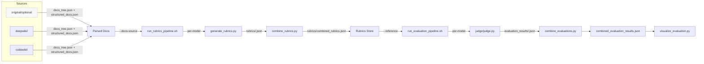

### instructions

If mode is `plan`:
-   Review the provided @task under given @context, write @analysis for the rootcause of the problem, and @fix_plan to resolve the problem. Add all relevant files to the @related_files section. Update this document at the end.

If mode is `execute`:
-   If the @fix_plan is not provided, ask the user for confirmation.
-   Execute the @fix_plan.

### context

README.md expects teams to download and parse the "official" docs into `data/<repo>/original`, but many benchmarking runs only have alternate sources (`deepwiki`, `codewiki`, etc.). We need a single note that clarifies how the rubrics generation and evaluation logic behaves when `original/` is absent and how to point the pipelines at whichever parsed docs actually exist.

### task

Explain how the rubrics and evaluation algorithms operate end to end, with an emphasis on what happens when `data/<repo>/original` is missing. Include a Mermaid diagram capturing the flow.

### analysis

- Rubrics generation (`src/run_rubrics_pipeline.sh` → `rubrics_generator/generate_rubrics.py`) assumes parsed docs live under `data/<repo>/<docs_source>`. It now exposes `--docs-source` (default `original`) so the operator can redirect the workflow whenever the `original` folder hasn’t been populated. Internally the Python script validates that `docs_tree.json` exists inside that folder before running the LLM agent.
- Evaluation (`src/run_evaluation_pipeline.sh` → `judge/judge.py`) already lets you pick any parsed docs folder via `--reference`. The script then loads the rubrics (combined or per-model) and runs the binary scoring agent only against the leaf requirements. If `original` is absent, you just set `--reference deepwiki` (or similar) and the judge will walk those docs as long as they contain `docs_tree.json` + `structured_docs.json`.
- The README instructions focus on pulling official docs for determinism, but the tooling itself works with any parsed folder. The key constraint is that every parsed folder must maintain the canonical outputs (`docs_tree.json` + `structured_docs.json`) so the `docs_navigator` tool can traverse files.
- Both pipelines follow the same pattern: choose source folder → confirm tree exists → run per-model agents → combine results → optional visualization.
- When `original/` is missing and you forget to pass `--docs-source`/`--reference`, the scripts stop immediately with a "Documentation tree not found" error. Passing the correct folder name (e.g., `codewiki`) resolves the issue without modifying any other logic.

### fix_plan

Document the workflow, calling out the `--docs-source` and `--reference` switches, the shared requirement for `docs_tree.json`, and the rubrics/evaluation algorithms. Provide a Mermaid diagram showing how different doc sources feed into the pipelines.

### related_files

- README.md
- src/run_rubrics_pipeline.sh
- src/rubrics_generator/generate_rubrics.py
- src/run_evaluation_pipeline.sh
- src/judge/judge.py

### execution

**Rubrics pipeline.** `run_rubrics_pipeline.sh` orchestrates the multi-model run. After validating `data/<repo>/<docs_source>/docs_tree.json`, it loops through each requested LLM model, calling `rubrics_generator/generate_rubrics.py`. That script loads the tree, instantiates the rubric agent (optionally with the `docs_navigator` tool), generates hierarchical criteria with weights + doc references, and writes them to `data/<repo>/rubrics/<model>.json`. The pipeline can then combine the results with `combine_rubrics.py` and optionally render the hierarchy.

**Evaluation pipeline.** `run_evaluation_pipeline.sh` performs the complementary loop. It targets whatever folder you pass via `--reference` (default `original`, but often `deepwiki` or `codewiki`). For every model, it runs `judge/judge.py`, which loads the rubrics (usually `rubrics/combined_rubrics.json`), collects every leaf requirement, and queries the LLM agent to assign binary scores with reasoning/evidence. Scores propagate upward by weight to produce a fully scored rubric tree per model. Finally, `combine_evaluations.py` fuses the per-model files (average, majority vote, etc.), and `visualize_evaluation.py` can summarize or export the combined results.

**When `original/` is missing.** Nothing in either algorithm actually relies on the folder being named `original`; they only require a parsed docs directory that contains the canonical outputs. If `data/<repo>/original/docs_tree.json` is missing, pass the relevant folder explicitly (e.g., `--docs-source deepwiki` when generating rubrics, `--reference deepwiki` when judging). The scripts will validate that folder, use its `docs_tree.json` for navigation, and write outputs exactly as before.

With this setup you only have to ensure that at least one folder under `data/<repo>/` contains parsed documentation. Point both pipelines at that folder and the rubrics/evaluation algorithms behave identically to the README’s "original" workflow.
