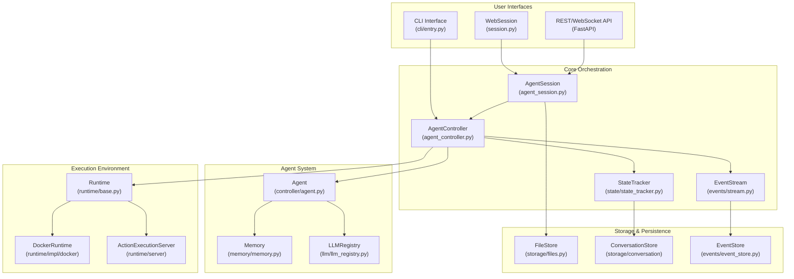
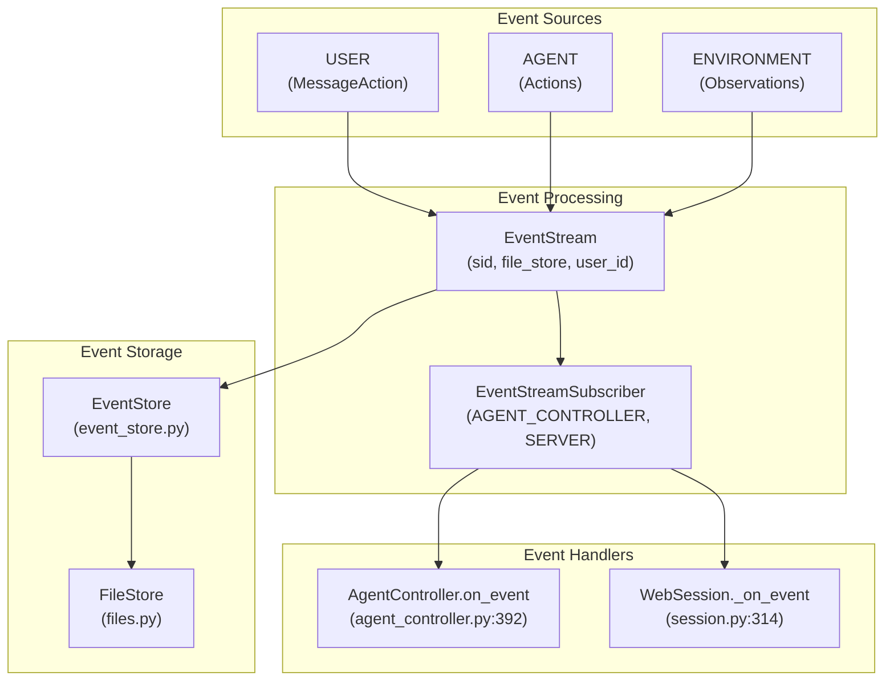
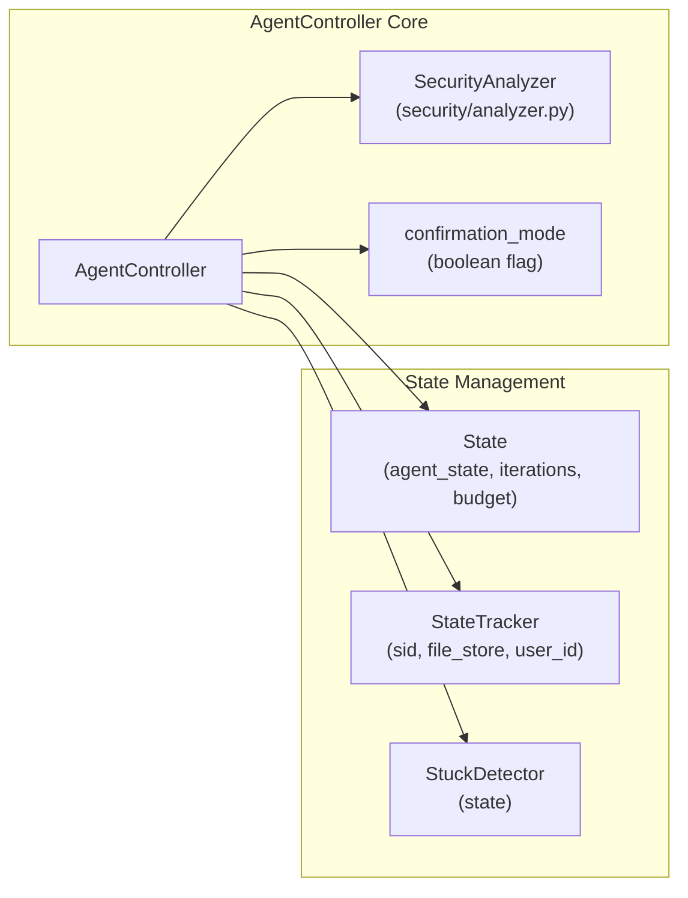
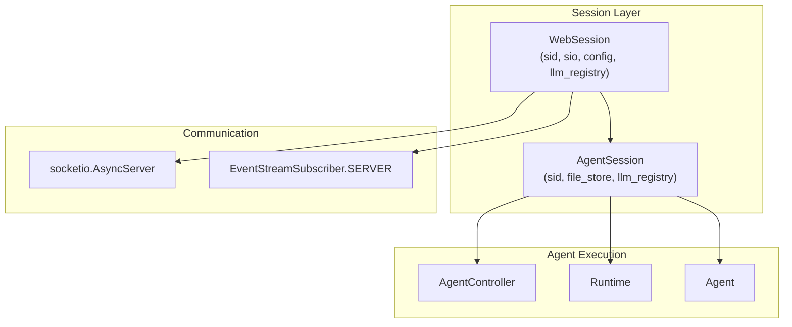
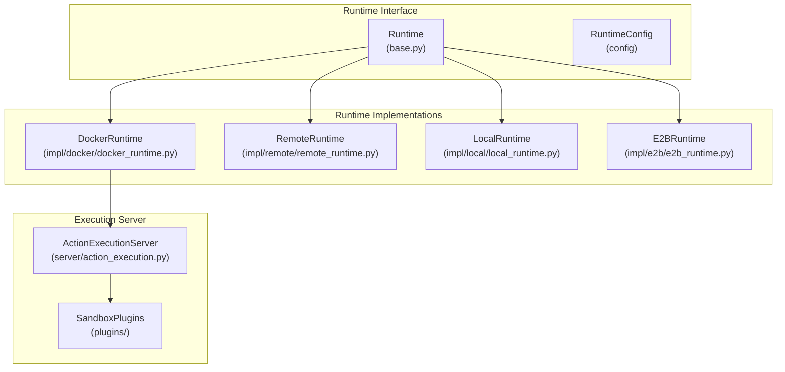
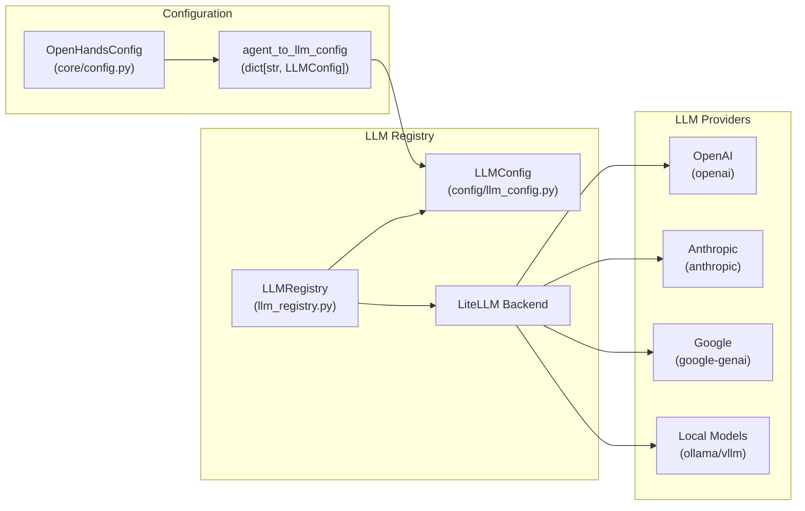
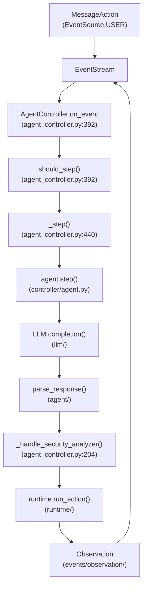
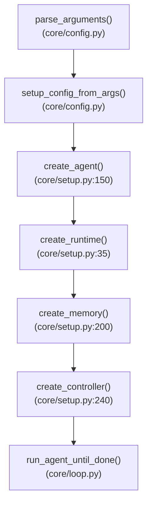

1-Overview

# Page: Overview

# Overview

Relevant source files

The following files were used as context for generating this wiki page:

- [Development.md](Development.md)
- [README.md](README.md)
- [README_CN.md](README_CN.md)
- [README_JA.md](README_JA.md)
- [containers/dev/compose.yml](containers/dev/compose.yml)
- [docker-compose.yml](docker-compose.yml)
- [frontend/package-lock.json](frontend/package-lock.json)
- [frontend/package.json](frontend/package.json)
- [openhands/controller/agent_controller.py](openhands/controller/agent_controller.py)
- [openhands/core/main.py](openhands/core/main.py)
- [openhands/core/setup.py](openhands/core/setup.py)
- [openhands/memory/view.py](openhands/memory/view.py)
- [openhands/server/routes/manage_conversations.py](openhands/server/routes/manage_conversations.py)
- [openhands/server/session/agent_session.py](openhands/server/session/agent_session.py)
- [openhands/server/session/session.py](openhands/server/session/session.py)
- [openhands/utils/http_session.py](openhands/utils/http_session.py)
- [poetry.lock](poetry.lock)
- [pyproject.toml](pyproject.toml)

This document provides a technical overview of OpenHands, an AI-powered software development agent platform that enables autonomous code modification, command execution, web browsing, and API interaction. OpenHands orchestrates LLM-powered agents within sandboxed runtime environments to perform complex development tasks.

For information about getting started with OpenHands, see [Getting Started](#2). For details about the agent system architecture, see [Agent System](#3). For LLM configuration and integration, see [LLM Integration](#4).

## System Architecture

OpenHands follows a multi-layered architecture with distinct separation between user interfaces, core orchestration, execution environments, and external integrations.

### High-Level Component Architecture

Sources: [openhands/server/session/session.py:40-112](), [openhands/controller/agent_controller.py:100-203](), [openhands/server/session/agent_session.py:42-89](), [openhands/core/main.py:51-96]()

### Event-Driven Communication Flow

Sources: [openhands/events/stream.py](), [openhands/server/session/session.py:311-330](), [openhands/controller/agent_controller.py:392-408]()

## Core Components

### Agent Controller System

The `AgentController` class serves as the primary orchestration component, managing agent lifecycle, state transitions, and action execution.

| Component | File Path | Primary Responsibility |
|-----------|-----------|----------------------|
| `AgentController` | [openhands/controller/agent_controller.py:100-203]() | Agent orchestration and lifecycle management |
| `State` | [openhands/controller/state/state.py]() | Agent state persistence and tracking |
| `StateTracker` | [openhands/controller/state/state_tracker.py]() | State change monitoring and persistence |
| `StuckDetector` | [openhands/controller/stuck.py]() | Agent loop detection and prevention |

The controller handles security analysis, confirmation mode, and error recovery through dedicated subsystems:

Sources: [openhands/controller/agent_controller.py:100-203](), [openhands/controller/state/state_tracker.py]()

### Session Management Architecture

OpenHands uses a dual-session architecture separating web connectivity from agent execution:

Sources: [openhands/server/session/session.py:74-112](), [openhands/server/session/agent_session.py:64-89]()

### Runtime Environment System

The runtime system provides sandboxed execution environments with multiple implementation options:

| Runtime Type | Implementation | Use Case |
|--------------|----------------|----------|
| `DockerRuntime` | [openhands/runtime/impl/docker]() | Local Docker-based sandbox |
| `RemoteRuntime` | [openhands/runtime/impl/remote]() | Remote execution environment |
| `LocalRuntime` | [openhands/runtime/impl/local]() | Direct local execution |
| `E2BRuntime` | [openhands/runtime/impl/e2b]() | E2B cloud sandbox |

The runtime architecture supports pluggable sandbox backends:

Sources: [openhands/runtime/base.py](), [openhands/runtime/impl/docker](), [openhands/core/setup.py:35-89]()

### LLM Integration Framework

OpenHands supports multiple LLM providers through a unified registry system built on `litellm`:

Sources: [openhands/llm/llm_registry.py](), [pyproject.toml:29-30](), [openhands/core/config/llm_config.py]()

## Key Execution Workflows

### Agent Task Execution Flow

The primary execution workflow orchestrates user input through agent processing to action execution:

Sources: [openhands/controller/agent_controller.py:392-408](), [openhands/controller/agent_controller.py:440-500](), [openhands/controller/agent_controller.py:204-243]()

### Configuration and Initialization

OpenHands uses a layered configuration system combining TOML files, environment variables, and runtime settings:

| Configuration Source | File Path | Priority |
|---------------------|-----------|----------|
| Environment Variables | System environment | Highest |
| `config.toml` | [config.toml]() | Medium |
| Default Values | [openhands/core/config/]() | Lowest |

The initialization process follows this sequence:

Sources: [openhands/core/main.py:51-96](), [openhands/core/setup.py:35-89](), [openhands/core/config/]()

The system supports multiple deployment modes including local development, Docker containers, and cloud-based execution through this unified configuration and initialization framework.

Sources: [README.md:53-127](), [pyproject.toml:1-199](), [frontend/package.json:1-151]()