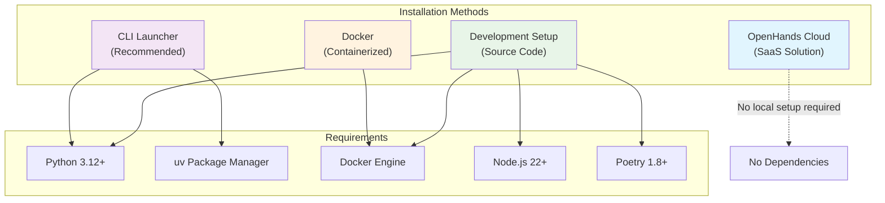
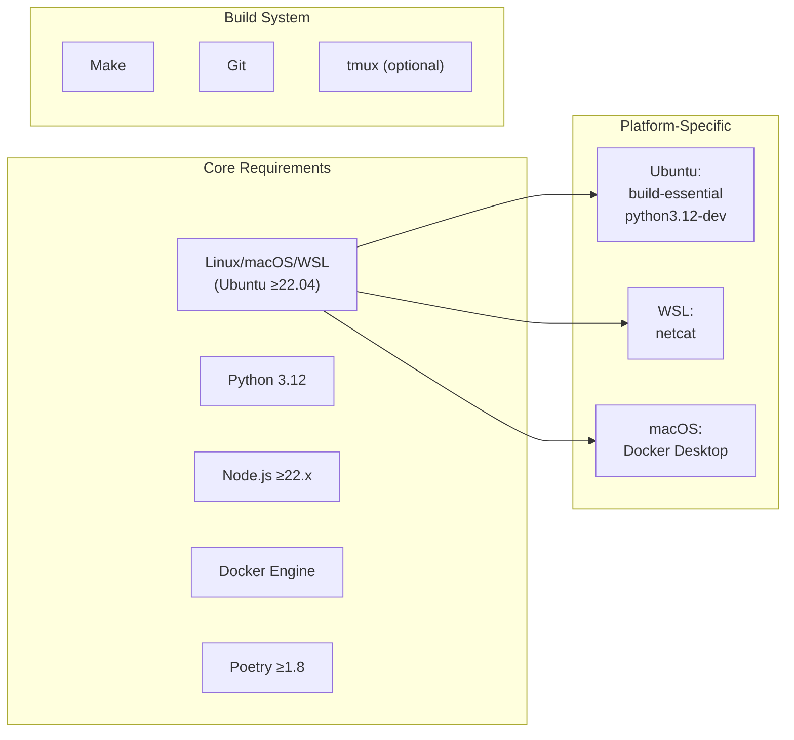
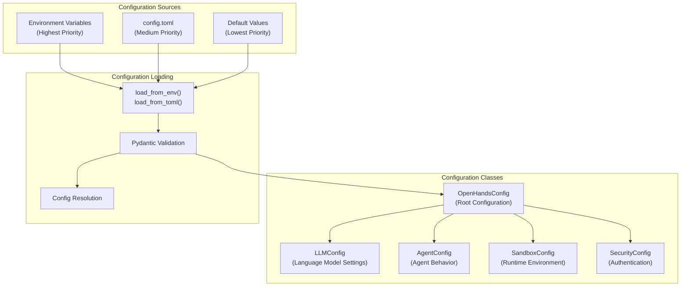
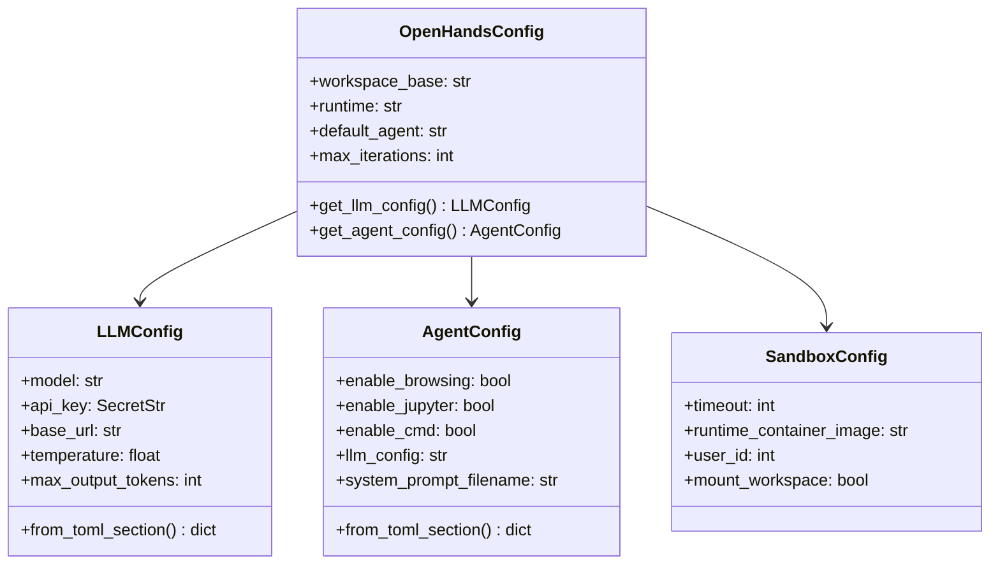
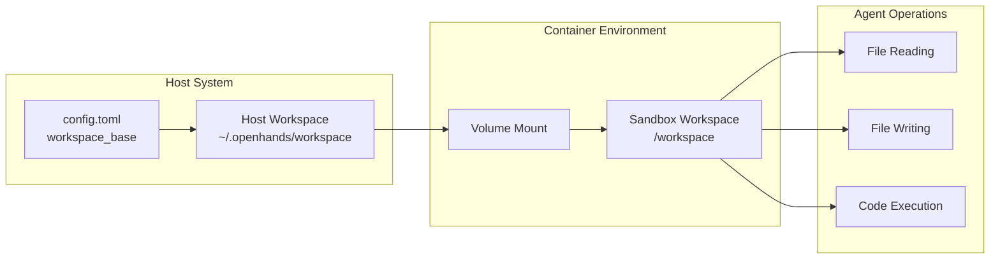
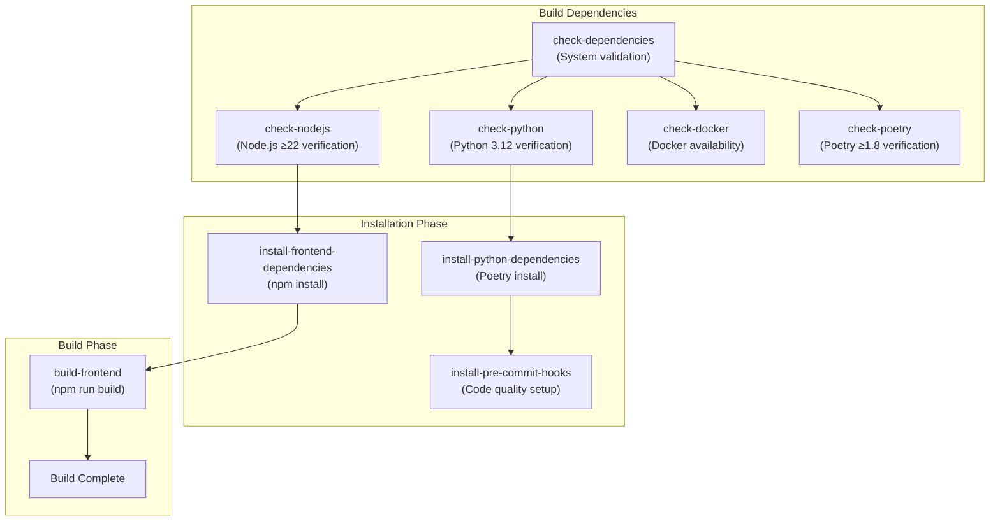

2-Getting Started

# Page: Getting Started

# Getting Started

<details>
<summary>Relevant source files</summary>

The following files were used as context for generating this wiki page:

- [.github/workflows/clean-up.yml](.github/workflows/clean-up.yml)
- [.github/workflows/fe-unit-tests.yml](.github/workflows/fe-unit-tests.yml)
- [.github/workflows/lint-fix.yml](.github/workflows/lint-fix.yml)
- [.github/workflows/lint.yml](.github/workflows/lint.yml)
- [.github/workflows/stale.yml](.github/workflows/stale.yml)
- [Development.md](Development.md)
- [Makefile](Makefile)
- [README.md](README.md)
- [README_CN.md](README_CN.md)
- [README_JA.md](README_JA.md)
- [config.template.toml](config.template.toml)
- [containers/build.sh](containers/build.sh)
- [containers/dev/compose.yml](containers/dev/compose.yml)
- [docker-compose.yml](docker-compose.yml)
- [frontend/package-lock.json](frontend/package-lock.json)
- [frontend/package.json](frontend/package.json)
- [frontend/src/state/metrics-slice.ts](frontend/src/state/metrics-slice.ts)
- [frontend/src/types/message.tsx](frontend/src/types/message.tsx)
- [openhands/agenthub/codeact_agent/codeact_agent.py](openhands/agenthub/codeact_agent/codeact_agent.py)
- [openhands/core/config/agent_config.py](openhands/core/config/agent_config.py)
- [openhands/core/config/llm_config.py](openhands/core/config/llm_config.py)
- [openhands/core/config/utils.py](openhands/core/config/utils.py)
- [openhands/core/exceptions.py](openhands/core/exceptions.py)
- [openhands/core/message.py](openhands/core/message.py)
- [openhands/llm/__init__.py](openhands/llm/__init__.py)
- [openhands/llm/async_llm.py](openhands/llm/async_llm.py)
- [openhands/llm/bedrock.py](openhands/llm/bedrock.py)
- [openhands/llm/debug_mixin.py](openhands/llm/debug_mixin.py)
- [openhands/llm/llm.py](openhands/llm/llm.py)
- [openhands/llm/metrics.py](openhands/llm/metrics.py)
- [openhands/llm/retry_mixin.py](openhands/llm/retry_mixin.py)
- [openhands/llm/streaming_llm.py](openhands/llm/streaming_llm.py)
- [poetry.lock](poetry.lock)
- [pyproject.toml](pyproject.toml)

</details>


This document provides step-by-step instructions for installing, configuring, and running OpenHands locally. It covers the essential setup processes needed to get OpenHands operational on your system, including dependency management, configuration, and basic usage patterns.

For information about developing OpenHands itself or contributing to the codebase, see [Development & Contributing](#8). For advanced deployment configurations and production usage, see [CI/CD & Deployment](#8.2).

## Installation Options Overview

OpenHands offers multiple installation methods to accommodate different user needs and environments:



**Installation Method Comparison**

| Method | Use Case | Setup Time | Flexibility | Resource Usage |
|--------|----------|------------|-------------|----------------|
| Cloud | Quick evaluation, no local setup | < 5 minutes | Limited | Remote |
| CLI Launcher | General usage, isolated environment | 5-10 minutes | High | Low |
| Docker | Containerized deployment | 10-15 minutes | Medium | Medium |
| Development | Contributing, customization | 15-30 minutes | Maximum | High |

Sources: [README.md:49-131](), [Development.md:11-22]()

## Cloud Installation

The quickest way to get started is with OpenHands Cloud, which requires no local installation:

1. Visit [OpenHands Cloud](https://app.all-hands.dev)
2. Sign up for an account
3. New users receive $20 in free credits
4. Select your preferred LLM provider and configure API keys in the web interface

Sources: [README.md:49-51]()

## CLI Launcher Installation (Recommended)

The CLI launcher provides the best isolation and is required for OpenHands' default MCP servers:

### Prerequisites

Install `uv` package manager following the [official installation guide](https://docs.astral.sh/uv/getting-started/installation/):

```bash
# Example installation methods (choose one)
curl -LsSf https://astral.sh/uv/install.sh | sh
# or
pip install uv
# or
pipx install uv
```

### Installation and Usage

```bash
# Launch the GUI server
uvx --python 3.12 --from openhands-ai openhands serve

# Launch the CLI interface  
uvx --python 3.12 --from openhands-ai openhands
```

The GUI interface will be available at `http://localhost:3000`.

Sources: [README.md:55-72]()

## Docker Installation

For containerized deployment, OpenHands provides pre-built Docker images:

### Pull Required Images

```bash
docker pull docker.all-hands.dev/all-hands-ai/runtime:0.56-nikolaik
```

### Run OpenHands Container

```bash
docker run -it --rm --pull=always \
    -e SANDBOX_RUNTIME_CONTAINER_IMAGE=docker.all-hands.dev/all-hands-ai/runtime:0.56-nikolaik \
    -e LOG_ALL_EVENTS=true \
    -v /var/run/docker.sock:/var/run/docker.sock \
    -v ~/.openhands:/.openhands \
    -p 3000:3000 \
    --add-host host.docker.internal:host-gateway \
    --name openhands-app \
    docker.all-hands.dev/all-hands-ai/openhands:0.56
```

### Docker Environment Configuration

The container accepts several environment variables for configuration:

- `SANDBOX_RUNTIME_CONTAINER_IMAGE`: Runtime container image
- `SANDBOX_USER_ID`: User ID for sandbox execution
- `WORKSPACE_MOUNT_PATH`: Path to workspace directory
- `LOG_ALL_EVENTS`: Enable comprehensive event logging

Sources: [README.md:76-96](), [docker-compose.yml:8-13]()

## Development Installation

For developers wanting to modify OpenHands or contribute to the project:

### System Requirements



Sources: [Development.md:11-21]()

### Installation Steps

1. **Clone the repository:**
   ```bash
   git clone https://github.com/All-Hands-AI/OpenHands.git
   cd OpenHands
   ```

2. **Build the project:**
   ```bash
   make build
   ```

   This command orchestrates:
   - Dependency verification via `make check-dependencies`
   - Python dependency installation via `make install-python-dependencies`
   - Frontend dependency installation via `make install-frontend-dependencies`
   - Pre-commit hook installation via `make install-pre-commit-hooks`
   - Frontend build via `make build-frontend`

3. **Configure the language model:**
   ```bash
   make setup-config
   ```

4. **Start the application:**
   ```bash
   make run
   ```

Sources: [Development.md:51-89](), [Makefile:24-33]()

## Configuration System Architecture

OpenHands uses a hierarchical configuration system with multiple sources and precedence rules:



### Configuration File Structure

The primary configuration file follows TOML format with these main sections:

```toml
[core]
workspace_base = "./workspace"
runtime = "docker"
default_agent = "CodeActAgent"
max_iterations = 500

[llm]
model = "claude-sonnet-4-20250514"
api_key = "your-api-key"
temperature = 0.0
max_output_tokens = 4096

[agent]
enable_browsing = true
enable_jupyter = true
enable_cmd = true

[sandbox]
timeout = 120
```

Sources: [config.template.toml:9-75](), [openhands/core/config/utils.py:138-200]()

### Configuration Class Hierarchy



Sources: [openhands/core/config/openhands_config.py](), [openhands/core/config/llm_config.py:12-51](), [openhands/core/config/agent_config.py:15-65]()

## Initial Configuration

### LLM Provider Setup

OpenHands supports multiple LLM providers through the `litellm` library. The recommended configuration process:

1. **Interactive Configuration:**
   ```bash
   make setup-config
   ```
   This prompts for:
   - Workspace directory path
   - LLM model name
   - API key
   - Base URL (for local LLMs)

2. **Manual Configuration:**
   Create `config.toml` in the project root:
   ```toml
   [core]
   workspace_base = "./workspace"
   
   [llm]
   model = "anthropic/claude-sonnet-4-20250514"
   api_key = "your-anthropic-api-key"
   ```

3. **Environment Variable Configuration:**
   ```bash
   export LLM_MODEL="anthropic/claude-sonnet-4-20250514"
   export LLM_API_KEY="your-api-key"
   export LLM_BASE_URL="https://api.anthropic.com"
   ```

### Recommended LLM Models

| Provider | Model | Performance | Cost |
|----------|-------|-------------|------|
| Anthropic | `claude-sonnet-4-20250514` | Excellent | High |
| OpenAI | `gpt-4o` | Excellent | High |
| OpenAI | `gpt-4o-mini` | Good | Low |
| Google | `gemini-2.5-pro` | Excellent | Medium |

Sources: [README.md:105-107](), [Makefile:301-325](), [openhands/core/config/utils.py:127-135]()

## Basic Usage Patterns

### Starting OpenHands

After installation and configuration, start OpenHands using your preferred method:

```bash
# Development mode (with live reloading)
make run

# Individual server startup
make start-backend  # Port 3000
make start-frontend # Port 3001

# Docker mode
make docker-run

# Production mode
uvx --python 3.12 --from openhands-ai openhands serve
```

### Web Interface Access

The web interface provides the primary interaction method:

1. Navigate to `http://localhost:3000`
2. Configure your LLM provider in the settings
3. Start a new conversation
4. Provide instructions in natural language

### CLI Interface Access

For headless operation:

```bash
# Interactive CLI mode
uvx --python 3.12 --from openhands-ai openhands

# Direct command execution
openhands --task "Fix the bug in main.py" --model gpt-4o
```

Sources: [Development.md:82-89](), [Makefile:248-283]()

### Workspace Configuration

OpenHands operates within a designated workspace directory:



The workspace configuration controls:
- File access permissions
- Code execution environment
- Persistent storage location
- Security boundaries

Sources: [config.template.toml:15-16](), [openhands/core/config/sandbox_config.py]()

## Build System Overview

The OpenHands build system orchestrates multiple components through Make targets:



Key build targets include:
- `make build`: Complete build process
- `make check-dependencies`: Verify system requirements
- `make install-python-dependencies`: Install Python packages via Poetry
- `make install-frontend-dependencies`: Install Node.js packages via npm
- `make lint`: Run code quality checks
- `make test`: Execute test suites

Sources: [Makefile:24-45](), [Makefile:139-175](), [Makefile:177-183]()