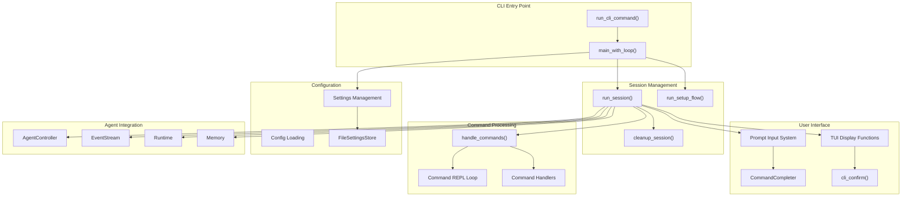
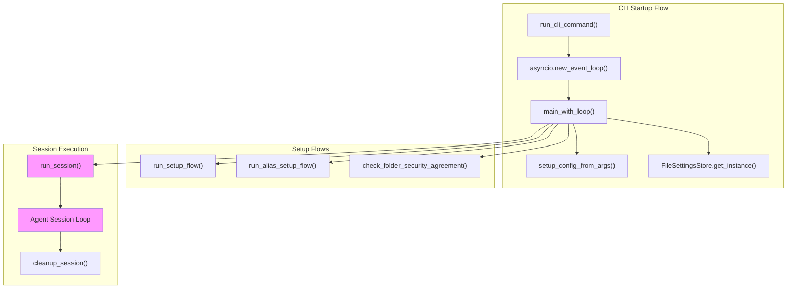
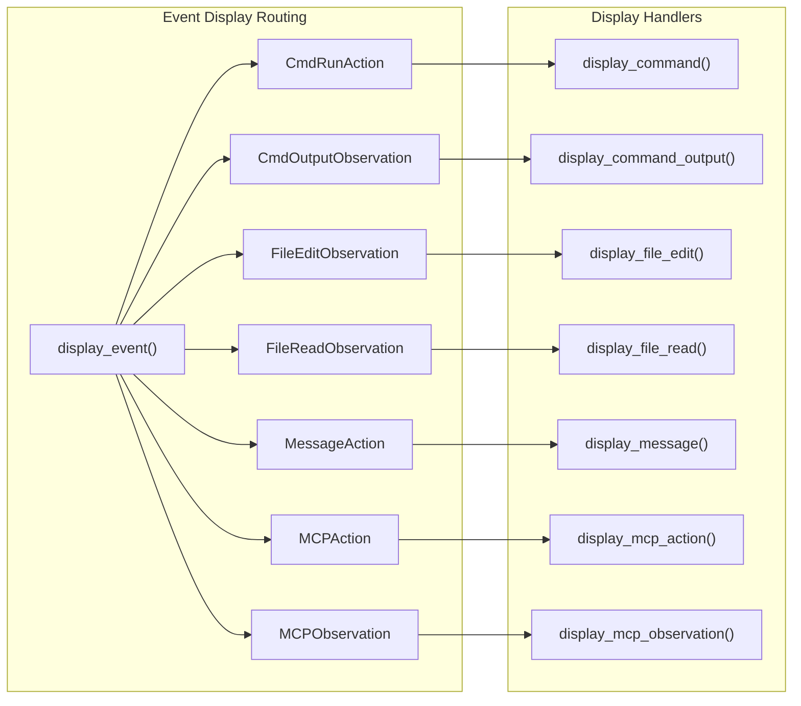
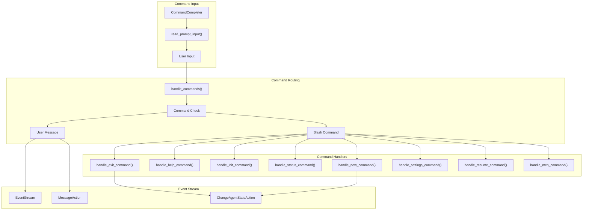
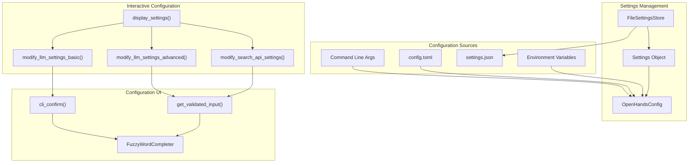
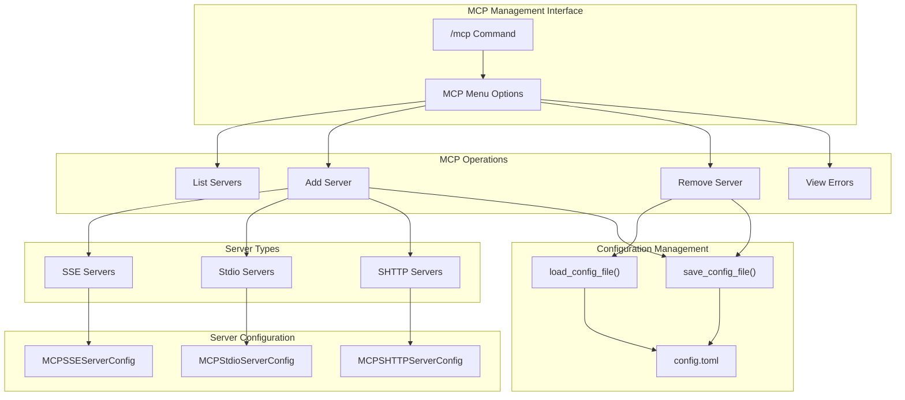
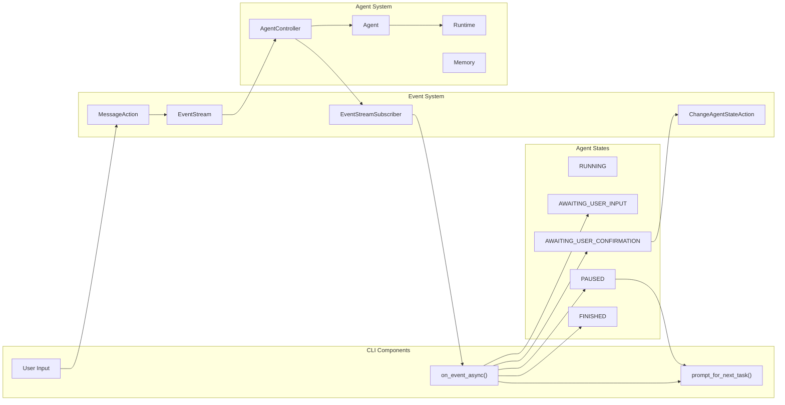
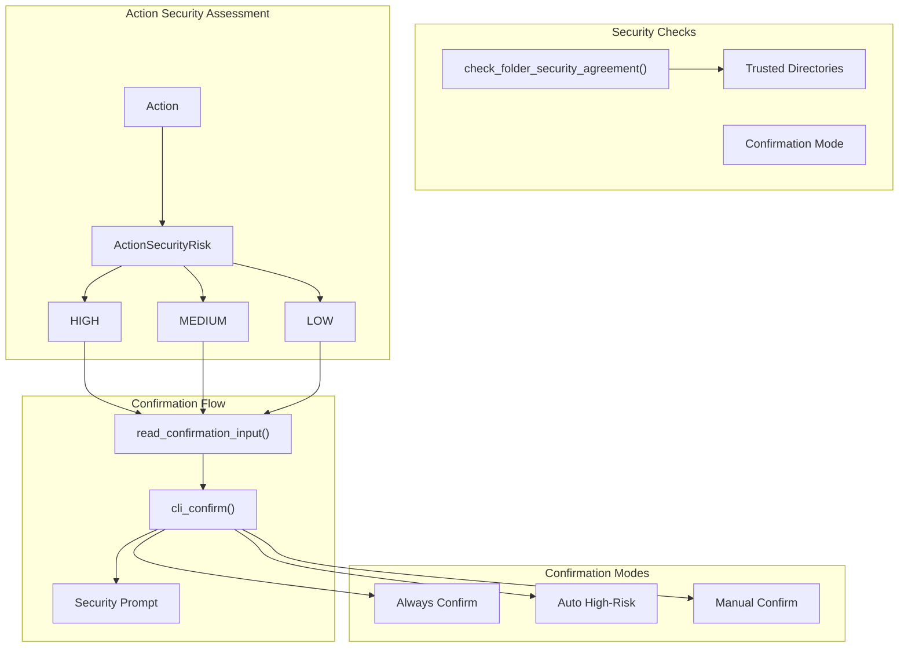

6.2-Command Line Interface

# Page: Command Line Interface

# Command Line Interface

Relevant source files

The following files were used as context for generating this wiki page:

- [openhands/cli/commands.py](openhands/cli/commands.py)
- [openhands/cli/main.py](openhands/cli/main.py)
- [openhands/cli/pt_style.py](openhands/cli/pt_style.py)
- [openhands/cli/settings.py](openhands/cli/settings.py)
- [openhands/cli/tui.py](openhands/cli/tui.py)
- [openhands/core/schema/exit_reason.py](openhands/core/schema/exit_reason.py)
- [tests/unit/cli/test_cli_tui.py](tests/unit/cli/test_cli_tui.py)

The Command Line Interface (CLI) provides a terminal-based text user interface (TUI) for interacting with OpenHands agents. It enables users to run agents locally, configure settings, manage conversations, and execute commands through an interactive prompt system. The CLI operates in headless mode with confirmation-based security controls and supports advanced features like MCP server integration and repository initialization.

For information about the web-based interface, see [Web Interface & API](#6.1). For details about agent orchestration and execution, see [Agent Controller & Orchestration](#3.1).

## CLI Architecture Overview

The CLI system consists of several interconnected components that handle user interaction, agent orchestration, and session management:

**CLI System Architecture**

The CLI operates through a main event loop that coordinates user input, agent execution, and output rendering through a sophisticated terminal user interface.

Sources: [openhands/cli/main.py:758-781](), [openhands/cli/main.py:565-756](), [openhands/cli/tui.py:1-40]()

## Core CLI Components

### Main Entry Point and Session Management

The CLI entry point is handled by `run_cli_command` which sets up the event loop and manages the overall CLI lifecycle:

**CLI Startup and Session Flow**

The session management handles agent lifecycle, conversation persistence, and cleanup through coordinated async operations.

Sources: [openhands/cli/main.py:758-781](), [openhands/cli/main.py:565-756](), [openhands/cli/main.py:125-444]()

### Terminal User Interface System

The TUI system provides rich terminal output and interactive input handling through the `prompt_toolkit` library:

| Component | Function | Description |
|-----------|----------|-------------|
| **Display Functions** | `display_event()` | Routes events to appropriate display handlers |
| **Input System** | `read_prompt_input()` | Handles user input with command completion |
| **Confirmation UI** | `cli_confirm()` | Interactive choice selection with keyboard navigation |
| **Command Completion** | `CommandCompleter` | Auto-completion for CLI commands |
| **Streaming Output** | `update_streaming_output()` | Real-time command output display |
| **Styled Output** | `get_cli_style()` | Terminal styling and color management |

The event display system handles different event types through specialized display functions:

**TUI Event Display System**

Sources: [openhands/cli/tui.py:260-305](), [openhands/cli/tui.py:384-587](), [openhands/cli/pt_style.py:13-28]()

## Interactive Command System

The CLI provides an interactive command system with a REPL (Read-Eval-Print Loop) that processes both user messages and special commands:

### Command Processing Flow

**Interactive Command Processing**

### Available Commands

The CLI supports the following interactive commands:

| Command | Handler Function | Description |
|---------|------------------|-------------|
| `/exit` | `handle_exit_command()` | Terminates the current session with confirmation |
| `/help` | `handle_help_command()` | Displays help information and available commands |
| `/init` | `handle_init_command()` | Initializes repository with microagent instructions |
| `/status` | `handle_status_command()` | Shows session status and usage metrics |
| `/new` | `handle_new_command()` | Creates a new conversation session |
| `/settings` | `handle_settings_command()` | Opens interactive settings configuration |
| `/resume` | `handle_resume_command()` | Resumes a paused agent |
| `/mcp` | `handle_mcp_command()` | Manages MCP server configuration |

Sources: [openhands/cli/commands.py:122-173](), [openhands/cli/tui.py:79-88](), [openhands/cli/tui.py:772-795]()

## Configuration and Settings Management

The CLI provides comprehensive configuration management through interactive menus and file-based persistence:

### Settings Architecture

**Settings Management System**

### Settings Categories

The CLI settings system manages several configuration categories:

| Category | Configuration Function | Purpose |
|----------|----------------------|---------|
| **LLM Basic** | `modify_llm_settings_basic()` | Provider selection, model choice, API keys |
| **LLM Advanced** | `modify_llm_settings_advanced()` | Custom models, base URLs, advanced options |
| **Search API** | `modify_search_api_settings()` | Tavily search API configuration |
| **Agent Settings** | Agent configuration | Default agent, confirmation mode |
| **Memory Condensation** | Condenser configuration | Memory management settings |

The settings system uses a hierarchical precedence model where CLI arguments override config files, which override settings.json, which override defaults.

Sources: [openhands/cli/settings.py:233-487](), [openhands/cli/settings.py:41-121](), [openhands/cli/commands.py:269-291]()

## MCP Server Integration

The CLI provides comprehensive Model Context Protocol (MCP) server management through interactive commands:

### MCP Command System

**MCP Server Management System**

The MCP integration supports three transport types:
- **SSE (Server-Sent Events)**: HTTP-based streaming connections
- **Stdio**: Standard input/output process communication  
- **SHTTP**: Streamable HTTP connections

Each server type has dedicated configuration handlers that validate input and persist settings to `config.toml`.

Sources: [openhands/cli/commands.py:431-884](), [openhands/cli/commands.py:507-563](), [openhands/cli/tui.py:199-238]()

## Agent Integration and Event Flow

The CLI integrates closely with the OpenHands agent system through event streams and session management:

### CLI-Agent Communication Flow

**CLI-Agent Event Flow**

### Session Lifecycle Management

The CLI manages agent sessions through several key functions:

| Function | Purpose | Key Operations |
|----------|---------|----------------|
| `run_session()` | Main session orchestration | Agent creation, runtime setup, event handling |
| `cleanup_session()` | Session termination | Task cancellation, state persistence, resource cleanup |
| `on_event_async()` | Event processing | State change handling, user interaction prompts |
| `prompt_for_next_task()` | User input collection | Command processing, message creation |

The session system handles agent state transitions and coordinates between user input and agent execution through an event-driven architecture.

Sources: [openhands/cli/main.py:125-444](), [openhands/cli/main.py:91-123](), [openhands/cli/main.py:214-310]()

## Security and Confirmation System

The CLI implements a multi-layered security system with user confirmation for potentially risky operations:

### Security Architecture

**Security and Confirmation System**

The security system includes:
- **Folder Security**: Verification of workspace directory trust
- **Action Risk Assessment**: Classification of actions by security risk level
- **User Confirmation**: Interactive approval for risky operations
- **Confirmation Modes**: Flexible security policies

Sources: [openhands/cli/commands.py:384-428](), [openhands/cli/tui.py:839-869](), [openhands/cli/main.py:245-300]()

## Error Handling and User Experience

The CLI provides comprehensive error handling and user experience enhancements:

### Error Display System

The CLI includes specialized error handling for different components:

| Error Type | Handler | Description |
|------------|---------|-------------|
| **MCP Errors** | `display_mcp_errors()` | Shows MCP server connection issues |
| **Validation Errors** | `ValidationError` handling | Input validation with retry prompts |
| **Agent Errors** | `ErrorObservation` display | Agent execution error formatting |
| **Session Errors** | Session error recovery | Handles interrupted sessions and authentication errors |

The error system provides detailed error messages with actionable guidance and retry mechanisms for recoverable errors.

Sources: [openhands/cli/tui.py:199-238](), [openhands/cli/commands.py:636-727](), [openhands/cli/main.py:395-413]()