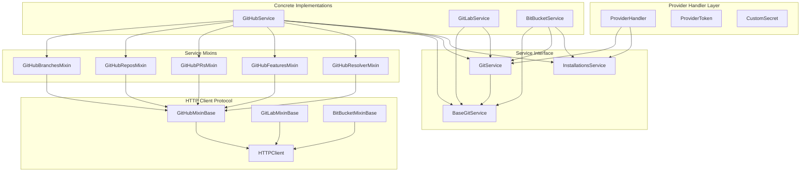
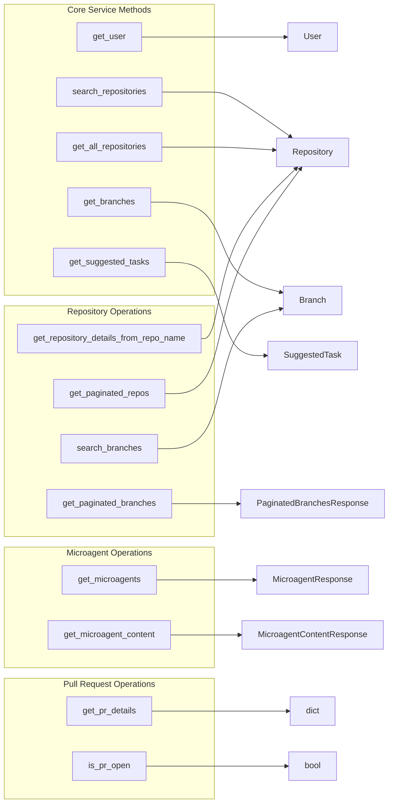
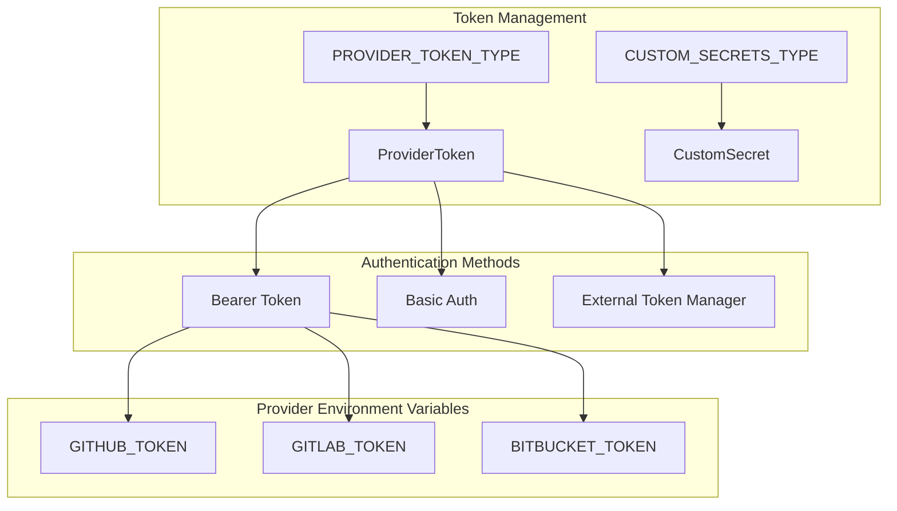
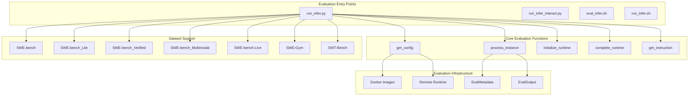
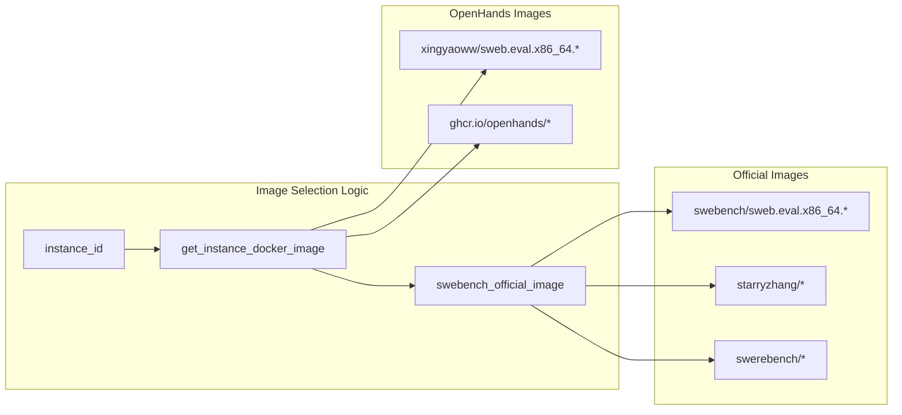
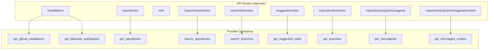

7-Integrations

# Page: Integrations

# Integrations

Relevant source files

The following files were used as context for generating this wiki page:

- [evaluation/benchmarks/swe_bench/README.md](evaluation/benchmarks/swe_bench/README.md)
- [evaluation/benchmarks/swe_bench/SWE-Interact.md](evaluation/benchmarks/swe_bench/SWE-Interact.md)
- [evaluation/benchmarks/swe_bench/run_infer.py](evaluation/benchmarks/swe_bench/run_infer.py)
- [evaluation/benchmarks/swe_bench/run_infer_interact.py](evaluation/benchmarks/swe_bench/run_infer_interact.py)
- [evaluation/benchmarks/swe_bench/scripts/run_infer_interact.sh](evaluation/benchmarks/swe_bench/scripts/run_infer_interact.sh)
- [evaluation/utils/shared.py](evaluation/utils/shared.py)
- [openhands/integrations/bitbucket/service/base.py](openhands/integrations/bitbucket/service/base.py)
- [openhands/integrations/github/github_service.py](openhands/integrations/github/github_service.py)
- [openhands/integrations/github/service/__init__.py](openhands/integrations/github/service/__init__.py)
- [openhands/integrations/github/service/base.py](openhands/integrations/github/service/base.py)
- [openhands/integrations/gitlab/gitlab_service.py](openhands/integrations/gitlab/gitlab_service.py)
- [openhands/integrations/gitlab/service/__init__.py](openhands/integrations/gitlab/service/__init__.py)
- [openhands/integrations/gitlab/service/base.py](openhands/integrations/gitlab/service/base.py)
- [openhands/integrations/protocols/http_client.py](openhands/integrations/protocols/http_client.py)
- [openhands/integrations/provider.py](openhands/integrations/provider.py)
- [openhands/integrations/service_types.py](openhands/integrations/service_types.py)
- [openhands/server/routes/git.py](openhands/server/routes/git.py)
- [tests/unit/integrations/github/test_github_service.py](tests/unit/integrations/github/test_github_service.py)

OpenHands provides extensive integration capabilities with external services and evaluation systems. This document covers the architecture and implementation of these integrations, focusing on Git provider services and evaluation benchmarking systems.

For information about the core agent system and runtime execution, see [Agent System](#3). For details about the frontend interfaces that utilize these integrations, see [Frontend & User Interfaces](#6).

## Git Provider Integration Architecture

OpenHands supports multiple Git service providers through a unified service interface. The system is designed with a pluggable architecture that allows easy addition of new providers while maintaining consistent functionality across all supported platforms.

### Provider Service Architecture

The `ProviderHandler` class serves as the central orchestrator for all Git provider interactions. It maintains provider tokens and routes requests to appropriate service implementations based on the `ProviderType` enum.

Sources: [openhands/integrations/provider.py:105-161](), [openhands/integrations/service_types.py:20-25](), [openhands/integrations/github/github_service.py:21-42]()

### Service Interface Definition

The Git provider services implement a common protocol defined by the `GitService` interface, which provides methods for repository operations, user management, and microagent handling:

Sources: [openhands/integrations/service_types.py:437-542](), [openhands/integrations/service_types.py:116-151]()

### Provider Implementation Details

Each Git provider implements the service interface through a mixin-based architecture. For example, GitHub service combines multiple mixins:

- `GitHubReposMixin`: Repository listing and search operations
- `GitHubBranchesMixin`: Branch management operations  
- `GitHubPRsMixin`: Pull request operations
- `GitHubFeaturesMixin`: Microagent and file operations
- `GitHubResolverMixin`: Issue resolution workflows

The mixins inherit from `GitHubMixinBase`, which provides common HTTP client functionality and authentication handling.

Sources: [openhands/integrations/github/github_service.py:21-30](), [openhands/integrations/github/service/__init__.py:1-17](), [openhands/integrations/github/service/base.py:16-126]()

## Authentication and Token Management

The integration system supports multiple authentication mechanisms and token refresh capabilities:

### Token Types and Configuration

The `ProviderToken` class encapsulates authentication credentials with support for different token types and hosts. The system can automatically refresh tokens when they expire by detecting HTTP 401 responses.

Sources: [openhands/integrations/provider.py:41-68](), [openhands/integrations/provider.py:425-446]()

## Evaluation System Integrations

OpenHands integrates with various evaluation benchmarks, primarily focused on the SWE-Bench family of software engineering benchmarks.

### SWE-Bench Integration Architecture

The evaluation system processes individual benchmark instances through a standardized pipeline that includes runtime initialization, instruction generation, agent execution, and result collection.

Sources: [evaluation/benchmarks/swe_bench/run_infer.py:606-710](), [evaluation/utils/shared.py:164-216]()

### Docker-based Evaluation Environment

OpenHands uses instance-specific Docker images for SWE-Bench evaluation to ensure reproducible environments:

The system automatically selects appropriate Docker images based on the dataset type and instance ID, with support for both official SWE-Bench images and OpenHands-specific variants.

Sources: [evaluation/benchmarks/swe_bench/run_infer.py:178-204](), [evaluation/benchmarks/swe_bench/run_infer.py:210-232]()

### Evaluation Modes and Dataset Support

The evaluation system supports multiple modes and dataset variants:

| Mode | Description | Template | Purpose |
|------|-------------|----------|---------|
| `swe` | Standard SWE-Bench evaluation | `swe_default.j2`, `swe_gpt4.j2` | Issue resolution |
| `swt` | SWT-Bench test generation | `swt.j2` | Unit test creation |
| `swt-ci` | SWT-Bench with CI setup | `swt.j2` + CI commands | Test generation with environment |

The instruction generation system uses Jinja2 templates to customize prompts based on the evaluation mode and model type.

Sources: [evaluation/benchmarks/swe_bench/run_infer.py:109-169](), [evaluation/benchmarks/swe_bench/run_infer.py:72-83]()

## API Integration Points

### Server Routes for Git Operations

OpenHands exposes Git provider functionality through REST API endpoints:

The API routes handle authentication, provider selection, and error handling while delegating the actual operations to the `ProviderHandler`.

Sources: [openhands/server/routes/git.py:38-277](), [openhands/server/routes/git.py:292-421]()

## Extension Points and Customization

### Adding New Git Providers

The system allows for easy addition of new Git providers through the service interface:

1. Implement the `GitService` protocol
2. Create provider-specific mixins if needed
3. Register the service class in `ProviderHandler.service_class_map`
4. Add the provider to the `ProviderType` enum

The HTTP client protocol provides a foundation for consistent error handling and authentication patterns across providers.

Sources: [openhands/integrations/provider.py:127-131](), [openhands/integrations/service_types.py:20-25](), [openhands/integrations/protocols/http_client.py:19-100]()

### Custom Service Implementation

Applications can override default service implementations by setting environment variables:

- `OPENHANDS_GITHUB_SERVICE_CLS` for GitHub service customization
- `OPENHANDS_GITLAB_SERVICE_CLS` for GitLab service customization

The `get_impl` utility dynamically loads the specified implementation class.

Sources: [openhands/integrations/github/github_service.py:74-78](), [openhands/integrations/gitlab/gitlab_service.py:78-82]()