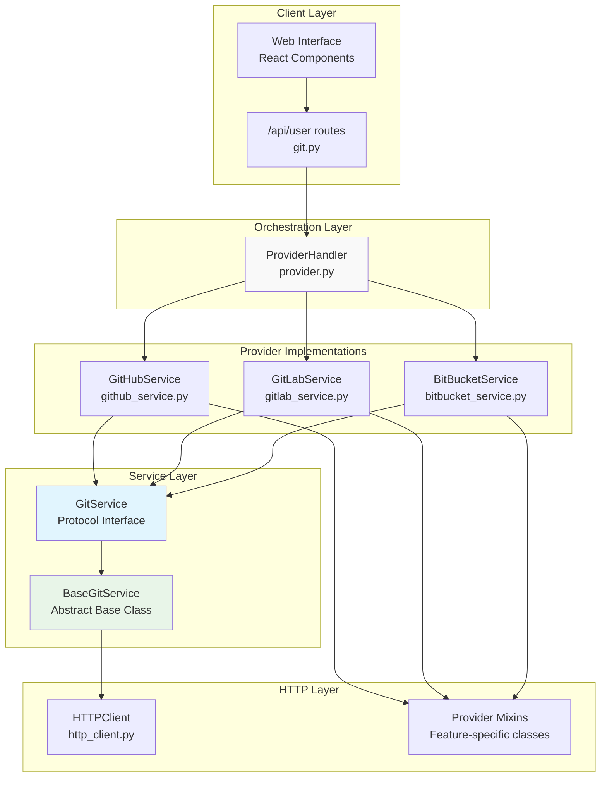
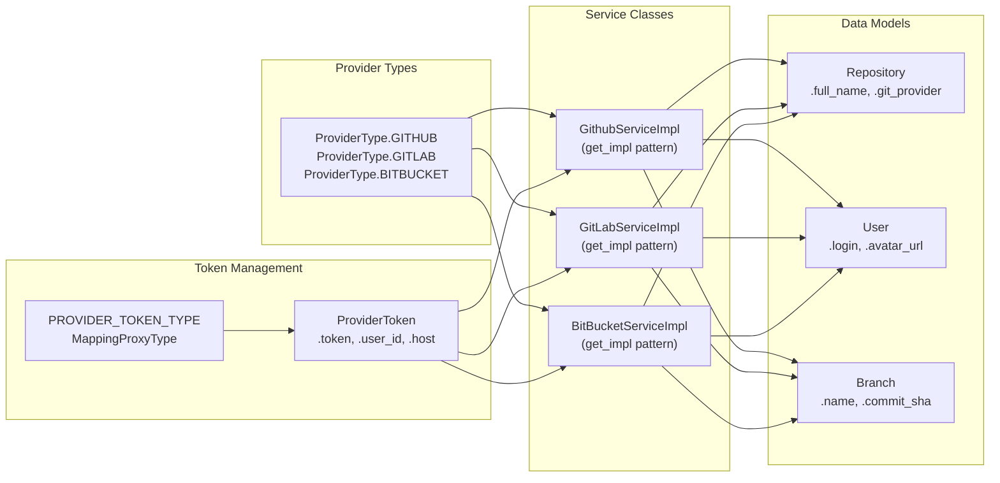
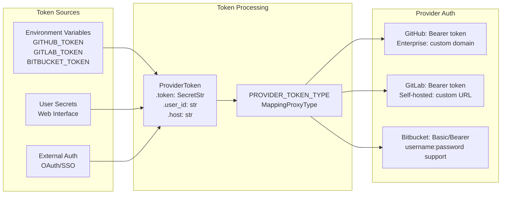
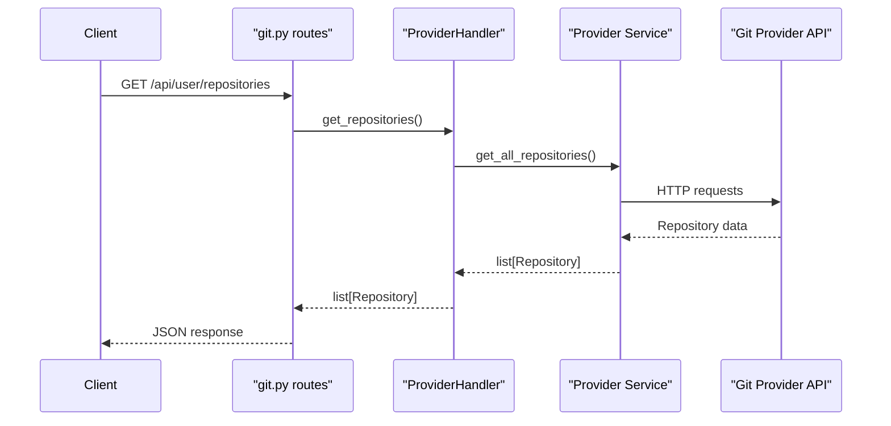

7.1-Git Provider Integration

# Page: Git Provider Integration

# Git Provider Integration

<details>
<summary>Relevant source files</summary>

The following files were used as context for generating this wiki page:

- [openhands/integrations/bitbucket/service/base.py](openhands/integrations/bitbucket/service/base.py)
- [openhands/integrations/github/github_service.py](openhands/integrations/github/github_service.py)
- [openhands/integrations/github/service/__init__.py](openhands/integrations/github/service/__init__.py)
- [openhands/integrations/github/service/base.py](openhands/integrations/github/service/base.py)
- [openhands/integrations/gitlab/gitlab_service.py](openhands/integrations/gitlab/gitlab_service.py)
- [openhands/integrations/gitlab/service/__init__.py](openhands/integrations/gitlab/service/__init__.py)
- [openhands/integrations/gitlab/service/base.py](openhands/integrations/gitlab/service/base.py)
- [openhands/integrations/protocols/http_client.py](openhands/integrations/protocols/http_client.py)
- [openhands/integrations/provider.py](openhands/integrations/provider.py)
- [openhands/integrations/service_types.py](openhands/integrations/service_types.py)
- [openhands/server/routes/git.py](openhands/server/routes/git.py)
- [tests/unit/integrations/github/test_github_service.py](tests/unit/integrations/github/test_github_service.py)

</details>


This document describes OpenHands' integration with Git hosting providers (GitHub, GitLab, Bitbucket). The Git provider integration enables repository access, branch management, pull request operations, and microagent discovery across multiple Git hosting platforms. For information about runtime execution environments, see [Runtime & Execution Environment](#5). For details about the web interface that consumes these integrations, see [Web Interface & API](#6.1).

## Architecture Overview

OpenHands uses a multi-provider architecture that abstracts Git operations behind a unified interface. The system supports GitHub, GitLab, and Bitbucket through provider-specific service implementations.

### Provider Integration Architecture



**Sources**: [openhands/integrations/provider.py:105-689](), [openhands/integrations/service_types.py:198-542](), [openhands/server/routes/git.py:35-421]()

### Core Components Mapping



**Sources**: [openhands/integrations/service_types.py:20-25](), [openhands/integrations/provider.py:41-68](), [openhands/integrations/provider.py:127-131]()

## Provider Handler

The `ProviderHandler` class serves as the central orchestrator for all Git provider operations. It manages authentication, routing requests to appropriate providers, and handling provider fallbacks.

### Core Functionality

| Method | Purpose | Providers Supported |
|--------|---------|-------------------|
| `get_repositories()` | Fetch user repositories | All |
| `search_repositories()` | Search public repositories | All |
| `get_branches()` | Get repository branches | All |
| `search_branches()` | Search branches within repository | All |
| `get_microagents()` | Discover microagents | All |
| `verify_repo_provider()` | Determine repository's provider | All |
| `get_authenticated_git_url()` | Generate authenticated clone URLs | All |

The `ProviderHandler` maintains a service class mapping that dynamically instantiates provider services:

```python
self.service_class_map: dict[ProviderType, type[GitService]] = {
    ProviderType.GITHUB: GithubServiceImpl,
    ProviderType.GITLAB: GitLabServiceImpl,
    ProviderType.BITBUCKET: BitBucketServiceImpl,
}
```

**Sources**: [openhands/integrations/provider.py:105-161](), [openhands/integrations/provider.py:213-689]()

## Service Implementation Architecture

Each Git provider implements the `GitService` protocol through a mixin-based architecture that separates concerns by feature area.

### Mixin Structure

```mermaid
graph TB
    subgraph "GitHub Mixins"
        GHBASE["GitHubMixinBase<br/>base.py"]
        GHBRANCH["GitHubBranchesMixin<br/>branches_prs.py"]
        GHFEATURE["GitHubFeaturesMixin<br/>features.py"]
        GHPR["GitHubPRsMixin<br/>prs.py"]
        GHREPO["GitHubReposMixin<br/>repos.py"]
        GHRESOLVER["GitHubResolverMixin<br/>resolver.py"]
    end
    
    subgraph "GitLab Mixins"
        GLBASE["GitLabMixinBase<br/>base.py"]
        GLBRANCH["GitLabBranchesMixin<br/>branches.py"]
        GLFEATURE["GitLabFeaturesMixin<br/>features.py"]
        GLPR["GitLabPRsMixin<br/>prs.py"]
        GLREPO["GitLabReposMixin<br/>repos.py"]
        GLRESOLVER["GitLabResolverMixin<br/>resolver.py"]
    end
    
    subgraph "Final Services"
        GHS["GitHubService<br/>Combines all mixins"]
        GLS["GitLabService<br/>Combines all mixins"]
    end
    
    GHBASE --> GHS
    GHBRANCH --> GHS
    GHFEATURE --> GHS
    GHPR --> GHS
    GHREPO --> GHS
    GHRESOLVER --> GHS
    
    GLBASE --> GLS
    GLBRANCH --> GLS
    GLFEATURE --> GLS
    GLPR --> GLS
    GLREPO --> GLS
    GLRESOLVER --> GLS
```



**Sources**: [openhands/integrations/github/service/__init__.py:1-17](), [openhands/integrations/gitlab/service/__init__.py:1-17](), [openhands/integrations/github/github_service.py:21-30](), [openhands/integrations/gitlab/gitlab_service.py:20-28]()

### Base Implementation Pattern

All provider mixins inherit from their respective base classes, which provide common HTTP client functionality:

- **GitHubMixinBase**: Handles GitHub API authentication, headers, and GraphQL
- **GitLabMixinBase**: Manages GitLab API requests and GraphQL operations  
- **BitBucketMixinBase**: Provides Bitbucket API functionality with Basic/Bearer auth

**Sources**: [openhands/integrations/github/service/base.py:16-126](), [openhands/integrations/gitlab/service/base.py:15-178](), [openhands/integrations/bitbucket/service/base.py:19-248]()

## Authentication and Token Management

The system supports multiple authentication methods and token types across providers.

### Token Types and Configuration



**Sources**: [openhands/integrations/provider.py:41-68](), [openhands/integrations/provider.py:356-424](), [openhands/integrations/github/service/base.py:24-37](), [openhands/integrations/gitlab/service/base.py:23-35](), [openhands/integrations/bitbucket/service/base.py:51-66]()

### Provider-Specific Authentication

| Provider | Auth Method | Token Format | Custom Domains |
|----------|-------------|--------------|----------------|
| GitHub | Bearer | `ghp_xxx` or `gho_xxx` | GitHub Enterprise Server |
| GitLab | Bearer | `glpat-xxx` | Self-hosted GitLab |
| Bitbucket | Basic/Bearer | `username:password` or token | Bitbucket Server |

**Sources**: [openhands/integrations/github/github_service.py:62-64](), [openhands/integrations/gitlab/gitlab_service.py:62-71](), [openhands/integrations/bitbucket/service/base.py:55-66]()

## Core Operations

### Repository Management

The system provides comprehensive repository operations across all providers:

```mermaid
graph TB
    subgraph "Repository Operations"
        GETREPOS["get_all_repositories()<br/>User's repositories"]
        SEARCHREPOS["search_repositories()<br/>Public repository search"]
        GETDETAILS["get_repository_details_from_repo_name()<br/>Single repo details"]
        VERIFY["verify_repo_provider()<br/>Determine provider"]
    end
    
    subgraph "Branch Operations"
        GETBRANCHES["get_branches()<br/>List repository branches"]
        PAGEBRANCHES["get_paginated_branches()<br/>Paginated branch listing"]
        SEARCHBRANCHES["search_branches()<br/>Branch search within repo"]
    end
    
    subgraph "Microagent Operations"
        GETMICRO["get_microagents()<br/>Discover microagents"]
        GETCONTENT["get_microagent_content()<br/>Fetch microagent content"]
        PARSECONTENT["_parse_microagent_content()<br/>Parse triggers"]
    end
    
    GETREPOS --> Repository
    SEARCHREPOS --> Repository
    GETDETAILS --> Repository
    
    GETBRANCHES --> Branch
    PAGEBRANCHES --> PaginatedBranchesResponse
    SEARCHBRANCHES --> Branch
    
    GETMICRO --> MicroagentResponse
    GETCONTENT --> MicroagentContentResponse
    PARSECONTENT --> MicroagentContentResponse
```



**Sources**: [openhands/integrations/service_types.py:437-542](), [openhands/integrations/provider.py:213-689]()

### Microagent Discovery

OpenHands implements a sophisticated microagent discovery system that works across all Git providers:

| Location | File Types | Purpose |
|----------|------------|---------|
| `.cursorrules` | Single file | Cursor IDE integration |
| `.openhands/microagents/` | `*.md` files | OpenHands microagents |
| `microagents/` | `*.md` files | Special repositories (.openhands, openhands-config) |

The discovery process follows a standardized pattern implemented in `BaseGitService`:

1. Check for `.cursorrules` file in repository root
2. Determine microagents directory path based on repository name
3. Scan directory for `.md` files (excluding `README.md`)
4. Parse microagent content and extract triggers

**Sources**: [openhands/integrations/service_types.py:244-421](), [openhands/integrations/provider.py:515-612]()

## API Integration

The Git provider integration exposes functionality through RESTful API endpoints in `openhands/server/routes/git.py`.

### API Routes

| Endpoint | Method | Purpose | Response Type |
|----------|--------|---------|---------------|
| `/api/user/repositories` | GET | List user repositories | `list[Repository]` |
| `/api/user/search/repositories` | GET | Search repositories | `list[Repository]` |
| `/api/user/repository/branches` | GET | Get repository branches | `PaginatedBranchesResponse` |
| `/api/user/search/branches` | GET | Search branches | `list[Branch]` |
| `/api/user/repository/{repo}/microagents` | GET | List microagents | `list[MicroagentResponse]` |
| `/api/user/repository/{repo}/microagents/content` | GET | Get microagent content | `MicroagentContentResponse` |
| `/api/user/installations` | GET | List installations | `list[str]` |
| `/api/user/suggested-tasks` | GET | Get suggested tasks | `list[SuggestedTask]` |

**Sources**: [openhands/server/routes/git.py:35-421]()

### Request Flow



**Sources**: [openhands/server/routes/git.py:65-102](), [openhands/integrations/provider.py:213-245]()

## Extension Points

The Git provider integration is designed for extensibility through several mechanisms:

### Custom Service Implementation

Applications can substitute custom provider implementations using environment variables:

- `OPENHANDS_GITHUB_SERVICE_CLS`: Custom GitHub service class
- `OPENHANDS_GITLAB_SERVICE_CLS`: Custom GitLab service class

The implementations are loaded dynamically using the `get_impl()` pattern from `openhands.utils.import_utils`.

**Sources**: [openhands/integrations/github/github_service.py:74-78](), [openhands/integrations/gitlab/gitlab_service.py:78-82]()

### Protocol-Based Design

The `GitService` protocol defines the interface contract that all providers must implement, enabling new provider additions without modifying existing code:

```python
class GitService(Protocol):
    async def get_user(self) -> User: ...
    async def search_repositories(self, query: str, per_page: int, sort: str, order: str, public: bool) -> list[Repository]: ...
    async def get_all_repositories(self, sort: str, app_mode: AppMode) -> list[Repository]: ...
    # ... additional methods
```

**Sources**: [openhands/integrations/service_types.py:437-542]()

### Mixin Architecture

The mixin-based design allows feature-specific customization by overriding individual mixin classes while inheriting common functionality from base classes.

**Sources**: [openhands/integrations/github/github_service.py:31-42](), [openhands/integrations/gitlab/gitlab_service.py:29-39]()