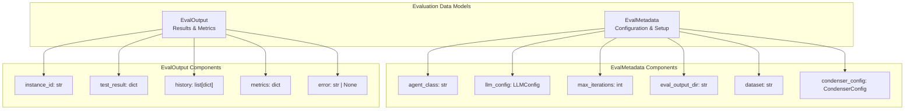
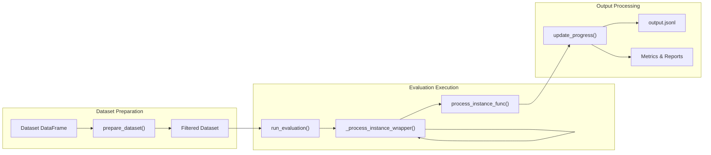
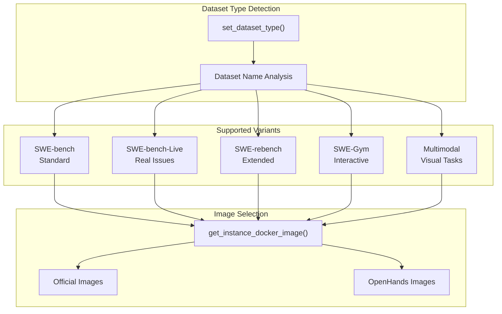
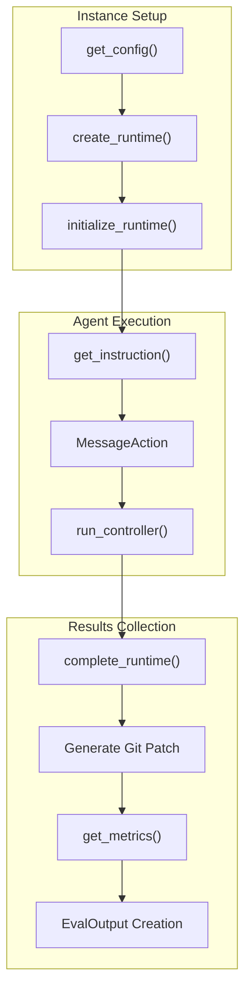
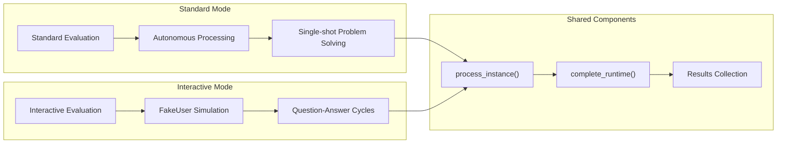
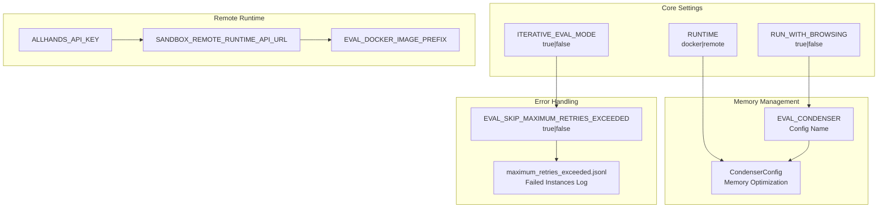
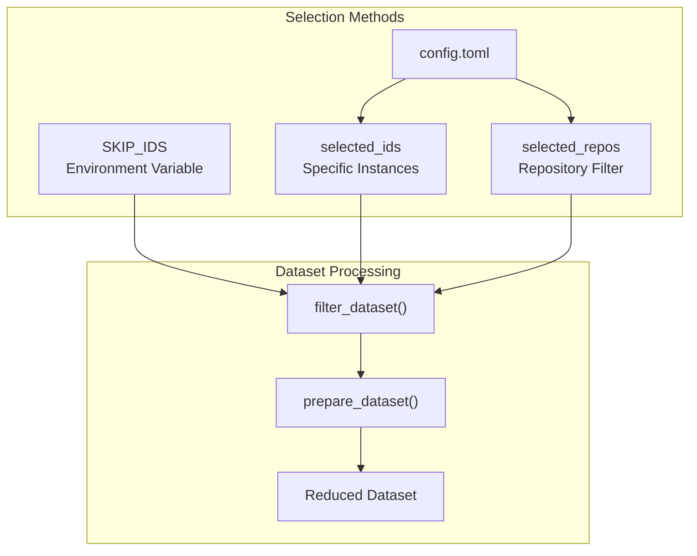
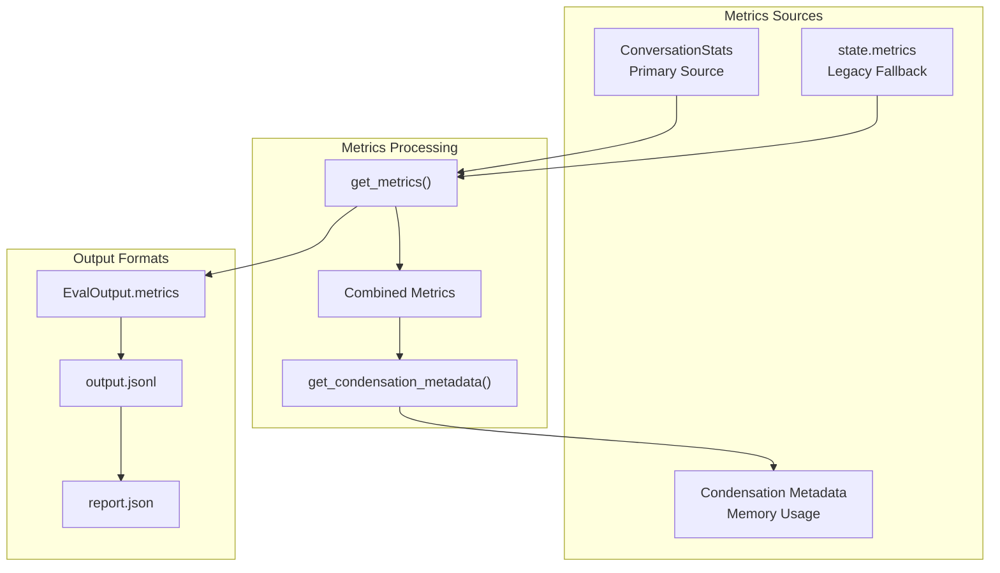

7.2-Evaluation & Benchmarking

# Page: Evaluation & Benchmarking

# Evaluation & Benchmarking

Relevant source files

The following files were used as context for generating this wiki page:

- [evaluation/benchmarks/swe_bench/README.md](evaluation/benchmarks/swe_bench/README.md)
- [evaluation/benchmarks/swe_bench/SWE-Interact.md](evaluation/benchmarks/swe_bench/SWE-Interact.md)
- [evaluation/benchmarks/swe_bench/run_infer.py](evaluation/benchmarks/swe_bench/run_infer.py)
- [evaluation/benchmarks/swe_bench/run_infer_interact.py](evaluation/benchmarks/swe_bench/run_infer_interact.py)
- [evaluation/benchmarks/swe_bench/scripts/run_infer_interact.sh](evaluation/benchmarks/swe_bench/scripts/run_infer_interact.sh)
- [evaluation/utils/shared.py](evaluation/utils/shared.py)

This page covers OpenHands' comprehensive evaluation and benchmarking framework, which provides standardized ways to measure agent performance across various software engineering tasks. The system primarily focuses on SWE-Bench integration but includes support for multiple evaluation modes and benchmarks.

For information about Git provider integrations that support evaluation workflows, see [Git Provider Integration](#7.1). For details about the runtime environments used during evaluation, see [Runtime & Execution Environment](#5).

## Core Evaluation Framework

The evaluation system is built around a standardized framework that provides consistent interfaces for running benchmarks, collecting metrics, and processing results across different evaluation scenarios.

### Evaluation Data Models

The framework uses two primary data models to structure evaluation workflows:

**Sources:** [evaluation/utils/shared.py:44-79]()

### Evaluation Orchestration

The core evaluation process is managed by the `run_evaluation` function, which handles parallelization, error recovery, and progress tracking:

**Sources:** [evaluation/utils/shared.py:486-550](), [evaluation/utils/shared.py:219-289]()

## SWE-Bench Integration

OpenHands provides comprehensive support for SWE-Bench evaluation, including multiple variants and modes. The system handles Docker image management, environment setup, and results processing automatically.

### Benchmark Variants Support

The evaluation system supports multiple SWE-Bench dataset variants through dynamic configuration:

**Sources:** [evaluation/benchmarks/swe_bench/run_infer.py:78-95](), [evaluation/benchmarks/swe_bench/run_infer.py:178-204]()

### Instance Processing Workflow

Each evaluation instance follows a standardized processing workflow that includes runtime initialization, agent execution, and results collection:

**Sources:** [evaluation/benchmarks/swe_bench/run_infer.py:606-710](), [evaluation/benchmarks/swe_bench/run_infer.py:267-435]()

## Evaluation Modes and Variants

OpenHands supports multiple evaluation modes to assess different aspects of agent capabilities:

### Standard vs Interactive Evaluation

The system provides both standard autonomous evaluation and interactive evaluation where agents can communicate with simulated users:

**Sources:** [evaluation/benchmarks/swe_bench/run_infer_interact.py:48-91](), [evaluation/benchmarks/swe_bench/run_infer_interact.py:97-104]()

### SWT-Bench Test Generation Mode

For test generation evaluation, the system modifies prompts and setup to focus on creating unit tests rather than fixing issues:

| Mode | Purpose | Environment Setup | Prompt Template |
|------|---------|-------------------|-----------------|
| `swe` | Issue Resolution | Standard | `swe_default.j2` |
| `swt` | Test Generation | Standard | `swt.j2` |
| `swt-ci` | Test Gen + CI | Pre-install deps | `swt.j2` + test commands |

**Sources:** [evaluation/benchmarks/swe_bench/run_infer.py:109-151](), [evaluation/benchmarks/swe_bench/run_infer.py:395-418]()

## Configuration and Customization

The evaluation system provides extensive configuration options through environment variables, TOML files, and command-line arguments.

### Environment Configuration

Key environment variables control evaluation behavior:

**Sources:** [evaluation/benchmarks/swe_bench/run_infer.py:69-71](), [evaluation/utils/shared.py:440-453]()

### Instance Filtering and Selection

Evaluations can be customized through TOML configuration files to run on specific subsets:

**Sources:** [evaluation/benchmarks/swe_bench/run_infer.py:713-744](), [evaluation/utils/shared.py:219-289]()

## Results Processing and Metrics

The evaluation framework captures comprehensive metrics and produces structured outputs for analysis and comparison.

### Metrics Collection

Multiple metric sources are combined to provide comprehensive evaluation data:

**Sources:** [evaluation/utils/shared.py:670-689](), [evaluation/utils/shared.py:59-79]()

### Output Structure and Formats

Evaluation results are structured consistently across all benchmark types:

| Field | Type | Description |
|-------|------|-------------|
| `instance_id` | string | Unique identifier for the task |
| `instruction` | string | Original problem statement |
| `test_result` | object | Benchmark-specific results (e.g., git_patch) |
| `history` | array | Complete interaction history |
| `metrics` | object | Performance and usage metrics |
| `error` | string | Error message if evaluation failed |
| `metadata` | object | Configuration and environment details |

**Sources:** [evaluation/utils/shared.py:59-79]()