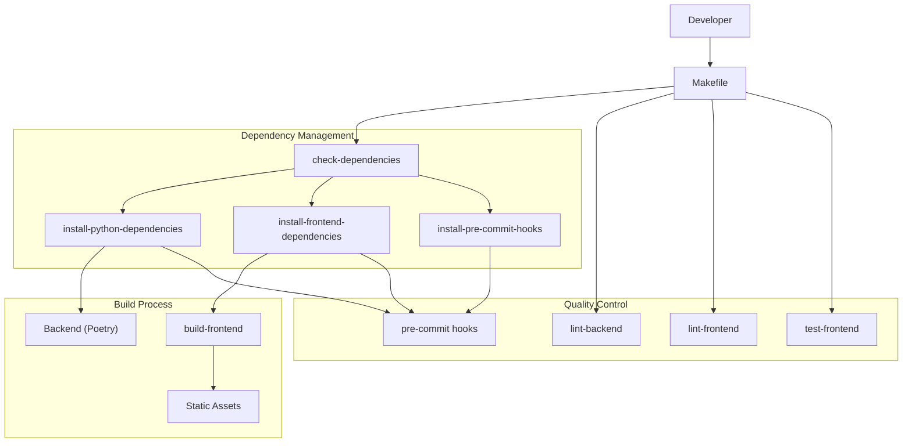
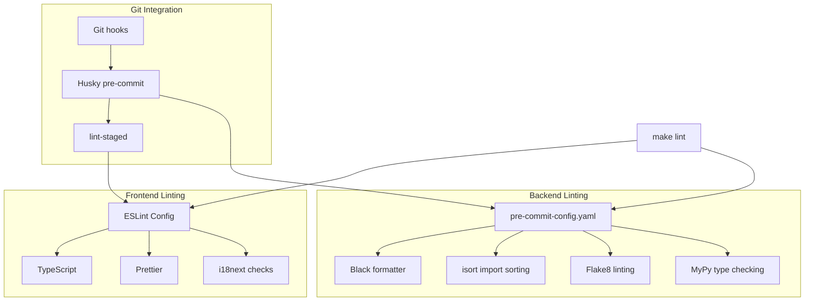
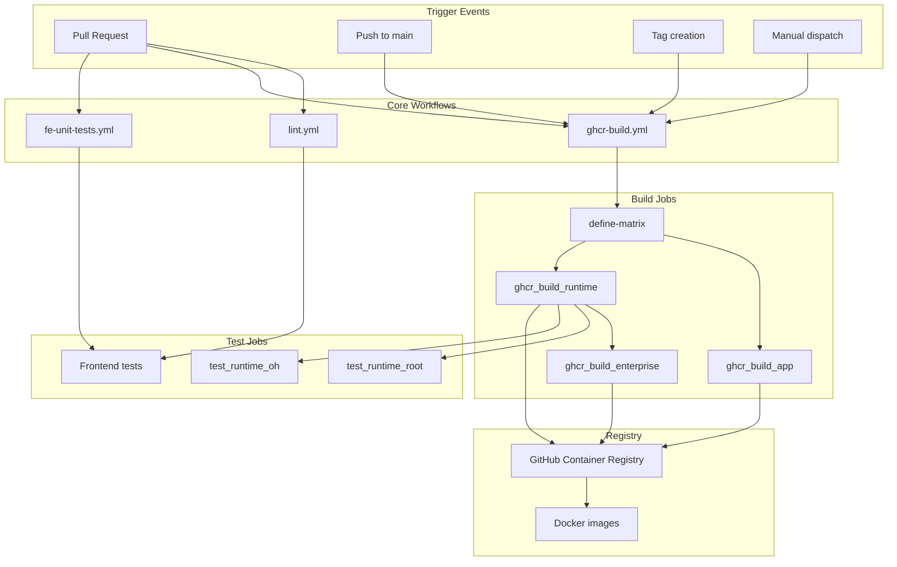
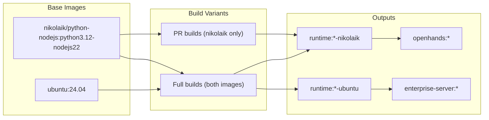
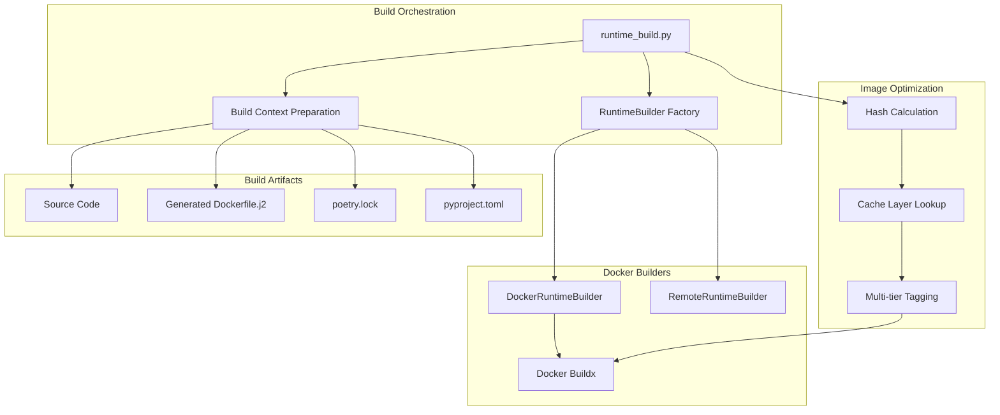
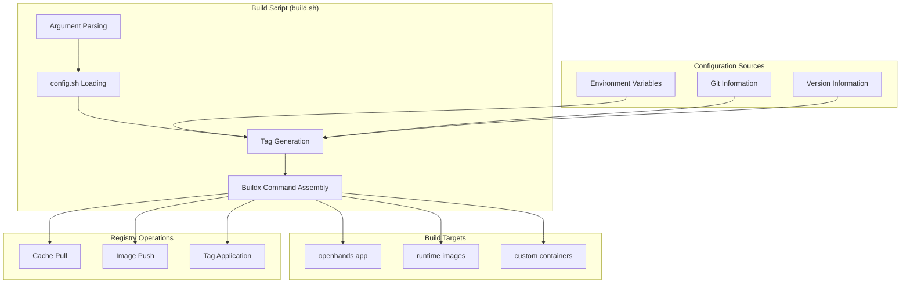
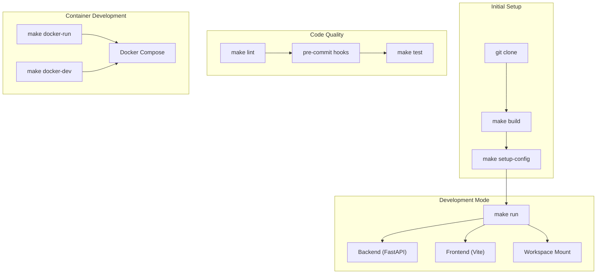

8-Development & Contributing

# Page: Development & Contributing

# Development & Contributing

Relevant source files

The following files were used as context for generating this wiki page:

- [.github/workflows/clean-up.yml](.github/workflows/clean-up.yml)
- [.github/workflows/enterprise-preview.yml](.github/workflows/enterprise-preview.yml)
- [.github/workflows/fe-unit-tests.yml](.github/workflows/fe-unit-tests.yml)
- [.github/workflows/ghcr-build.yml](.github/workflows/ghcr-build.yml)
- [.github/workflows/lint-fix.yml](.github/workflows/lint-fix.yml)
- [.github/workflows/lint.yml](.github/workflows/lint.yml)
- [.github/workflows/stale.yml](.github/workflows/stale.yml)
- [Makefile](Makefile)
- [containers/app/Dockerfile](containers/app/Dockerfile)
- [containers/app/entrypoint.sh](containers/app/entrypoint.sh)
- [containers/build.sh](containers/build.sh)
- [frontend/.eslintrc](frontend/.eslintrc)
- [frontend/.husky/pre-commit](frontend/.husky/pre-commit)
- [frontend/scripts/check-translation-completeness.cjs](frontend/scripts/check-translation-completeness.cjs)
- [openhands/runtime/builder/base.py](openhands/runtime/builder/base.py)
- [openhands/runtime/builder/docker.py](openhands/runtime/builder/docker.py)
- [openhands/runtime/builder/remote.py](openhands/runtime/builder/remote.py)
- [openhands/runtime/utils/request.py](openhands/runtime/utils/request.py)
- [openhands/runtime/utils/runtime_build.py](openhands/runtime/utils/runtime_build.py)
- [openhands/runtime/utils/runtime_templates/Dockerfile.j2](openhands/runtime/utils/runtime_templates/Dockerfile.j2)
- [openhands/utils/term_color.py](openhands/utils/term_color.py)
- [tests/runtime/test_aci_edit.py](tests/runtime/test_aci_edit.py)
- [tests/runtime/test_mcp_action.py](tests/runtime/test_mcp_action.py)

This document covers the development setup, build system, code quality processes, and contribution workflows for OpenHands. It provides technical details for developers who want to contribute to the project or understand how the build and deployment infrastructure works.

For information about the runtime system architecture, see [Runtime & Execution Environment](#5). For details about the agent system implementation, see [Agent System](#3).

## Development Setup

OpenHands uses a multi-language development environment with Python backend components and a Node.js frontend. The primary entry point for all development tasks is the `Makefile`, which orchestrates dependency management, building, and testing across both ecosystems.

### Build System Architecture

The build system coordinates several key components:

- **`make build`** - Main build target that orchestrates all setup steps
- **`check-dependencies`** - Validates system requirements (Python 3.12, Node.js 22, Docker, Poetry, tmux)
- **`install-python-dependencies`** - Uses Poetry to install Python packages with optional Playwright support
- **`install-frontend-dependencies`** - Uses npm to install Node.js dependencies
- **`build-frontend`** - Compiles React application with Vite

Sources: [Makefile:25-32](), [Makefile:34-45](), [Makefile:139-175](), [Makefile:177-183](), [Makefile:244-246]()

### Development Dependencies

The project requires specific versions of core tools:

| Tool | Required Version | Purpose |
|------|-----------------|---------|
| Python | 3.12 | Backend runtime and package management |
| Node.js | 22.x+ | Frontend build and runtime |
| Poetry | 1.8+ | Python dependency management |
| Docker | Latest | Container runtime for sandboxed execution |
| tmux | Optional | Advanced terminal features |

The dependency checking system validates these requirements and provides installation guidance when tools are missing.

Sources: [Makefile:14](), [Makefile:64-96](), [Makefile:119-137]()

## Code Quality & Linting

### Linting Architecture

The linting system uses different tools for frontend and backend code:

**Frontend linting** (`npm run lint`):
- ESLint with Airbnb config and TypeScript support
- Prettier for code formatting
- i18next plugin for internationalization string checking
- TypeScript compilation verification

**Backend linting** (`pre-commit`):
- Black for Python code formatting
- isort for import statement organization
- Flake8 for style guide enforcement
- MyPy for static type checking

Sources: [frontend/.eslintrc:1-76](), [frontend/.husky/pre-commit:1-10](), [Makefile:191-201]()

### Pre-commit Hook Integration

The project uses Husky and lint-staged for Git integration:

1. **Husky** manages Git hooks and triggers checks on commit
2. **lint-staged** runs linters only on staged files
3. **Pre-commit framework** handles Python-side linting with configuration in `dev_config/python/.pre-commit-config.yaml`

This ensures code quality standards are enforced before commits reach the repository.

Sources: [frontend/.husky/pre-commit:1-10](), [Makefile:185-189]()

## CI/CD Pipeline

### GitHub Actions Workflow Architecture

The CI/CD system is built around GitHub Actions with several key workflows:

**Primary Build Workflow** (`ghcr-build.yml`):
- Builds application, runtime, and enterprise Docker images
- Supports multi-platform builds (linux/amd64, linux/arm64)
- Pushes to GitHub Container Registry (GHCR)
- Runs comprehensive runtime testing

**Quality Assurance** (`lint.yml`):
- Frontend linting with ESLint and TypeScript compilation
- Backend linting with pre-commit hooks
- Translation completeness checking
- Version consistency validation

**Testing** (`fe-unit-tests.yml`):
- Frontend unit tests with coverage reporting
- TypeScript compilation verification

Sources: [.github/workflows/ghcr-build.yml:1-421](), [.github/workflows/lint.yml:1-88](), [.github/workflows/fe-unit-tests.yml:1-45]()

### Build Matrix Strategy

The CI system uses a dynamic build matrix to optimize build times:

- **Pull Requests**: Build only nikolaik variant to save CI resources
- **Main/Tag builds**: Build both nikolaik and ubuntu variants for full platform support
- **Conditional execution**: Fork repositories cannot push to GHCR but still build for validation

Sources: [.github/workflows/ghcr-build.yml:31-52](), [.github/workflows/ghcr-build.yml:96-99]()

## Docker Build System

### Runtime Image Build Process

The Docker build system implements sophisticated caching and optimization:

**Build Strategy Hierarchy**:
1. **SCRATCH**: Build from base image with no reused layers
2. **VERSIONED**: Reuse image with same base + OpenHands version  
3. **LOCK**: Reuse image with identical dependency locks (fastest)

**Hash-based Tagging**:
- `get_hash_for_lock_files()`: Creates hash from `pyproject.toml` and `poetry.lock`
- `get_hash_for_source_files()`: Creates hash from source code changes
- `get_tag_for_versioned_image()`: Creates tag from base image identifier

**Multi-tier Image Tags**:
- Source tag: `oh_v{version}_{lock_hash}_{source_hash}`
- Lock tag: `oh_v{version}_{lock_hash}`
- Versioned tag: `oh_v{version}_{base_image_tag}`

Sources: [openhands/runtime/utils/runtime_build.py:108-255](), [openhands/runtime/utils/runtime_build.py:320-358](), [openhands/runtime/builder/docker.py:51-249]()

### Container Build Script Architecture

The `containers/build.sh` script serves as a universal Docker build orchestrator:

**Key Parameters**:
- `-i <image_name>`: Target image (openhands, runtime, etc.)
- `-o <org_name>`: Docker organization/registry prefix
- `--push`: Push to registry after build
- `--load`: Load image locally after build
- `-t <tag_suffix>`: Additional tag suffix
- `--dry`: Generate build configuration without building

**Tag Generation Logic**:
- Git commit SHA for tracking builds
- Branch/tag names for version identification
- Semantic version parsing for release builds
- Cache optimization tags for build acceleration

Sources: [containers/build.sh:1-183](), [containers/build.sh:45-78](), [containers/build.sh:118-176]()

## Development Workflows

### Local Development Setup

**Standard Development Flow**:

1. **Environment Setup**: `make build` handles all dependency installation and pre-commit hook setup
2. **Configuration**: `make setup-config` creates initial `config.toml` with LLM settings and workspace path
3. **Local Development**: `make run` starts both backend (port 3000) and frontend (port 3001) servers
4. **Docker Development**: `make docker-run` or `make docker-dev` for containerized development

**Development Server Architecture**:
- **Backend**: FastAPI server with hot reload via `uvicorn --reload`
- **Frontend**: Vite development server with HMR (Hot Module Replacement)
- **Workspace**: Configurable workspace directory for agent file operations

Sources: [Makefile:279-283](), [Makefile:249-263](), [Makefile:286-297](), [Makefile:301-333]()

### Contributing Process

The contribution workflow enforces code quality through automated checks:

**Pre-commit Validation**:
1. Frontend linting (ESLint, Prettier, TypeScript)
2. Backend linting (Black, isort, flake8, MyPy) 
3. Translation completeness verification
4. Import organization and unused import removal

**CI Pipeline Integration**:
1. All PRs trigger lint and build workflows
2. Runtime tests execute against built Docker images
3. Fork repositories build locally but cannot push to registry
4. Auto-fix workflows available via `lint-fix` label

**Quality Gates**:
- Pre-commit hooks prevent commits with linting issues
- CI workflows must pass before merge
- Docker builds verify runtime compatibility
- Translation coverage ensures internationalization completeness

Sources: [.github/workflows/lint-fix.yml:1-98](), [frontend/.husky/pre-commit:1-10](), [frontend/scripts/check-translation-completeness.cjs:1-89]()