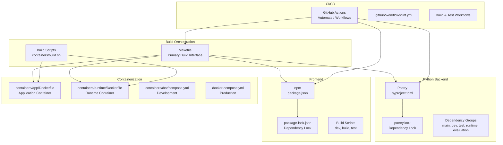
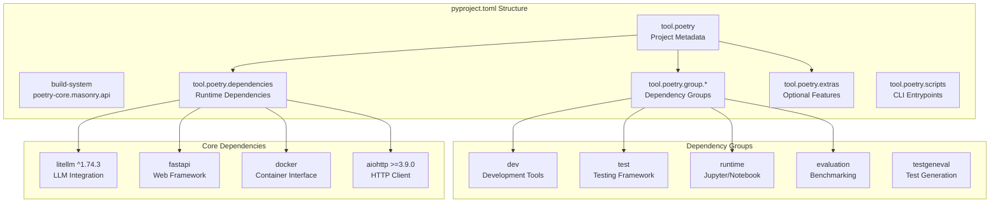
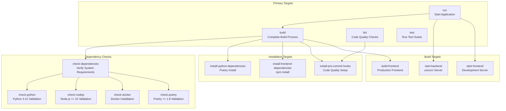
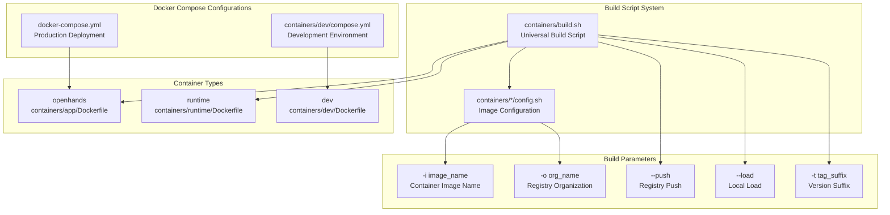
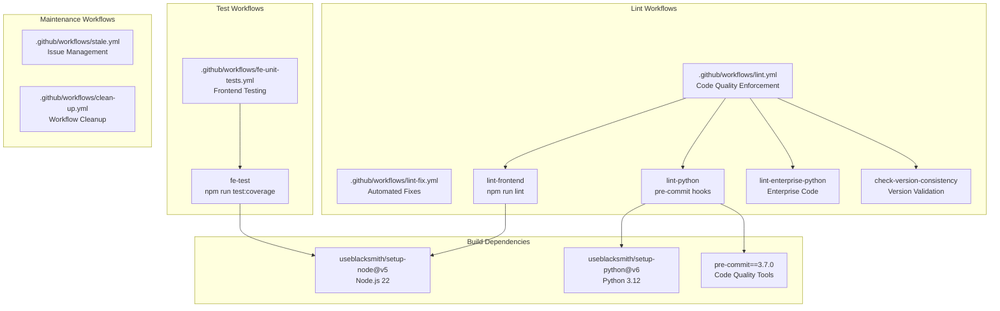
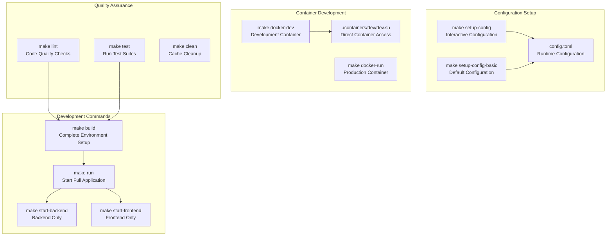

8.1-Build System & Dependencies

# Page: Build System & Dependencies

# Build System & Dependencies

<details>
<summary>Relevant source files</summary>

The following files were used as context for generating this wiki page:

- [.github/workflows/clean-up.yml](.github/workflows/clean-up.yml)
- [.github/workflows/fe-unit-tests.yml](.github/workflows/fe-unit-tests.yml)
- [.github/workflows/lint-fix.yml](.github/workflows/lint-fix.yml)
- [.github/workflows/lint.yml](.github/workflows/lint.yml)
- [.github/workflows/stale.yml](.github/workflows/stale.yml)
- [Development.md](Development.md)
- [Makefile](Makefile)
- [README.md](README.md)
- [README_CN.md](README_CN.md)
- [README_JA.md](README_JA.md)
- [containers/build.sh](containers/build.sh)
- [containers/dev/compose.yml](containers/dev/compose.yml)
- [docker-compose.yml](docker-compose.yml)
- [frontend/package-lock.json](frontend/package-lock.json)
- [frontend/package.json](frontend/package.json)
- [poetry.lock](poetry.lock)
- [pyproject.toml](pyproject.toml)

</details>


This document covers the build system architecture, dependency management, and development workflow orchestration in OpenHands. It details the tools and processes used to manage Python backend dependencies, frontend JavaScript/TypeScript dependencies, Docker containerization, and CI/CD automation.

For information about deployment and production infrastructure, see [CI/CD & Deployment](#8.2). For details about the development environment setup and contribution workflow, see [Development & Contributing](#8).

## Overview

OpenHands uses a multi-language build system orchestrated primarily through a `Makefile` with Poetry managing Python dependencies and npm handling frontend dependencies. The system supports both local development and containerized deployment scenarios.

### Build System Architecture



Sources: [Makefile:1-372](), [pyproject.toml:1-199](), [frontend/package.json:1-152](), [containers/build.sh:1-183]()

## Python Dependency Management

OpenHands uses Poetry as its primary Python dependency management tool, configured through `pyproject.toml` with dependencies locked in `poetry.lock`.

### Poetry Configuration Structure



Sources: [pyproject.toml:1-199](), [poetry.lock:1-948]()

### Python Version and Core Requirements

The project requires Python `^3.12,<3.14` as specified in [pyproject.toml:28](). Key dependency categories include:

- **LLM Integration**: `litellm`, `openai`, `anthropic` with specific version constraints
- **Web Framework**: `fastapi`, `uvicorn`, `python-socketio` for the backend server
- **Container Interface**: `docker` for runtime management
- **Development Tools**: `ruff`, `mypy`, `pre-commit` in the dev group
- **Testing**: `pytest` with various plugins in the test group

### Dependency Group Usage

The `install-python-dependencies` target in the Makefile installs dependencies based on the `POETRY_GROUP` environment variable:

```bash
# Install specific group
poetry install --only ${POETRY_GROUP}

# Default: install main groups
poetry install --with dev,test,runtime
```

Sources: [Makefile:139-175](), [pyproject.toml:108-178]()

## Frontend Dependency Management

The frontend uses npm for dependency management with Node.js >= 22.0.0 requirement defined in [frontend/package.json:6-8]().

### Frontend Build System Structure

```mermaid
graph TB
    subgraph "package.json Configuration"
        DEPENDENCIES["dependencies<br/>Runtime Libraries"]
        DEV_DEPS["devDependencies<br/>Build Tools"]
        SCRIPTS["scripts<br/>Build Commands"]
        ENGINES["engines<br/>Node.js >= 22.0.0"]
    end
    
    subgraph "Core Frontend Dependencies"
        REACT["react ^19.1.1<br/>UI Framework"]
        REACT_ROUTER["@react-router/*<br/>Routing System"]
        REDUX["@reduxjs/toolkit<br/>State Management"]
        VITE["vite ^7.1.4<br/>Build Tool"]
        TAILWIND["tailwindcss<br/>CSS Framework"]
    end
    
    subgraph "Build Scripts"
        DEV_SCRIPT["dev<br/>Development Server"]
        BUILD_SCRIPT["build<br/>Production Build"]
        TEST_SCRIPT["test<br/>Unit Testing"]
        LINT_SCRIPT["lint<br/>Code Quality"]
        TYPECHECK["typecheck<br/>TypeScript Validation"]
    end
    
    subgraph "Development Tools"
        TYPESCRIPT["typescript ^5.9.2<br/>Type System"]
        ESLINT["eslint ^8.57.0<br/>Linting"]
        PRETTIER["prettier ^3.6.2<br/>Formatting"]
        PLAYWRIGHT["@playwright/test<br/>E2E Testing"]
        HUSKY["husky<br/>Git Hooks"]
    end
    
    DEPENDENCIES --> REACT
    DEPENDENCIES --> REACT_ROUTER
    DEPENDENCIES --> REDUX
    DEPENDENCIES --> VITE
    
    DEV_DEPS --> TYPESCRIPT
    DEV_DEPS --> ESLINT
    DEV_DEPS --> PRETTIER
    DEV_DEPS --> PLAYWRIGHT
    
    SCRIPTS --> DEV_SCRIPT
    SCRIPTS --> BUILD_SCRIPT
    SCRIPTS --> TEST_SCRIPT
    SCRIPTS --> LINT_SCRIPT
```



Sources: [frontend/package.json:1-152](), [frontend/package-lock.json:1-748]()

### Frontend Build Scripts

The frontend defines several npm scripts for different development phases:

| Script | Purpose | Command |
|--------|---------|---------|
| `dev` | Development server | `react-router dev` with i18n setup |
| `build` | Production build | `react-router build` with optimization |
| `test` | Unit testing | `vitest run` |
| `lint` | Code quality check | `eslint` + `prettier` + `tsc` |
| `typecheck` | TypeScript validation | `react-router typegen && tsc` |

Sources: [frontend/package.json:63-82]()

## Build Orchestration

The `Makefile` serves as the primary build orchestration tool, providing a unified interface for all build operations across the polyglot codebase.

### Makefile Target Dependencies



Sources: [Makefile:24-370]()

### Key Makefile Variables

The Makefile defines several configurable variables for build customization:

| Variable | Default | Purpose |
|----------|---------|---------|
| `BACKEND_HOST` | "127.0.0.1" | Backend server bind address |
| `BACKEND_PORT` | 3000 | Backend server port |
| `FRONTEND_HOST` | "127.0.0.1" | Frontend server bind address |
| `FRONTEND_PORT` | 3001 | Frontend development server port |
| `PYTHON_VERSION` | 3.12 | Required Python version |
| `PRE_COMMIT_CONFIG_PATH` | "./dev_config/python/.pre-commit-config.yaml" | Pre-commit configuration |

Sources: [Makefile:4-16]()

## Container Build System

OpenHands uses Docker for both development and production environments, with specialized build scripts and configurations for different deployment scenarios.

### Container Build Architecture



Sources: [containers/build.sh:1-183](), [containers/dev/compose.yml:1-40](), [docker-compose.yml:1-24]()

### Container Build Script Usage

The `containers/build.sh` script provides a unified interface for building different container images:

```bash
# Build application container
./containers/build.sh -i openhands --load

# Build and push runtime container
./containers/build.sh -i runtime -o all-hands-ai --push

# Build with custom tag
./containers/build.sh -i openhands -t dev-$(git rev-parse --short HEAD)
```

The script automatically handles:
- Multi-platform builds (linux/amd64, linux/arm64)
- Registry caching for faster builds
- Git-based tagging from `GITHUB_REF_NAME` and `RELEVANT_SHA`
- Build argument injection (`OPENHANDS_BUILD_VERSION`)

Sources: [containers/build.sh:24-183]()

## CI/CD Integration

The build system integrates with GitHub Actions for automated testing, linting, and container builds.

### CI/CD Workflow Structure



Sources: [.github/workflows/lint.yml:1-88](), [.github/workflows/fe-unit-tests.yml:1-45](), [.github/workflows/lint-fix.yml:1-98]()

### Automated Quality Enforcement

The CI system enforces code quality through several mechanisms:

1. **Pre-commit Hooks**: Defined in `./dev_config/python/.pre-commit-config.yaml` and run via `pre-commit run --all-files`
2. **Frontend Linting**: Uses ESLint, Prettier, and TypeScript compilation checks
3. **Version Consistency**: Validates version numbers across documentation and configuration files
4. **Automated Fixes**: The `lint-fix` label triggers automated code formatting and correction

The lint workflows run on:
- All pushes to `main` branch
- All pull requests
- Specific path changes for frontend tests (`frontend/**`)

Sources: [.github/workflows/lint.yml:7-17](), [.github/workflows/fe-unit-tests.yml:6-14]()

## Development Workflow

The build system supports multiple development workflows through the Makefile interface and containerized environments.

### Local Development Setup



Sources: [Makefile:279-370](), [Development.md:51-140]()

### Environment Variables and Configuration

The build system respects several environment variables for customization:

| Variable | Purpose | Default |
|----------|---------|---------|
| `POETRY_GROUP` | Poetry dependency group to install | "dev,test,runtime" |
| `INSTALL_PLAYWRIGHT` | Control Playwright installation | true |
| `INSTALL_DOCKER` | Skip Docker requirement check | unset |
| `SANDBOX_RUNTIME_CONTAINER_IMAGE` | Override runtime container | ghcr.io/all-hands-ai/runtime:0.56-nikolaik |
| `WORKSPACE_BASE` | Workspace directory | "./workspace" |

These variables can be set to customize the build process for different environments or development scenarios.

Sources: [Makefile:139-175](), [containers/dev/compose.yml:10-17](), [docker-compose.yml:9-12]()