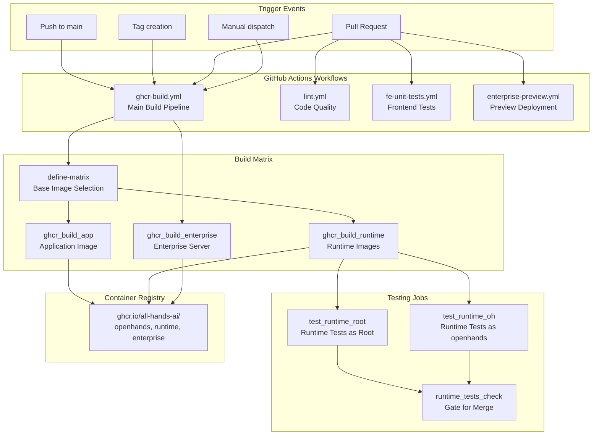
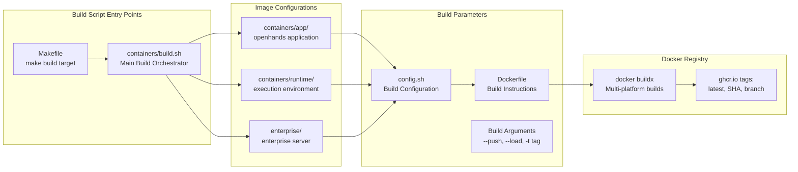
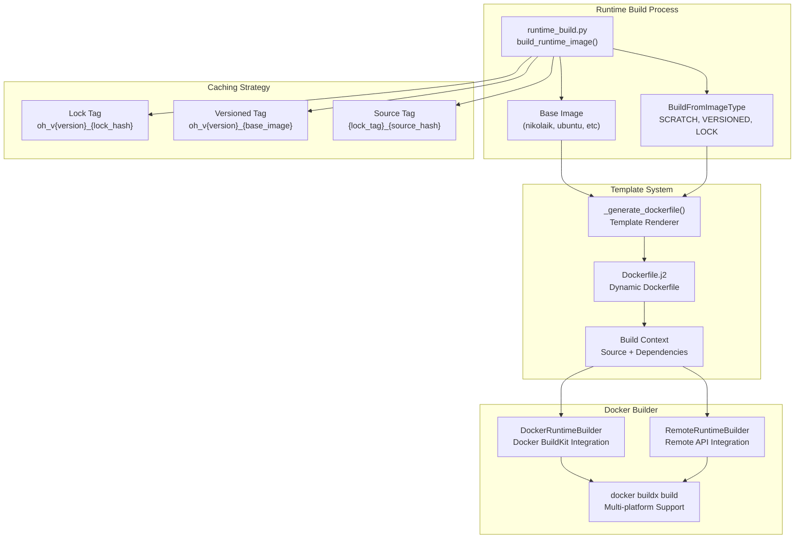
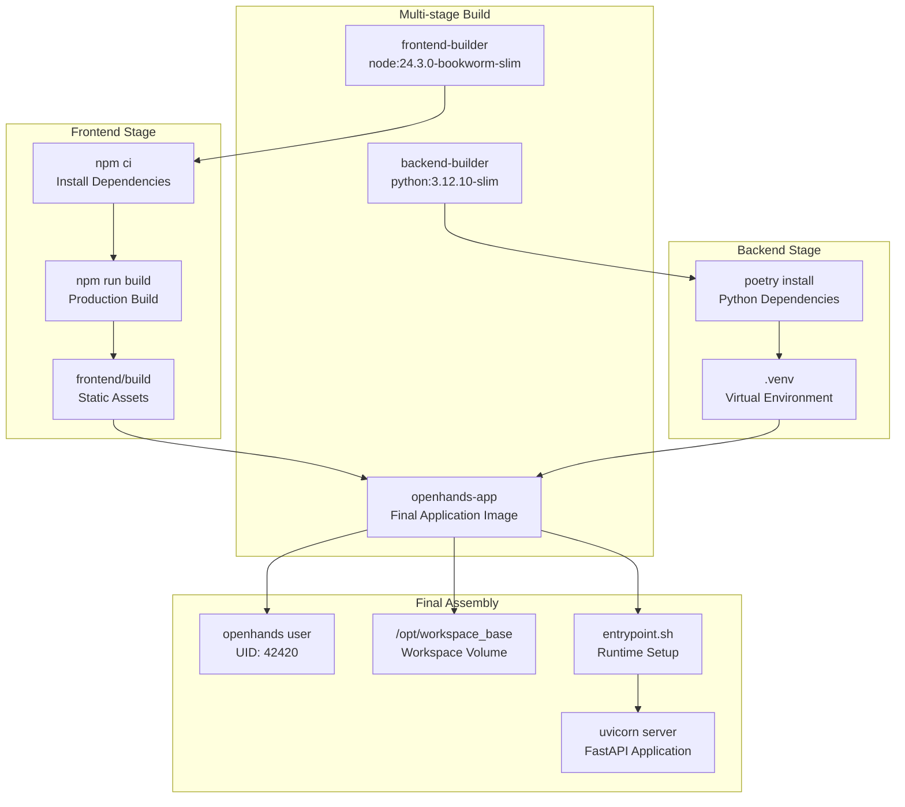
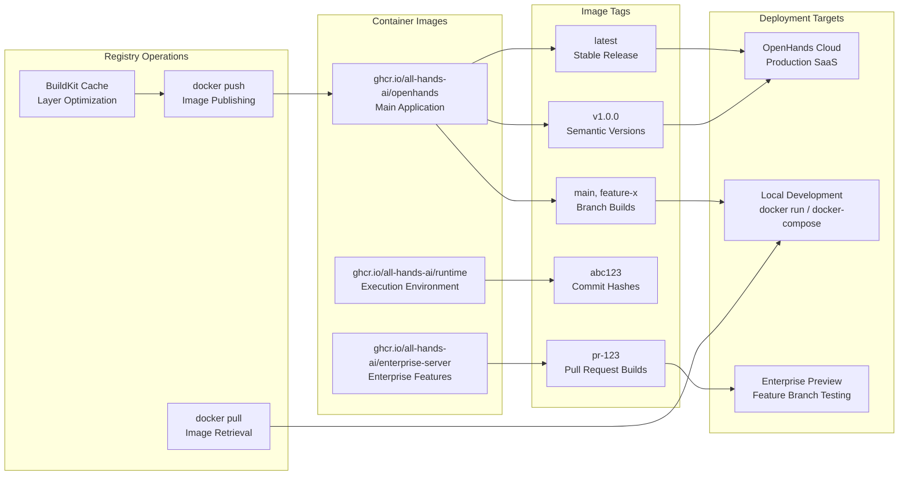

8.2-CI/CD & Deployment

# Page: CI/CD & Deployment

# CI/CD & Deployment

Relevant source files

The following files were used as context for generating this wiki page:

- [.github/workflows/clean-up.yml](.github/workflows/clean-up.yml)
- [.github/workflows/enterprise-preview.yml](.github/workflows/enterprise-preview.yml)
- [.github/workflows/fe-unit-tests.yml](.github/workflows/fe-unit-tests.yml)
- [.github/workflows/ghcr-build.yml](.github/workflows/ghcr-build.yml)
- [.github/workflows/lint-fix.yml](.github/workflows/lint-fix.yml)
- [.github/workflows/lint.yml](.github/workflows/lint.yml)
- [.github/workflows/stale.yml](.github/workflows/stale.yml)
- [Makefile](Makefile)
- [containers/app/Dockerfile](containers/app/Dockerfile)
- [containers/app/entrypoint.sh](containers/app/entrypoint.sh)
- [containers/build.sh](containers/build.sh)
- [openhands/runtime/builder/base.py](openhands/runtime/builder/base.py)
- [openhands/runtime/builder/docker.py](openhands/runtime/builder/docker.py)
- [openhands/runtime/builder/remote.py](openhands/runtime/builder/remote.py)
- [openhands/runtime/utils/request.py](openhands/runtime/utils/request.py)
- [openhands/runtime/utils/runtime_build.py](openhands/runtime/utils/runtime_build.py)
- [openhands/runtime/utils/runtime_templates/Dockerfile.j2](openhands/runtime/utils/runtime_templates/Dockerfile.j2)
- [openhands/utils/term_color.py](openhands/utils/term_color.py)
- [tests/runtime/test_aci_edit.py](tests/runtime/test_aci_edit.py)
- [tests/runtime/test_mcp_action.py](tests/runtime/test_mcp_action.py)

This document covers OpenHands' continuous integration, continuous deployment (CI/CD) pipelines, and deployment processes. It explains how code changes flow from development through testing to production-ready container images, and how these images are deployed across different environments.

For information about local development build processes and dependency management, see [Build System & Dependencies](#8.1).

## CI/CD Pipeline Architecture

OpenHands uses GitHub Actions as its primary CI/CD platform, orchestrating builds, tests, and deployments through several specialized workflows. The main pipeline is triggered on pushes to `main`, tags, pull requests, and manual dispatches.

The pipeline supports concurrent execution with intelligent cancellation - PR-based builds share the same concurrency group but each commit to `main` gets its own group to prevent interference.

**Sources:** [.github/workflows/ghcr-build.yml:1-421](), [.github/workflows/lint.yml:1-88](), [.github/workflows/fe-unit-tests.yml:1-45]()

## Docker Build System

OpenHands builds three primary Docker images through a sophisticated multi-stage build process. The build system uses `containers/build.sh` as the orchestration script, with specialized configuration for each image type.

The build system implements intelligent tagging based on Git context. For version tags (e.g., `1.2.3`), it creates multiple tags including major version (`1`), minor version (`1.2`), and `latest`. Branch builds use sanitized branch names, while commit builds use both short and full SHA hashes.

**Sources:** [containers/build.sh:1-183](), [Makefile:24-32](), [.github/workflows/ghcr-build.yml:83-86]()

## Runtime Image Building System

Runtime images are built dynamically using a sophisticated templating and caching system implemented in the `openhands/runtime/utils/runtime_build.py` module. This system supports building from different base images while maximizing build cache reuse.

The build system uses three levels of caching to optimize build times:
1. **Lock-based caching**: Reuses images with identical `pyproject.toml` and `poetry.lock` files
2. **Version-based caching**: Reuses images with the same OpenHands version and base image
3. **Source-based caching**: The final image incorporating all source code changes

**Sources:** [openhands/runtime/utils/runtime_build.py:108-255](), [openhands/runtime/utils/runtime_templates/Dockerfile.j2:1-373](), [openhands/runtime/builder/docker.py:51-249]()

## Application Container Architecture

The OpenHands application image uses a multi-stage build process optimized for both frontend and backend components, with careful user management and security considerations.

The application container implements flexible user management through `entrypoint.sh`, supporting both root execution (`SANDBOX_USER_ID=0`) and dynamic user creation based on the host user ID. This ensures proper file permissions when mounting host directories.

**Sources:** [containers/app/Dockerfile:1-96](), [containers/app/entrypoint.sh:1-74]()

## Deployment and Registry Management

OpenHands uses GitHub Container Registry (GHCR) as its primary container registry, with sophisticated tagging and caching strategies. The deployment process varies based on the target environment.

The registry implements layer caching through BuildKit, with cache references stored as registry cache manifests. This significantly reduces build times for subsequent builds with similar dependencies.

For enterprise previews, the system automatically triggers deployments when PRs are labeled with `deploy`, creating temporary preview environments using the PR-specific image tags.

**Sources:** [.github/workflows/ghcr-build.yml:126-143](), [.github/workflows/enterprise-preview.yml:1-30](), [containers/build.sh:126-143]()

## Testing Integration in CI/CD

The CI/CD pipeline includes comprehensive testing that validates both the built images and the deployment process. Runtime tests are particularly critical as they verify the execution environment works correctly across different configurations.

| Test Category | Job Name | Purpose | Base Images |
|---------------|----------|---------|-------------|
| Runtime Tests (Root) | `test_runtime_root` | Validate runtime as root user | nikolaik, ubuntu |
| Runtime Tests (User) | `test_runtime_oh` | Validate runtime as openhands user | nikolaik, ubuntu |
| Frontend Tests | `fe-unit-tests` | UI component and logic validation | Node.js 22 |
| Lint Checks | `lint-python`, `lint-frontend` | Code quality enforcement | Python 3.12, Node.js 22 |

The testing process includes automatic retry logic for flaky tests (`--reruns 2 --reruns-delay 5`) and runs tests in parallel using `pytest-xdist`. All runtime tests must pass before PR merge is allowed, enforced by the `runtime_tests_check` gate job.

**Sources:** [.github/workflows/ghcr-build.yml:254-397](), [tests/runtime/test_mcp_action.py:1-369](), [.github/workflows/lint.yml:40-75]()