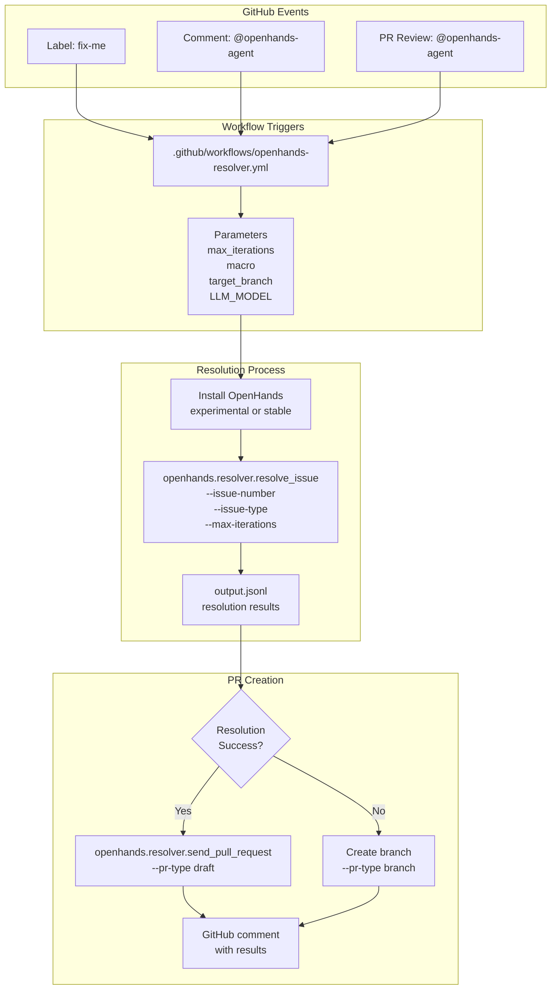
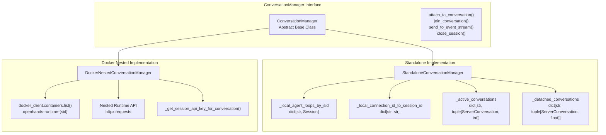
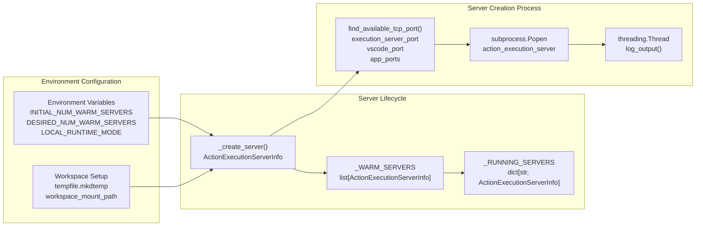
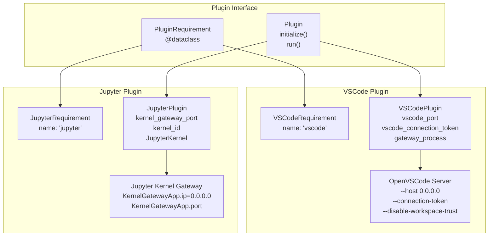
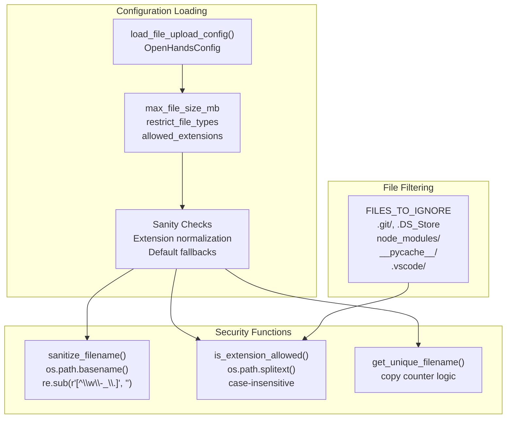
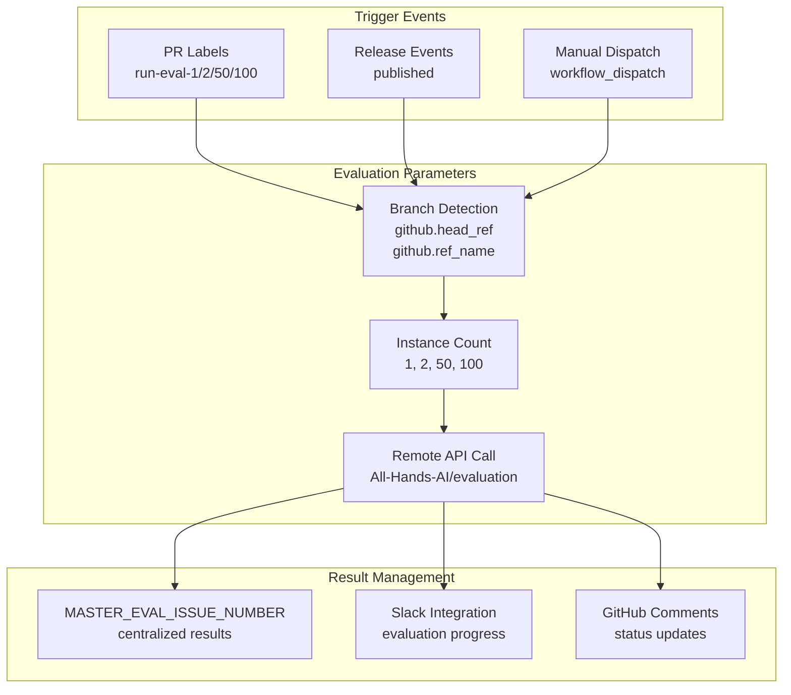

9-Advanced Features

# Page: Advanced Features

# Advanced Features

Relevant source files

The following files were used as context for generating this wiki page:

- [.github/workflows/openhands-resolver.yml](.github/workflows/openhands-resolver.yml)
- [.github/workflows/run-eval.yml](.github/workflows/run-eval.yml)
- [openhands/resolver/examples/openhands-resolver.yml](openhands/resolver/examples/openhands-resolver.yml)
- [openhands/runtime/impl/local/local_runtime.py](openhands/runtime/impl/local/local_runtime.py)
- [openhands/runtime/plugins/jupyter/__init__.py](openhands/runtime/plugins/jupyter/__init__.py)
- [openhands/runtime/plugins/jupyter/execute_server.py](openhands/runtime/plugins/jupyter/execute_server.py)
- [openhands/runtime/plugins/vscode/__init__.py](openhands/runtime/plugins/vscode/__init__.py)
- [openhands/runtime/plugins/vscode/settings.json](openhands/runtime/plugins/vscode/settings.json)
- [openhands/server/conversation_manager/conversation_manager.py](openhands/server/conversation_manager/conversation_manager.py)
- [openhands/server/conversation_manager/docker_nested_conversation_manager.py](openhands/server/conversation_manager/docker_nested_conversation_manager.py)
- [openhands/server/conversation_manager/standalone_conversation_manager.py](openhands/server/conversation_manager/standalone_conversation_manager.py)
- [openhands/server/data_models/feedback.py](openhands/server/data_models/feedback.py)
- [openhands/server/file_config.py](openhands/server/file_config.py)
- [openhands/server/mock/listen.py](openhands/server/mock/listen.py)
- [openhands/server/static.py](openhands/server/static.py)
- [tests/unit/runtime/impl/test_local_runtime.py](tests/unit/runtime/impl/test_local_runtime.py)
- [tests/unit/test_conversation_summary.py](tests/unit/test_conversation_summary.py)

This document covers OpenHands' specialized features that extend beyond basic agent operations and user interactions. These features include automated issue resolution, advanced conversation management patterns, runtime optimization techniques, file security measures, and evaluation integrations.

For core agent functionality, see [Agent System](#3). For basic user interfaces, see [Frontend & User Interfaces](#6). For development workflows, see [Development & Contributing](#8).

## Automated Issue Resolution

OpenHands provides a sophisticated GitHub Actions workflow that automatically resolves issues and pull requests using AI agents. This system can be triggered by labels, comments, or pull request reviews.

**Workflow Configuration**

The resolver accepts multiple configuration parameters through workflow inputs and secrets:

- `max_iterations`: Maximum number of agent iterations (default: 50)
- `macro`: Trigger phrase in comments (default: "@openhands-agent")
- `LLM_MODEL`: Model to use (default: "anthropic/claude-sonnet-4-20250514")
- `base_container_image`: Custom sandbox environment
- `target_branch`: Branch to create PR against (default: "main")

**Trigger Mechanisms**

The system responds to three types of GitHub events:
1. **Label-based**: Issues/PRs labeled with `fix-me` or `fix-me-experimental`
2. **Comment-based**: Comments containing the configured macro from collaborators
3. **Review-based**: PR reviews containing the macro from authorized users

Sources: [.github/workflows/openhands-resolver.yml:1-434]()

## Advanced Conversation Management

OpenHands implements two distinct conversation management strategies depending on deployment requirements.

**Standalone Conversation Manager**

The `StandaloneConversationManager` handles conversations within a single server process. It maintains several key data structures:

- `_local_agent_loops_by_sid`: Maps session IDs to `Session` objects
- `_active_conversations`: Tracks active conversations with reference counts
- `_detached_conversations`: Manages recently disconnected conversations for reuse

Key features include automatic cleanup of stale conversations and branch tracking for Git operations.

**Docker Nested Conversation Manager**  

The `DockerNestedConversationManager` runs each conversation in its own Docker container. This approach provides better isolation but requires container orchestration:

- Each conversation runs in a container named `openhands-runtime-{sid}`
- Communication occurs through HTTP API calls to nested runtimes
- Session API keys provide authentication between parent and nested containers

Sources: [openhands/server/conversation_manager/standalone_conversation_manager.py:53-753](), [openhands/server/conversation_manager/docker_nested_conversation_manager.py:50-618]()

## Runtime System Advanced Features

The local runtime implementation includes sophisticated optimization features for improved performance and resource management.

### Warm Server Pool Management

The `LocalRuntime` maintains pools of pre-initialized servers to reduce connection latency:

**Warm Server Creation**: Background processes create ready-to-use server instances
- `INITIAL_NUM_WARM_SERVERS`: Servers created during setup
- `DESIRED_NUM_WARM_SERVERS`: Target pool size maintained during operation

**Server Reuse Logic**: When connecting to a conversation:
1. Check `_RUNNING_SERVERS` for existing server
2. Pop from `_WARM_SERVERS` if available  
3. Create new server if needed
4. Update workspace paths appropriately

**Resource Management**: Each `ActionExecutionServerInfo` tracks:
- Process handle and port assignments
- Log thread and exit event for cleanup
- Temporary workspace path
- Workspace mount configuration

Sources: [openhands/runtime/impl/local/local_runtime.py:123-568]()

## Plugin System Architecture

OpenHands supports a flexible plugin system for extending runtime capabilities with development tools.

**VSCode Plugin Implementation**

The `VSCodePlugin` provides a web-based development environment:

- Initializes OpenVSCode Server with authentication tokens
- Configures workspace settings through `.vscode/settings.json`
- Supports path-based routing with `--server-base-path` flag
- Handles platform-specific limitations (disabled on Windows)

**Jupyter Plugin Implementation**

The `JupyterPlugin` enables interactive Python execution:

- Launches Jupyter Kernel Gateway on available ports
- Manages `JupyterKernel` instances with WebSocket communication
- Supports structured output with text and image content
- Handles execution timeouts and kernel interruption

**Plugin Lifecycle**: Plugins follow a standard initialization pattern:
1. `initialize()` called with username and runtime context
2. Platform compatibility checks and port allocation
3. Subprocess management for external services
4. Connection verification and service readiness

Sources: [openhands/runtime/plugins/vscode/__init__.py:24-142](), [openhands/runtime/plugins/jupyter/__init__.py:22-173]()

## File Operations & Security

OpenHands implements comprehensive file security measures to prevent malicious uploads and path traversal attacks.

### File Upload Configuration System

**Security Implementations**:

1. **Filename Sanitization**: `sanitize_filename()` removes directory traversal attempts and limits filename length
2. **Extension Validation**: `is_extension_allowed()` enforces whitelist-based file type restrictions  
3. **Unique Naming**: `get_unique_filename()` prevents overwrites with copy counter suffixes
4. **Path Safety**: Automatic filtering of sensitive directories and system files

**Configuration Options**:
- `max_file_size_mb`: Size limit enforcement (0 = unlimited)
- `restrict_file_types`: Enable/disable extension filtering
- `allowed_extensions`: Whitelist of permitted file extensions

Sources: [openhands/server/file_config.py:18-140]()

## Evaluation Integration

OpenHands integrates with external evaluation systems for automated performance testing and benchmarking.

**Evaluation Workflow Features**:

1. **Multi-trigger Support**: PR labels, releases, or manual dispatch
2. **Scalable Testing**: Configurable instance counts (1-100)
3. **Branch Flexibility**: Automatic branch detection based on trigger type
4. **Centralized Results**: Master issue for non-PR evaluations
5. **External Integration**: Remote repository dispatch for evaluation execution

**Trigger Configuration**:
- Label-based: `run-eval-{1,2,50,100}` labels on PRs
- Release-based: Automatic evaluation on published releases
- Manual: Workflow dispatch with custom parameters

Sources: [.github/workflows/run-eval.yml:1-136]()