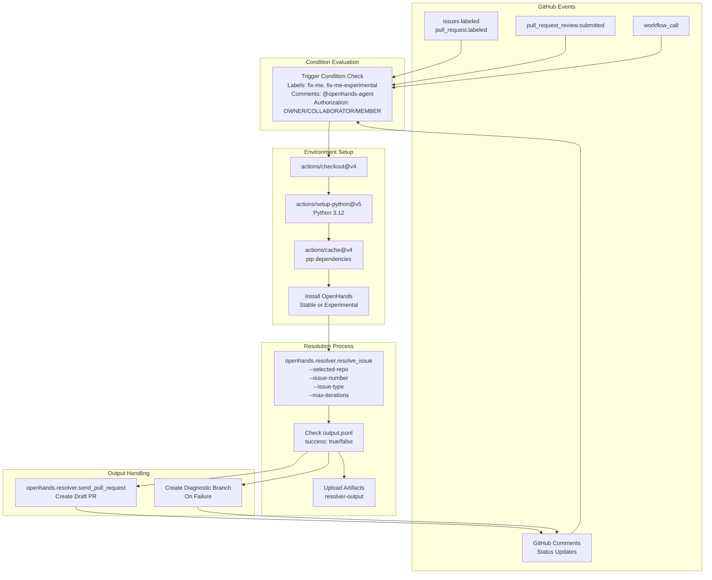
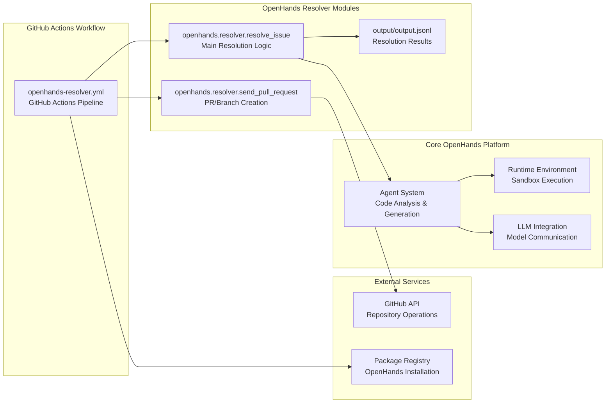

9.1-Automated Issue Resolution

# Page: Automated Issue Resolution

# Automated Issue Resolution

<details>
<summary>Relevant source files</summary>

The following files were used as context for generating this wiki page:

- [.github/workflows/openhands-resolver.yml](.github/workflows/openhands-resolver.yml)
- [.github/workflows/run-eval.yml](.github/workflows/run-eval.yml)
- [openhands/resolver/examples/openhands-resolver.yml](openhands/resolver/examples/openhands-resolver.yml)

</details>


This document describes OpenHands' automated issue resolution system, which uses AI agents to automatically analyze and fix GitHub issues and pull requests. The system operates through GitHub Actions workflows that trigger OpenHands agents to generate code changes and create pull requests with potential fixes.

For information about the core agent system and execution flow, see [Agent System](#3). For details about the evaluation framework used to measure resolver performance, see [Evaluation & Benchmarking](#7.2).

## Overview

The automated issue resolution system allows repository maintainers to leverage OpenHands agents for automated bug fixes and feature implementations. Users can trigger the resolver by applying specific labels to issues/PRs or mentioning the agent in comments. The system runs in isolated sandbox environments and produces either successful pull requests or diagnostic branches with attempted changes.

Sources: [.github/workflows/openhands-resolver.yml:1-434]()

## Trigger Mechanisms

The resolver supports multiple activation methods through GitHub webhook events:

| Trigger Type | Event | Condition |
|--------------|-------|-----------|
| Label-based | `issues.labeled`, `pull_request.labeled` | Label name is `fix-me` or `fix-me-experimental` |
| Comment-based | `issue_comment.created` | Comment contains configurable macro (default: `@openhands-agent`) |
| PR Review | `pull_request_review_comment.created`, `pull_request_review.submitted` | Review contains agent macro |
| Programmatic | `workflow_call` | Direct workflow invocation |

Comment-based triggers require the commenter to have `OWNER`, `COLLABORATOR`, or `MEMBER` association with the repository.

Sources: [.github/workflows/openhands-resolver.yml:53-85]()

## Workflow Architecture

### Main Workflow Structure



Sources: [.github/workflows/openhands-resolver.yml:69-434]()

### Module Integration



Sources: [.github/workflows/openhands-resolver.yml:254-260](), [.github/workflows/openhands-resolver.yml:292-304]()

## Resolution Process

### Issue Analysis Phase

The resolver begins by analyzing the target issue or pull request using the `openhands.resolver.resolve_issue` module with the following parameters:

- `--selected-repo`: Target repository in format `owner/name`
- `--issue-number`: GitHub issue or PR number
- `--issue-type`: Either `issue` or `pr`
- `--max-iterations`: Maximum agent iterations (default: 50)
- `--comment-id`: Optional comment ID for context
- `--is-experimental`: Boolean flag for experimental features

Sources: [.github/workflows/openhands-resolver.yml:254-260]()

### Agent Execution Environment

The resolver configures the OpenHands agent with specific environment variables:

```
GITHUB_TOKEN: Repository access token
GITHUB_USERNAME: Agent username for commits
LLM_MODEL: Language model specification
LLM_API_KEY: Model API credentials
SANDBOX_ENV_GITHUB_TOKEN: Sandbox GitHub access
SANDBOX_BASE_CONTAINER_IMAGE: Custom container image
```

The agent operates within a sandboxed runtime environment with access to repository contents and development tools.

Sources: [.github/workflows/openhands-resolver.yml:244-252]()

### Success Determination

Resolution success is determined by parsing the `output/output.jsonl` file for a JSON object containing `"success":true`. This file contains structured data about the agent's execution including:

- Success/failure status
- Result explanations for failed attempts  
- Generated code changes
- Execution metadata

Sources: [.github/workflows/openhands-resolver.yml:264-269]()

## Output Handling

### Successful Resolutions

When resolution succeeds (`"success":true` in output.jsonl), the system:

1. Executes `openhands.resolver.send_pull_request` with parameters:
   - `--issue-number`: Original issue number
   - `--target-branch`: Base branch for PR (default: `main`)
   - `--pr-type`: Either `draft` or `ready`
   - `--reviewer`: Assigns the triggering user as reviewer

2. Creates a draft pull request with the agent's proposed changes
3. Comments on the original issue linking to the new PR

Sources: [.github/workflows/openhands-resolver.yml:291-297]()

### Failed Resolutions

When resolution fails, the system:

1. Creates a diagnostic branch named after the issue
2. Pushes any partial changes made during the attempt
3. Comments on the original issue with:
   - Link to the diagnostic branch
   - Failure explanation from `output.jsonl`
   - Manual intervention guidance

The diagnostic branch allows maintainers to review the agent's partial progress and continue work manually.

Sources: [.github/workflows/openhands-resolver.yml:298-304](), [.github/workflows/openhands-resolver.yml:401-415]()

### Artifact Preservation

All resolver executions produce artifacts stored for 30 days:

- **resolver-output**: Contains `output.jsonl` with complete execution logs
- Artifacts are uploaded regardless of success/failure for debugging

Sources: [.github/workflows/openhands-resolver.yml:271-277]()

## Configuration Options

### Workflow Inputs

The resolver workflow accepts the following configuration inputs:

| Parameter | Type | Default | Description |
|-----------|------|---------|-------------|
| `max_iterations` | number | 50 | Maximum agent execution cycles |
| `macro` | string | "@openhands-agent" | Comment trigger phrase |
| `target_branch` | string | "main" | Base branch for PRs |
| `pr_type` | string | "draft" | PR creation mode |
| `LLM_MODEL` | string | "anthropic/claude-sonnet-4-20250514" | Language model |
| `LLM_API_VERSION` | string | "" | Model API version |
| `base_container_image` | string | "" | Custom sandbox image |
| `runner` | string | "ubuntu-latest" | GitHub Actions runner |

Sources: [.github/workflows/openhands-resolver.yml:5-41]()

### Secret Management

Required and optional secrets for resolver operation:

| Secret | Required | Purpose |
|--------|----------|---------|
| `LLM_API_KEY` | Yes | Language model authentication |
| `LLM_MODEL` | No | Override model selection |
| `LLM_BASE_URL` | No | Custom model endpoint |
| `PAT_TOKEN` | No | GitHub personal access token |
| `PAT_USERNAME` | No | Custom commit username |

The system falls back to `GITHUB_TOKEN` when `PAT_TOKEN` is unavailable, and uses "openhands-agent" as default username.

Sources: [.github/workflows/openhands-resolver.yml:42-51](), [.github/workflows/openhands-resolver.yml:128-158]()

### Installation Modes

The resolver supports two installation modes based on trigger type:

- **Stable Mode**: Installs latest published version from PyPI
- **Experimental Mode**: Installs from GitHub main branch for cutting-edge features

Experimental mode is triggered by:
- `fix-me-experimental` label
- `@openhands-agent-exp` in comments
- Workflow parameter configuration

Sources: [.github/workflows/openhands-resolver.yml:207-242]()