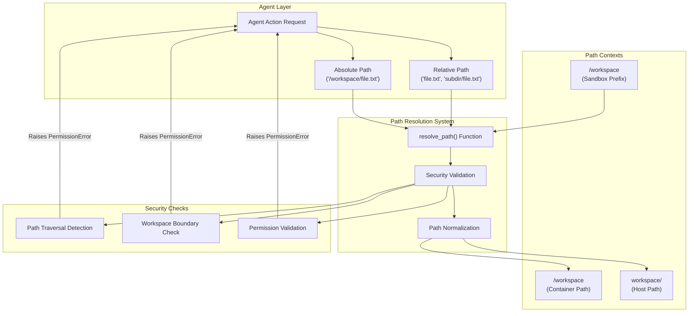
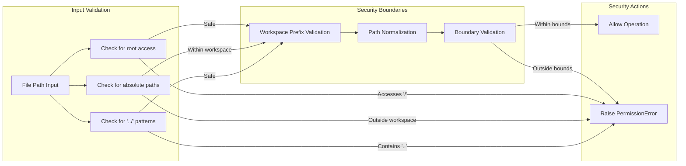
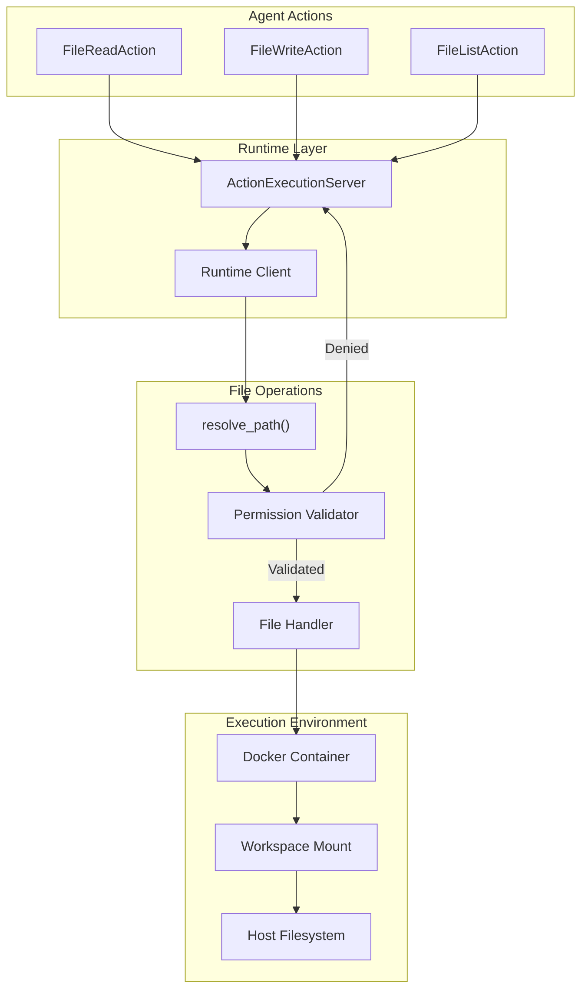

9.2-File Operations & Security

# Page: File Operations & Security

# File Operations & Security

Relevant source files

The following files were used as context for generating this wiki page:

- [tests/test_fileops.py](tests/test_fileops.py)

This document covers how OpenHands handles file system operations securely within sandboxed environments. It explains the path resolution mechanisms, security measures, and how agents safely interact with files while preventing unauthorized access outside their designated workspace.

For information about the broader runtime environment and execution sandboxing, see [Runtime & Execution Environment](#5). For details on how agents perform file-based actions, see [Function Calling & Actions](#3.3).

## Overview

OpenHands operates in sandboxed environments where AI agents need to read, write, and manipulate files safely. The file operations system provides secure path resolution that prevents directory traversal attacks and ensures agents can only access files within their designated workspace boundaries.

The core security model maps between three path contexts:
- **Container paths**: Paths as seen inside the Docker container (e.g., `/workspace/file.txt`)
- **Host paths**: Corresponding paths on the host system (e.g., `workspace/file.txt`)  
- **Sandbox paths**: Virtual paths used by agents for workspace operations

## File Path Resolution Architecture

The path resolution system ensures that all file operations are validated and constrained within the sandbox workspace boundaries.

Sources: [tests/test_fileops.py:1-67]()

## Security Implementation

### Path Traversal Prevention

The `resolve_path` function in `openhands.runtime.utils.files` implements several security measures:

The system prevents common attack vectors:
- **Directory traversal**: Paths containing `../` are rejected
- **Absolute path escape**: Paths outside the workspace root are blocked  
- **Root filesystem access**: Direct access to `/` or system directories is denied

Sources: [tests/test_fileops.py:48-62]()

## Path Resolution Examples

The following table shows how different path inputs are resolved and validated:

| Input Path | Workspace | Expected Result | Security Status |
|------------|-----------|-----------------|------------------|
| `'test.txt'` | `/workspace` | `workspace/test.txt` | ✅ Allowed |
| `'subdir/test.txt'` | `/workspace` | `workspace/subdir/test.txt` | ✅ Allowed |
| `'/workspace/test.txt'` | `/workspace` | `workspace/test.txt` | ✅ Allowed |
| `'../test.txt'` | `/workspace` | N/A | ❌ PermissionError |
| `'/test.txt'` | `/workspace` | N/A | ❌ PermissionError |
| `'/workspace/../test.txt'` | `/workspace` | N/A | ❌ PermissionError |

### Valid Path Resolution

For allowed paths, the resolution process follows these steps:

1. **Input normalization**: Convert relative paths to absolute workspace paths
2. **Path cleaning**: Resolve `..` and `.` components safely within workspace bounds
3. **Boundary validation**: Ensure the resolved path stays within the designated workspace
4. **Host mapping**: Map the container path to the corresponding host filesystem path

Sources: [tests/test_fileops.py:12-47]()

## Integration with Runtime System

File operations flow through the runtime system where each path is validated before any filesystem access occurs. This ensures that even if an agent attempts unauthorized file access, the security layer blocks it at the path resolution stage.

Sources: [tests/test_fileops.py:7-10]()

## Workspace Configuration

The file operations system supports flexible workspace configuration through several parameters:

- **`sandbox_path_prefix`**: The path prefix within the sandbox environment (typically `/workspace`)
- **`container_path`**: The mounted path inside the Docker container  
- **`host_path`**: The corresponding directory on the host system
- **`workspace_subdir`**: Optional subdirectory within the workspace for additional isolation

This configuration allows OpenHands to operate in various deployment scenarios while maintaining consistent security boundaries.

Sources: [tests/test_fileops.py:7-10](), [tests/test_fileops.py:64-66]()