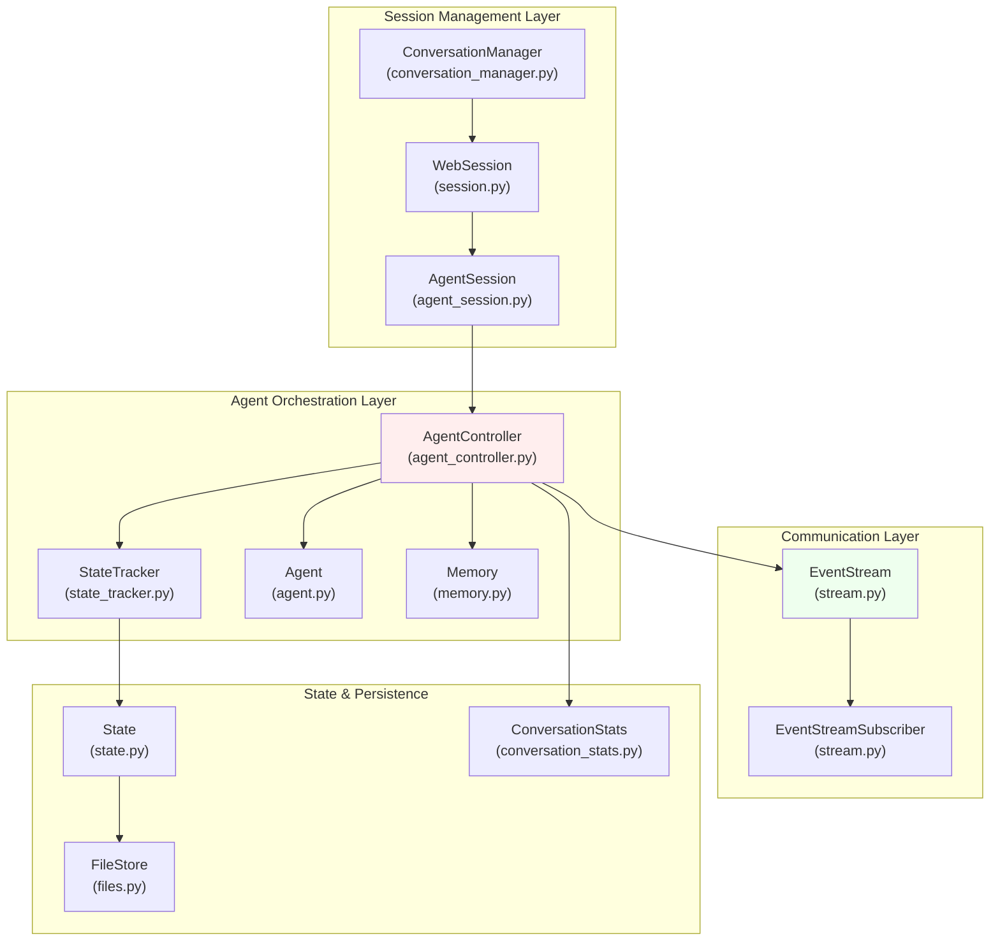
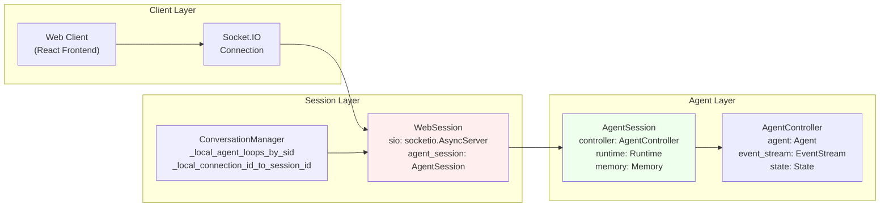
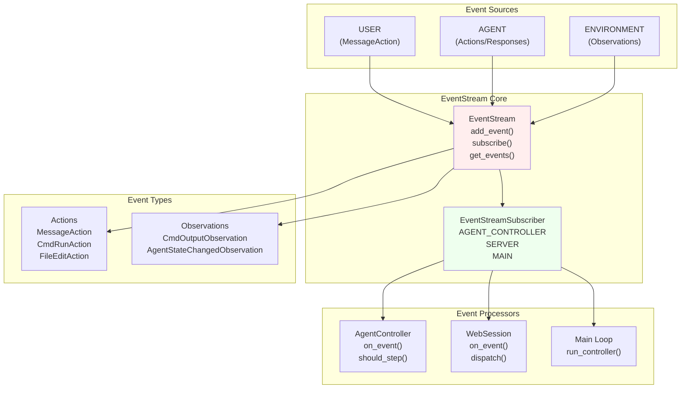
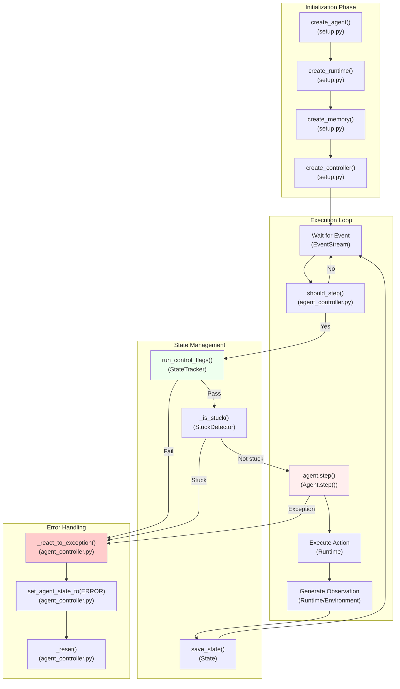
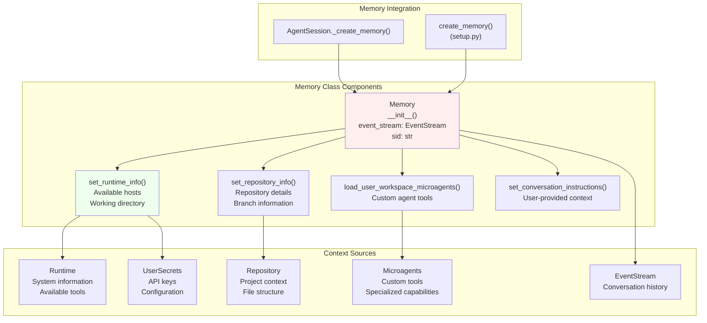
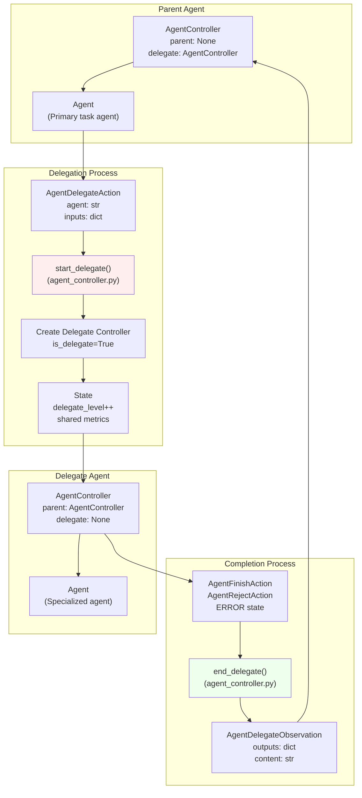

3-Agent System

# Page: Agent System

# Agent System

Relevant source files

The following files were used as context for generating this wiki page:

- [openhands/controller/agent_controller.py](openhands/controller/agent_controller.py)
- [openhands/core/main.py](openhands/core/main.py)
- [openhands/core/setup.py](openhands/core/setup.py)
- [openhands/memory/view.py](openhands/memory/view.py)
- [openhands/runtime/impl/local/local_runtime.py](openhands/runtime/impl/local/local_runtime.py)
- [openhands/runtime/plugins/jupyter/__init__.py](openhands/runtime/plugins/jupyter/__init__.py)
- [openhands/runtime/plugins/jupyter/execute_server.py](openhands/runtime/plugins/jupyter/execute_server.py)
- [openhands/runtime/plugins/vscode/__init__.py](openhands/runtime/plugins/vscode/__init__.py)
- [openhands/runtime/plugins/vscode/settings.json](openhands/runtime/plugins/vscode/settings.json)
- [openhands/server/conversation_manager/conversation_manager.py](openhands/server/conversation_manager/conversation_manager.py)
- [openhands/server/conversation_manager/docker_nested_conversation_manager.py](openhands/server/conversation_manager/docker_nested_conversation_manager.py)
- [openhands/server/conversation_manager/standalone_conversation_manager.py](openhands/server/conversation_manager/standalone_conversation_manager.py)
- [openhands/server/data_models/feedback.py](openhands/server/data_models/feedback.py)
- [openhands/server/file_config.py](openhands/server/file_config.py)
- [openhands/server/mock/listen.py](openhands/server/mock/listen.py)
- [openhands/server/routes/manage_conversations.py](openhands/server/routes/manage_conversations.py)
- [openhands/server/session/agent_session.py](openhands/server/session/agent_session.py)
- [openhands/server/session/session.py](openhands/server/session/session.py)
- [openhands/server/static.py](openhands/server/static.py)
- [openhands/utils/http_session.py](openhands/utils/http_session.py)
- [tests/unit/runtime/impl/test_local_runtime.py](tests/unit/runtime/impl/test_local_runtime.py)
- [tests/unit/test_conversation_summary.py](tests/unit/test_conversation_summary.py)

The Agent System is the core orchestration layer of OpenHands that manages AI agent execution, state, and lifecycle. It provides the foundational infrastructure for running LLM-powered agents in sandboxed environments while maintaining conversation context and handling multi-agent coordination.

This document covers the agent orchestration engine, session management, and event-driven communication patterns. For runtime execution environments, see [Runtime & Execution Environment](#5). For LLM integration details, see [LLM Integration](#4). For user interface components, see [Frontend & User Interfaces](#6).

## Architecture Overview

The Agent System follows an event-driven architecture where agents react to user inputs and environmental observations through a centralized event stream. The system supports both single-agent workflows and multi-agent delegation patterns.

### Core Components Architecture

Sources: [openhands/controller/agent_controller.py:100-200](), [openhands/server/session/session.py:40-75](), [openhands/server/session/agent_session.py:42-88](), [openhands/server/conversation_manager/conversation_manager.py:20-50]()

## Agent Controller & State Management

The `AgentController` class serves as the central orchestrator for agent execution. It manages the agent lifecycle, handles event processing, and maintains conversation state across sessions.

### AgentController Core Components

```mermaid
graph TD
    subgraph "AgentController Class"
        controller_init["__init__()<br/>Initialize controller"]
        step_method["step()<br/>Execute agent step"]
        on_event["on_event()<br/>Handle incoming events"]
        set_agent_state["set_agent_state_to()<br/>Update agent state"]
        handle_action["_handle_action()<br/>Process agent actions"]
        handle_observation["_handle_observation()<br/>Process observations"]
    end
    
    subgraph "State Management"
        State_restore["State.restore_from_session()"]
        state_save["state.save_to_session()"]
        StateTracker_class["StateTracker<br/>run_control_flags()"]
        StuckDetector["StuckDetector<br/>_is_stuck()"]
    end
    
    subgraph "Event Processing"
        should_step["should_step()<br/>Determine if agent should act"]
        react_to_exception["_react_to_exception()<br/>Handle errors"]
        reset_method["_reset()<br/>Reset agent state"]
    end
    
    controller_init --> State_restore
    step_method --> should_step
    on_event --> handle_action
    on_event --> handle_observation
    step_method --> StateTracker_class
    step_method --> StuckDetector
    set_agent_state --> state_save
    step_method --> react_to_exception
    set_agent_state --> reset_method
    
    style step_method fill:#ffeeee
    style on_event fill:#eeffee
    style State_restore fill:#eeeeff
```

Sources: [openhands/controller/agent_controller.py:100-200](), [openhands/controller/agent_controller.py:358-390](), [openhands/controller/agent_controller.py:433-493](), [openhands/controller/state/state_tracker.py]()

### Agent State Lifecycle

The system manages agent states through the `AgentState` enum, transitioning between states based on events and conditions:

| State | Description | Triggers |
|-------|-------------|----------|
| `LOADING` | Agent initialization | Session startup |
| `AWAITING_USER_INPUT` | Waiting for user message | Agent requests input |
| `RUNNING` | Actively processing | User message received |
| `USER_CONFIRMED` | Action confirmed | User approval in confirmation mode |
| `USER_REJECTED` | Action rejected | User rejection in confirmation mode |
| `FINISHED` | Task completed | `AgentFinishAction` |
| `STOPPED` | Manual stop | User interruption |
| `ERROR` | Error occurred | Exception handling |

Sources: [openhands/controller/agent_controller.py:631-683](), [openhands/core/schema/agent.py]()

## Session Management

Session management handles the coordination between web clients, agent execution, and conversation persistence through a three-tier architecture.

### Session Architecture Flow

Sources: [openhands/server/session/session.py:74-112](), [openhands/server/session/agent_session.py:64-88](), [openhands/server/conversation_manager/standalone_conversation_manager.py:53-77]()

### Session Initialization Process

The session initialization follows a specific sequence to set up the complete agent environment:

1. **WebSession Creation**: Socket.IO connection established
2. **Agent Configuration**: LLM config and agent type selection  
3. **Runtime Initialization**: Sandbox environment setup
4. **Memory Creation**: Context and microagent loading
5. **Controller Setup**: Agent controller with state restoration
6. **Event Stream Activation**: Begin event processing

Sources: [openhands/server/session/session.py:132-305](), [openhands/server/session/agent_session.py:90-223]()

## Event-Driven Communication

The system uses an event-driven architecture where all communication flows through the `EventStream` class, enabling loose coupling between components.

### Event Flow Architecture

Sources: [openhands/events/stream.py](), [openhands/controller/agent_controller.py:433-493](), [openhands/server/session/session.py:311-352](), [openhands/events/action/__init__.py](), [openhands/events/observation/__init__.py]()

### Event Processing Pipeline

Each event follows a consistent processing pipeline:

1. **Event Addition**: Added to `EventStream` with source attribution
2. **Subscriber Notification**: All registered subscribers receive event
3. **Filtering**: Each subscriber applies `should_step()` logic
4. **Processing**: Relevant subscribers process the event
5. **State Updates**: Agent state and conversation state updated
6. **Response Generation**: New events may be generated as responses

Sources: [openhands/controller/agent_controller.py:392-431](), [openhands/controller/agent_controller.py:467-493]()

## Agent Lifecycle Management

The agent lifecycle encompasses initialization, execution, error handling, and cleanup phases, with support for session restoration and state persistence.

### Agent Execution Loop

Sources: [openhands/core/setup.py:202-243](), [openhands/controller/agent_controller.py:821-887](), [openhands/controller/agent_controller.py:302-391](), [openhands/controller/stuck.py]()

## Memory & Context Management

The `Memory` class provides context management for agents, including conversation history, repository information, runtime details, and microagent integration.

### Memory Architecture

Sources: [openhands/memory/memory.py](), [openhands/server/session/agent_session.py:448-481](), [openhands/core/setup.py:157-199]()

## Multi-Agent Coordination

OpenHands supports multi-agent workflows through a delegation system where parent agents can spawn child agents for specialized tasks.

### Delegation Architecture

Sources: [openhands/controller/agent_controller.py:693-753](), [openhands/controller/agent_controller.py:754-820](), [openhands/events/action/agent.py](), [openhands/events/observation/agent.py]()

### Delegation State Management

The delegation system maintains shared state across parent and child agents:

- **Iteration Counter**: Shared across all agents to enforce global limits
- **Budget Tracking**: Global budget accumulation across delegation chain  
- **Metrics Collection**: Consolidated metrics from all agents
- **Event Stream**: Single event stream shared between parent and delegates
- **State Isolation**: Each agent maintains independent conversation state

Sources: [openhands/controller/agent_controller.py:717-752](), [openhands/controller/state/state.py]()