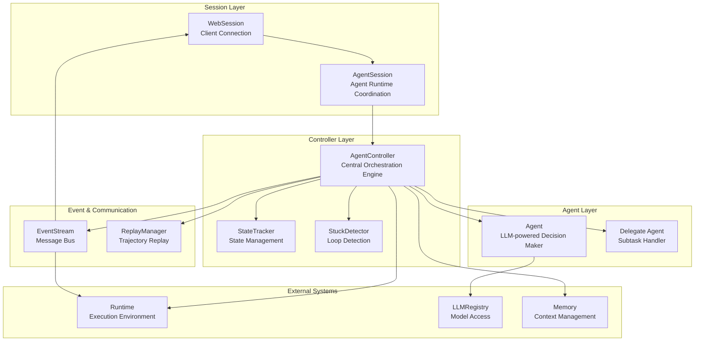
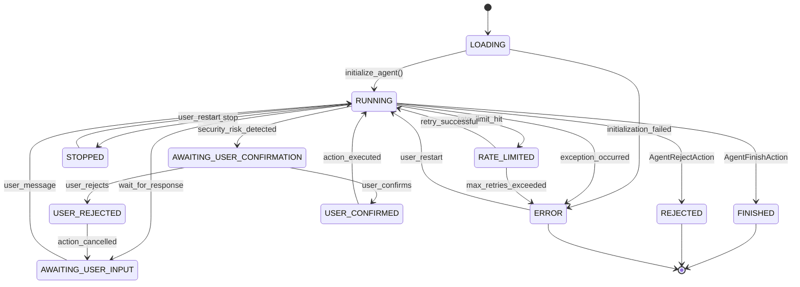
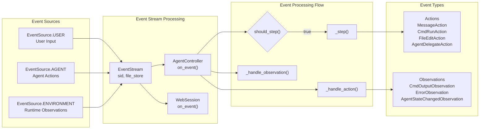
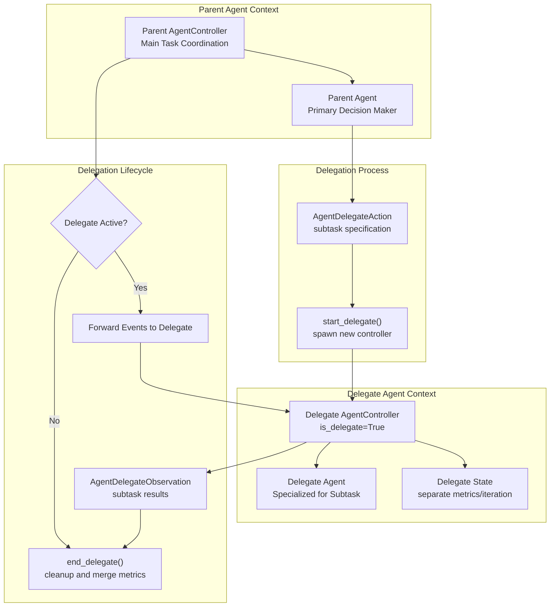
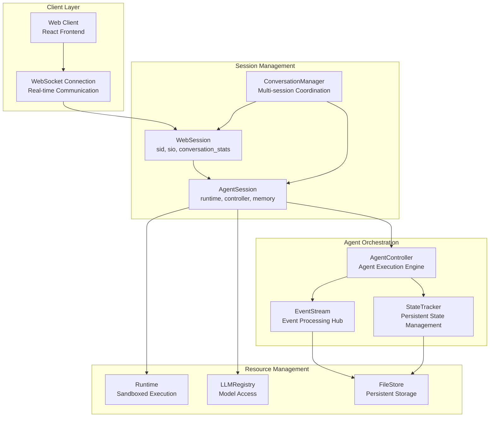
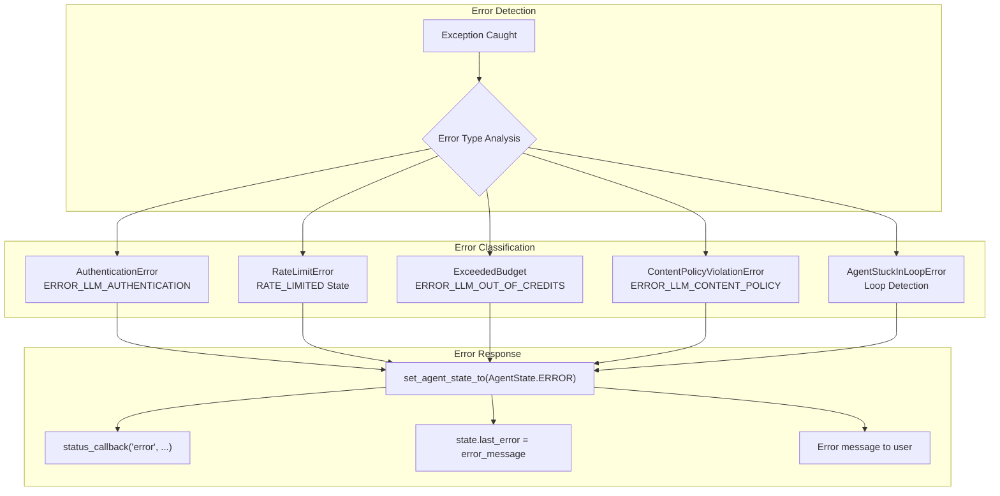

3.1-Agent Controller & Orchestration

# Page: Agent Controller & Orchestration

# Agent Controller & Orchestration

<details>
<summary>Relevant source files</summary>

The following files were used as context for generating this wiki page:

- [openhands/controller/agent_controller.py](openhands/controller/agent_controller.py)
- [openhands/core/main.py](openhands/core/main.py)
- [openhands/core/setup.py](openhands/core/setup.py)
- [openhands/memory/view.py](openhands/memory/view.py)
- [openhands/server/routes/manage_conversations.py](openhands/server/routes/manage_conversations.py)
- [openhands/server/session/agent_session.py](openhands/server/session/agent_session.py)
- [openhands/server/session/session.py](openhands/server/session/session.py)
- [openhands/utils/http_session.py](openhands/utils/http_session.py)

</details>


This document covers the core orchestration system that manages agent execution, lifecycle, and coordination within OpenHands. The Agent Controller serves as the central decision engine that processes events, manages agent state transitions, coordinates between multiple agents through delegation, and integrates with runtime environments and LLM services.

For information about the runtime execution environment, see [Runtime & Execution Environment](#5). For details about LLM integration and configuration, see [LLM Integration](#4). For memory and prompt management, see [Memory & Prompt Management](#3.2).

## Core Architecture

The orchestration system is built around several key components that work together to manage agent execution:



**Agent Controller Orchestration Flow**

Sources: [openhands/controller/agent_controller.py:100-200](), [openhands/server/session/agent_session.py:42-90](), [openhands/server/session/session.py:40-112]()

The `AgentController` class serves as the central orchestration engine, managing the complete lifecycle of agent execution. It coordinates between the agent's decision-making process, the runtime environment, and the user interface through an event-driven architecture.

## Agent Controller Lifecycle

The agent controller follows a well-defined lifecycle with clear state transitions and event processing:



**Agent State Transition Diagram**

Sources: [openhands/controller/agent_controller.py:631-683](), [openhands/core/schema.py]()

### State Management Implementation

The `StateTracker` and controller work together to manage agent state transitions:

| State | Description | Triggers | Next States |
|-------|-------------|----------|-------------|
| `LOADING` | Agent initializing | Session start | `RUNNING`, `ERROR` |
| `RUNNING` | Agent actively processing | User message, observation | `AWAITING_USER_INPUT`, `STOPPED`, `ERROR`, `FINISHED` |
| `AWAITING_USER_INPUT` | Waiting for user response | Agent requests input | `RUNNING` |
| `AWAITING_USER_CONFIRMATION` | Security confirmation needed | High-risk action detected | `USER_CONFIRMED`, `USER_REJECTED` |
| `STOPPED` | Agent halted by user | Stop button pressed | `RUNNING` |
| `ERROR` | Error state | Exception occurred | `RUNNING` |
| `FINISHED` | Task completed successfully | `AgentFinishAction` | Terminal |
| `REJECTED` | Task rejected by agent | `AgentRejectAction` | Terminal |

Sources: [openhands/controller/agent_controller.py:631-683](), [openhands/controller/state/state_tracker.py]()

## Event Orchestration

The event orchestration system processes all communication between components through a centralized event stream:



**Event Processing Architecture**

Sources: [openhands/controller/agent_controller.py:433-493](), [openhands/events/](), [openhands/server/session/session.py:311-352]()

### Event Processing Logic

The controller implements sophisticated event processing logic in the `should_step()` method:

```python
# Key decision logic for when agent should take a step
def should_step(self, event: Event) -> bool:
    if self.delegate is not None:
        return False  # Delegate is active
    
    if isinstance(event, MessageAction) and event.source == EventSource.USER:
        return True  # User message triggers step
    
    if isinstance(event, Observation) and not isinstance(event, NullObservation):
        return True  # Environment feedback triggers step
```

Sources: [openhands/controller/agent_controller.py:392-431]()

## Agent Delegation System

OpenHands supports a multi-agent architecture where agents can delegate subtasks to specialized agents:



**Agent Delegation Architecture**

Sources: [openhands/controller/agent_controller.py:693-819](), [openhands/controller/agent_controller.py:439-462]()

### Delegation Implementation Details

The delegation system maintains separate execution contexts while sharing global resources:

| Component | Parent | Delegate | Notes |
|-----------|---------|----------|-------|
| `event_stream` | Subscriber | Non-subscriber | Delegate doesn't directly subscribe |
| `metrics` | Shared reference | Shared reference | Global accumulation |
| `iteration_flag` | Parent counter | Delegate counter | Merged on completion |
| `state` | Parent state | Isolated state | Separate delegate_level |
| `sid` | Original | `{parent_sid}-delegate` | Unique identifier |

Sources: [openhands/controller/agent_controller.py:717-752]()

## Session Management Integration

The orchestration system integrates with session management layers to provide scalable multi-user support:



**Session Management Integration**

Sources: [openhands/server/session/session.py:40-130](), [openhands/server/session/agent_session.py:42-106](), [openhands/server/shared.py]()

### Session Lifecycle Coordination

The session management system coordinates the complete lifecycle from client connection to resource cleanup:

1. **Session Creation**: `WebSession` created on client connection with unique `sid`
2. **Agent Initialization**: `AgentSession.start()` creates controller, runtime, memory
3. **Event Processing**: Events flow through `EventStream` to `AgentController`
4. **Resource Management**: Runtime containers, LLM connections managed per session
5. **Session Cleanup**: `close()` methods ensure proper resource deallocation

Sources: [openhands/server/session/agent_session.py:90-223](), [openhands/server/session/session.py:119-130]()

## Integration Points

The Agent Controller integrates with multiple system components through well-defined interfaces:

### Runtime Integration
- **Security Analysis**: Integration with `SecurityAnalyzer` for action risk assessment
- **Action Execution**: Direct communication with runtime for command execution
- **Status Callbacks**: Runtime status updates propagated through controller

Sources: [openhands/controller/agent_controller.py:204-243](), [openhands/controller/agent_controller.py:443]()

### LLM Integration
- **Registry Access**: Controller accesses LLM services through `LLMRegistry`
- **Error Handling**: Comprehensive LLM error handling with state transitions
- **Budget Management**: LLM usage tracking and budget enforcement

Sources: [openhands/controller/agent_controller.py:302-390](), [openhands/controller/state/state_tracker.py]()

### Memory Integration
- **Context Management**: Memory system provides conversation context to agents
- **Microagent Loading**: Integration with workspace-specific microagents
- **Repository Information**: Git repository context and branch management

Sources: [openhands/server/session/agent_session.py:448-481](), [openhands/memory/memory.py]()

### Error Handling and Recovery

The controller implements comprehensive error handling with automatic recovery mechanisms:



**Error Handling and Recovery System**

Sources: [openhands/controller/agent_controller.py:302-390](), [openhands/controller/agent_controller.py:849-860](), [openhands/controller/stuck.py]()