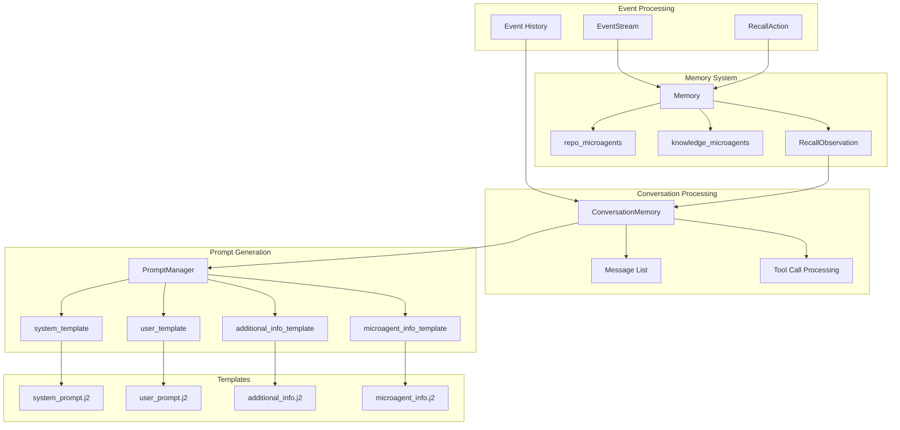
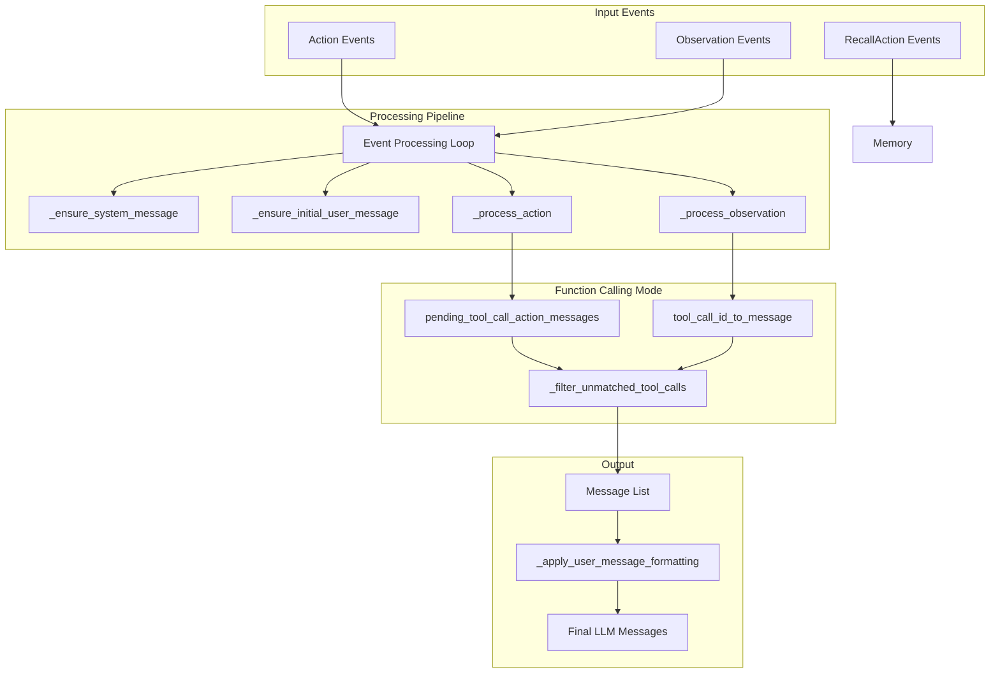
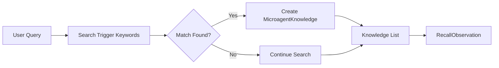
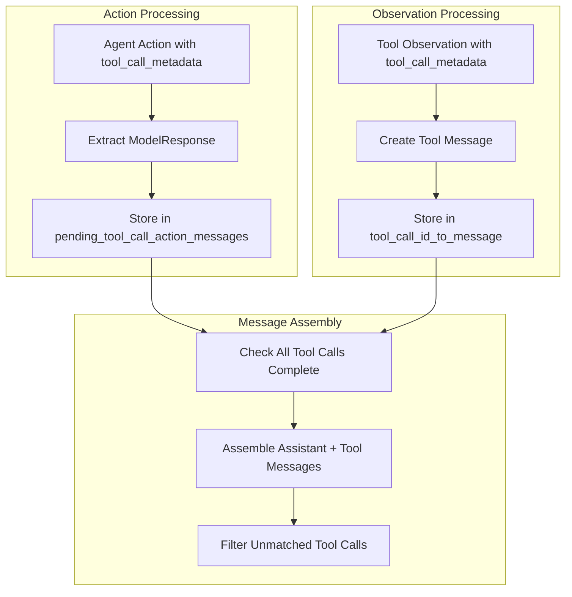

3.2-Memory & Prompt Management

# Page: Memory & Prompt Management

# Memory & Prompt Management

<details>
<summary>Relevant source files</summary>

The following files were used as context for generating this wiki page:

- [openhands/agenthub/codeact_agent/prompts/additional_info.j2](openhands/agenthub/codeact_agent/prompts/additional_info.j2)
- [openhands/events/observation/agent.py](openhands/events/observation/agent.py)
- [openhands/memory/conversation_memory.py](openhands/memory/conversation_memory.py)
- [openhands/memory/memory.py](openhands/memory/memory.py)
- [openhands/utils/prompt.py](openhands/utils/prompt.py)

</details>


This document covers OpenHands' memory and prompt management systems, which handle conversation context, prompt templating, and knowledge retrieval. The system converts event streams into structured conversations for LLMs while managing workspace context through microagents and templates.

For information about agent orchestration and lifecycle management, see [Agent Controller & Orchestration](#3.1). For details about LLM configuration and provider integration, see [LLM Integration](#4).

## System Overview

The memory and prompt management system consists of three primary components that work together to maintain conversation context and generate appropriate prompts for LLMs:

- **Memory** - Event stream listener that handles knowledge retrieval and microagent management
- **ConversationMemory** - Processes event history into structured LLM messages
- **PromptManager** - Template engine for generating system and user prompts

### Memory & Prompt System Architecture



Sources: [openhands/memory/memory.py:41-388](), [openhands/memory/conversation_memory.py:55-861](), [openhands/utils/prompt.py:43-152]()

## Core Components

### Memory Class

The `Memory` class serves as the central hub for knowledge retrieval and microagent management. It subscribes to the event stream and processes `RecallAction` events to provide contextual information.

| Component | Purpose | Location |
|-----------|---------|----------|
| `repo_microagents` | Repository-specific guidance and instructions | [openhands/memory/memory.py:71]() |
| `knowledge_microagents` | Keyword-triggered knowledge base | [openhands/memory/memory.py:72]() |
| `repository_info` | Git repository context (name, directory, branch) | [openhands/memory/memory.py:75]() |
| `runtime_info` | Environment details (hosts, ports, date) | [openhands/memory/memory.py:76]() |
| `conversation_instructions` | Task-specific guidance | [openhands/memory/memory.py:77]() |

### ConversationMemory Class

The `ConversationMemory` class processes event history into structured `Message` objects that LLMs can understand. It handles both traditional text-based interactions and function calling modes.

Key methods:
- `process_events()` - Main entry point for converting events to messages
- `_process_action()` - Converts Action events to assistant messages
- `_process_observation()` - Converts Observation events to user/tool messages
- `apply_prompt_caching()` - Optimizes prompt caching for Anthropic models

### PromptManager Class

The `PromptManager` uses Jinja2 templates to generate prompts with dynamic content injection. It loads templates from the agent's prompt directory and provides methods for building different prompt components.

Sources: [openhands/memory/memory.py:41-88](), [openhands/memory/conversation_memory.py:55-74](), [openhands/utils/prompt.py:43-70]()

## Event Processing Flow

The system processes events through a structured pipeline that converts raw events into LLM-compatible messages:

### Event to Message Conversion Flow



The processing handles different event types with specific logic:

| Event Type | Processing Method | Output |
|------------|-------------------|---------|
| `MessageAction` | `_process_action()` | User/assistant messages with text/image content |
| `CmdRunAction` | `_process_action()` | Tool calls (function mode) or user messages |
| `CmdOutputObservation` | `_process_observation()` | Tool responses (function mode) or user messages |
| `RecallAction` | Memory system | `RecallObservation` with context/knowledge |

Sources: [openhands/memory/conversation_memory.py:74-164](), [openhands/memory/conversation_memory.py:183-342](), [openhands/memory/conversation_memory.py:344-681]()

## Microagent System

Microagents provide contextual knowledge and instructions that are automatically triggered based on user queries or workspace context. The system supports two types of microagents:

### Microagent Types and Loading

| Type | Purpose | Storage | Loading Method |
|------|---------|---------|----------------|
| `KnowledgeMicroagent` | Keyword-triggered knowledge base | `knowledge_microagents` dict | `_load_global_microagents()` |
| `RepoMicroagent` | Repository-specific instructions | `repo_microagents` dict | `load_user_workspace_microagents()` |

Microagents are loaded from multiple sources:
- Global microagents: `OpenHands/microagents/` directory
- User microagents: `~/.openhands/microagents/` directory  
- Workspace microagents: Loaded dynamically from cloned repositories

### Knowledge Retrieval Process

The `_find_microagent_knowledge()` method searches for matching microagents:



Sources: [openhands/memory/memory.py:225-252](), [openhands/memory/memory.py:254-278](), [openhands/memory/memory.py:280-301]()

## Prompt Template System

The prompt system uses Jinja2 templates to generate dynamic prompts with contextual information injected at runtime.

### Template Structure

| Template | Purpose | Context Variables |
|----------|---------|-------------------|
| `system_prompt.j2` | Base system instructions | Agent config, CLI mode |
| `user_prompt.j2` | Example user message | Task demonstrations |
| `additional_info.j2` | Workspace context | Repository, runtime, conversation info |
| `microagent_info.j2` | Triggered microagent knowledge | Microagent knowledge list |

### Context Building Process

The `PromptManager` builds context through specialized methods:

- `build_workspace_context()` - Combines repository, runtime, and conversation information
- `build_microagent_info()` - Formats triggered microagent knowledge
- `get_system_message()` - Generates complete system prompt
- `add_turns_left_reminder()` - Adds turn count reminders for finite conversations

### Workspace Context Template

The `additional_info.j2` template structures workspace information:

```jinja2

<REPOSITORY_INFO>
At the user's request, repository {{ repository_info.repo_name }} has been cloned to {{ repository_info.repo_directory }}

The repository has been checked out to branch "{{ repository_info.branch_name }}"

</REPOSITORY_INFO>

```

Sources: [openhands/utils/prompt.py:89-94](), [openhands/utils/prompt.py:107-134](), [openhands/agenthub/codeact_agent/prompts/additional_info.j2:1-54]()

## Tool Calling & Function Calling Mode

The system supports both traditional text-based interactions and structured function calling through tool metadata.

### Function Calling Pipeline



The system maintains two key mappings during function calling:
- `pending_tool_call_action_messages` - Maps response IDs to assistant messages with tool calls
- `tool_call_id_to_message` - Maps tool call IDs to their corresponding tool response messages

### Tool Call Validation

The `_filter_unmatched_tool_calls()` method ensures message consistency:
- Removes tool messages without matching assistant tool calls
- Removes assistant tool calls without matching tool responses
- Preserves message ordering and relationships

Sources: [openhands/memory/conversation_memory.py:105-156](), [openhands/memory/conversation_memory.py:669-680](), [openhands/memory/conversation_memory.py:746-799]()

## Context Management

The system manages multiple layers of context that provide agents with comprehensive workspace understanding:

### Context Information Types

| Context Type | Source | Content |
|--------------|--------|---------|
| Repository Context | Git operations | Repo name, directory, branch, instructions |
| Runtime Context | Sandbox environment | Available hosts, ports, working directory, date |
| Conversation Context | User/system instructions | Task-specific guidance and constraints |
| Microagent Context | Knowledge base | Triggered expertise and recommendations |

### Context Injection Process

Context is injected into conversations through `RecallObservation` events:

1. **Workspace Context Recall** - Triggered on first user message
2. **Knowledge Recall** - Triggered by keyword matching in user/agent messages  
3. **Template Rendering** - Context formatted through Jinja2 templates
4. **Message Integration** - Context added as user messages in conversation

### Vision and Image Handling

The system supports multimodal interactions with special handling for images:
- `ImageContent` objects for image URLs
- Vision-aware content filtering and validation
- Browser screenshot and Set-of-Marks integration
- Base64 image cleanup in IPython outputs

Sources: [openhands/memory/memory.py:139-224](), [openhands/memory/conversation_memory.py:527-680](), [openhands/events/observation/agent.py:62-139]()