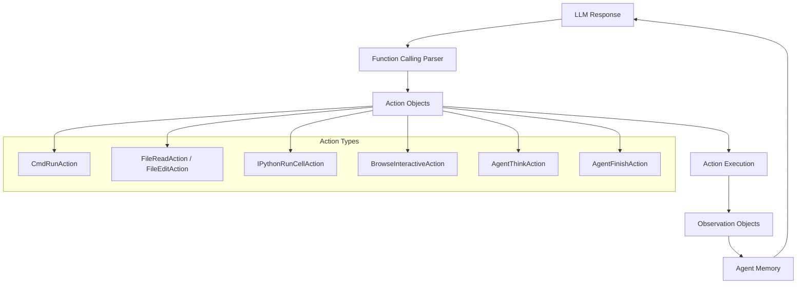
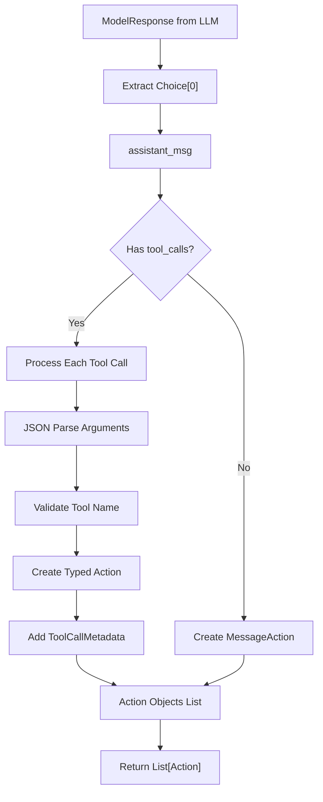
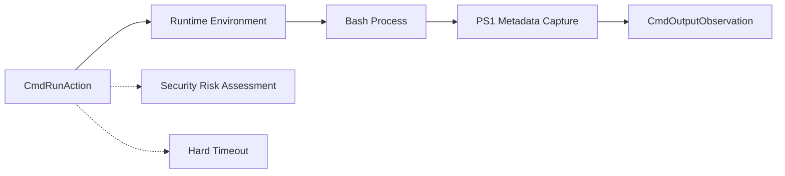
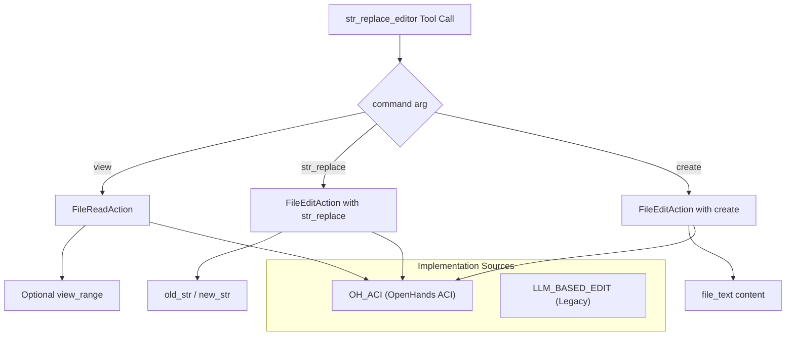
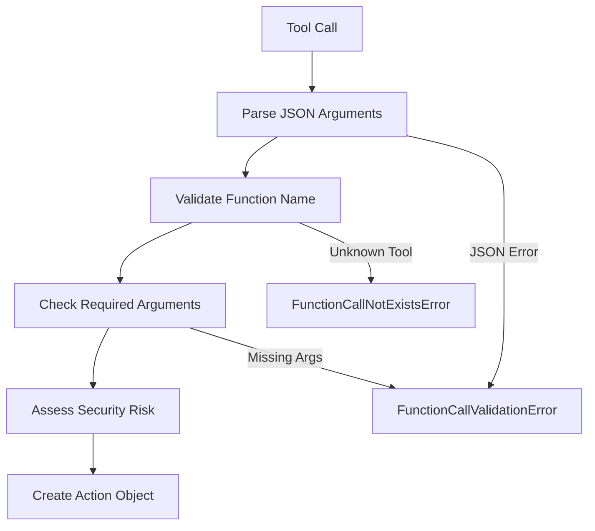
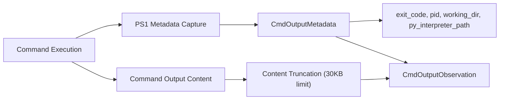
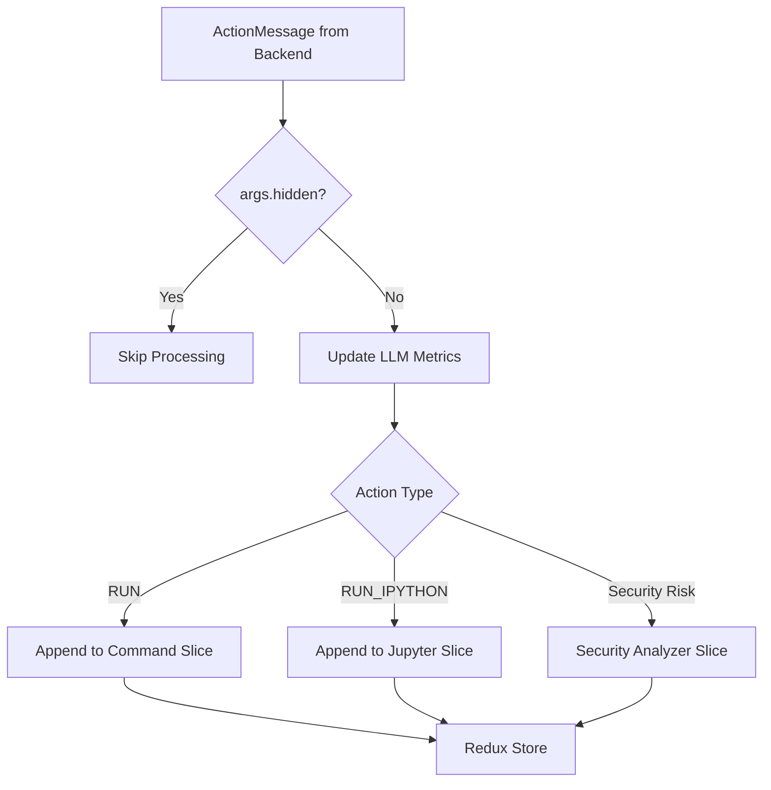

3.3-Function Calling & Actions

# Page: Function Calling & Actions

# Function Calling & Actions

Relevant source files

The following files were used as context for generating this wiki page:

- [frontend/__tests__/services/observations.test.tsx](frontend/__tests__/services/observations.test.tsx)
- [frontend/src/services/actions.ts](frontend/src/services/actions.ts)
- [frontend/src/services/observations.ts](frontend/src/services/observations.ts)
- [frontend/src/store.ts](frontend/src/store.ts)
- [frontend/src/types/action-type.tsx](frontend/src/types/action-type.tsx)
- [frontend/src/types/core/actions.ts](frontend/src/types/core/actions.ts)
- [frontend/src/types/core/base.ts](frontend/src/types/core/base.ts)
- [frontend/src/types/core/observations.ts](frontend/src/types/core/observations.ts)
- [frontend/src/types/observation-type.tsx](frontend/src/types/observation-type.tsx)
- [openhands/agenthub/codeact_agent/function_calling.py](openhands/agenthub/codeact_agent/function_calling.py)
- [openhands/agenthub/readonly_agent/function_calling.py](openhands/agenthub/readonly_agent/function_calling.py)
- [openhands/core/schema/action.py](openhands/core/schema/action.py)
- [openhands/events/action/__init__.py](openhands/events/action/__init__.py)
- [openhands/events/action/agent.py](openhands/events/action/agent.py)
- [openhands/events/action/commands.py](openhands/events/action/commands.py)
- [openhands/events/action/message.py](openhands/events/action/message.py)
- [openhands/events/observation/commands.py](openhands/events/observation/commands.py)
- [openhands/events/observation/observation.py](openhands/events/observation/observation.py)
- [openhands/events/serialization/__init__.py](openhands/events/serialization/__init__.py)
- [openhands/events/serialization/action.py](openhands/events/serialization/action.py)
- [openhands/events/serialization/event.py](openhands/events/serialization/event.py)

This document explains how OpenHands agents translate Language Model (LLM) responses into executable actions and how the resulting observations are processed. It covers the function calling mechanism, action types, validation, security, and the complete action-observation cycle.

For information about how agents are controlled and orchestrated, see [Agent Controller & Orchestration](#3.1). For details on memory management and prompt generation, see [Memory & Prompt Management](#3.2).

## Action-Observation Cycle Overview

OpenHands operates on a fundamental action-observation cycle where agents receive LLM responses containing tool calls, convert them to typed Action objects, execute them in sandboxed environments, and process the resulting Observation objects.

Sources: [openhands/agenthub/codeact_agent/function_calling.py:73-338](), [frontend/src/services/actions.ts:17-43](), [frontend/src/services/observations.ts:9-86]()

## Function Calling Mechanism

The core function calling implementation converts LLM tool call responses into OpenHands Action objects through the `response_to_actions` function.

### LLM Response Processing

The function calling parser handles multiple tool calls in a single response and extracts any accompanying text content as "thought" information.

Sources: [openhands/agenthub/codeact_agent/function_calling.py:73-90](), [openhands/agenthub/codeact_agent/function_calling.py:313-321]()

### Tool Name Mapping

Each LLM tool call is mapped to a specific Action class based on the function name:

| Tool Function Name | Action Class | Purpose |
|-------------------|--------------|---------|
| `str_replace_editor` | `FileEditAction` / `FileReadAction` | File editing operations |
| `bash` | `CmdRunAction` | Shell command execution |
| `ipython` | `IPythonRunCellAction` | Python code execution |
| `agent_think` | `AgentThinkAction` | Agent reasoning |
| `finish` | `AgentFinishAction` | Task completion |
| `browser` | `BrowseInteractiveAction` | Browser interaction |

Sources: [openhands/agenthub/codeact_agent/function_calling.py:105-310]()

## Action Types and Implementations

### Command Execution Actions

#### CmdRunAction
Executes shell commands in the sandboxed environment with support for input pipes, timeouts, and security risk assessment.

Key attributes:
- `command`: The shell command to execute
- `is_input`: Whether this is input to a running process
- `security_risk`: Risk level assessment
- `confirmation_state`: User confirmation status

Sources: [openhands/events/action/commands.py:12-40](), [openhands/agenthub/codeact_agent/function_calling.py:105-123]()

#### IPythonRunCellAction
Executes Python code in a Jupyter kernel environment with support for rich output including images.

Sources: [openhands/events/action/commands.py:42-65](), [openhands/agenthub/codeact_agent/function_calling.py:127-133]()

### File Operations Actions

#### File Editor Tool Integration
The `str_replace_editor` tool provides unified file operations with command-based dispatch:

Sources: [openhands/agenthub/codeact_agent/function_calling.py:173-229](), [openhands/events/action/files.py]()

### Agent Control Actions

#### AgentThinkAction
Records agent reasoning and internal thoughts without external side effects.

#### AgentFinishAction  
Signals task completion with final thoughts and optional output data.

#### AgentDelegateAction
Delegates subtasks to specialized agents (e.g., BrowsingAgent).

Sources: [openhands/events/action/agent.py:22-86](), [openhands/agenthub/codeact_agent/function_calling.py:138-150]()

## Security and Validation

### Function Call Validation
All tool calls undergo strict validation before conversion to actions:

### Security Risk Assessment
Actions can be tagged with security risk levels that affect execution:

- `UNKNOWN`: Default risk level
- `LOW`: Safe operations
- `MEDIUM`: Potentially risky operations  
- `HIGH`: Dangerous operations requiring confirmation

The `set_security_risk` function processes risk annotations from tool calls.

Sources: [openhands/agenthub/codeact_agent/function_calling.py:59-71](), [openhands/agenthub/codeact_agent/tools/security_utils.py](), [openhands/events/action/action.py]()

## Observation Processing

### Command Output Observations
Command execution results are captured in `CmdOutputObservation` objects with rich metadata:

The PS1 prompt injection captures structured metadata about command execution context.

Sources: [openhands/events/observation/commands.py:26-95](), [openhands/events/observation/commands.py:140-166]()

### IPython Observations
Python code execution produces `IPythonRunCellObservation` objects that can include image outputs for rich display.

Sources: [openhands/events/observation/commands.py:208-233]()

## Frontend Integration

### Action Handling
The frontend processes incoming actions through the `handleActionMessage` function:

Sources: [frontend/src/services/actions.ts:17-43]()

### Observation Handling
Observations are processed to update various UI states:

- `RUN` observations update command terminal output
- `RUN_IPYTHON` observations update Jupyter notebook display
- `BROWSE_INTERACTIVE` observations update browser screenshots and URLs
- `AGENT_STATE_CHANGED` observations update agent status

Sources: [frontend/src/services/observations.ts:9-86](), [frontend/src/types/core/observations.ts:13-179]()

### Type Safety
The frontend maintains strict TypeScript types for all actions and observations, ensuring type safety across the action-observation cycle.

Sources: [frontend/src/types/core/actions.ts:1-198](), [frontend/src/types/core/observations.ts:164-179]()

## Tool Call Metadata

Every action created from a tool call includes `ToolCallMetadata` that tracks:
- `tool_call_id`: Unique identifier for the tool call
- `function_name`: Name of the called function
- `model_response`: Reference to the original LLM response
- `total_calls_in_response`: Number of concurrent tool calls

This metadata enables correlation between actions and LLM token usage for cost tracking and debugging.

Sources: [openhands/agenthub/codeact_agent/function_calling.py:315-321](), [openhands/events/tool.py]()