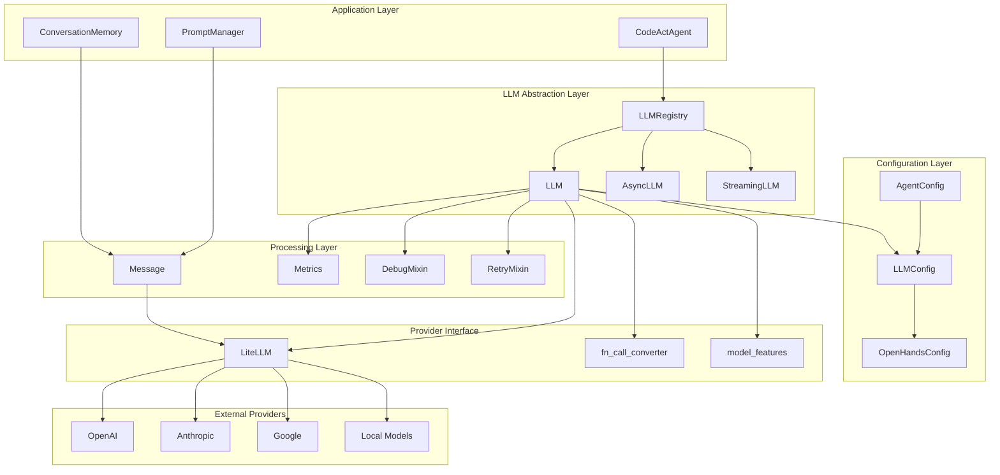
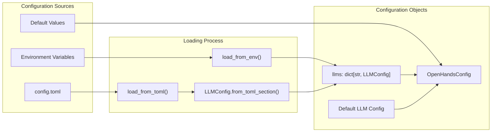
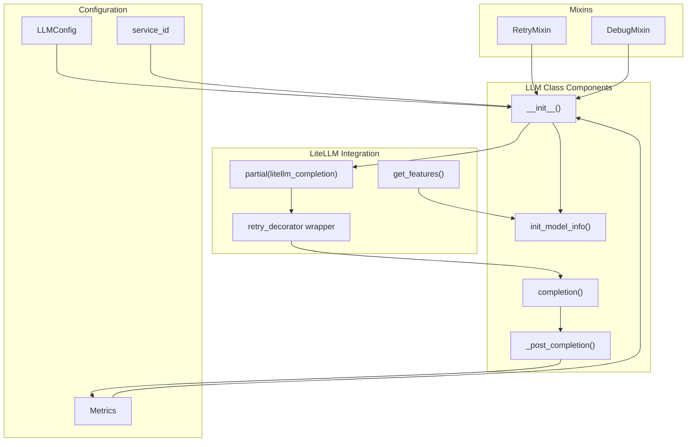
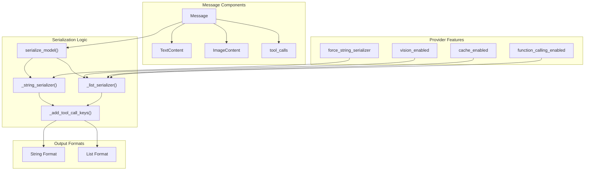
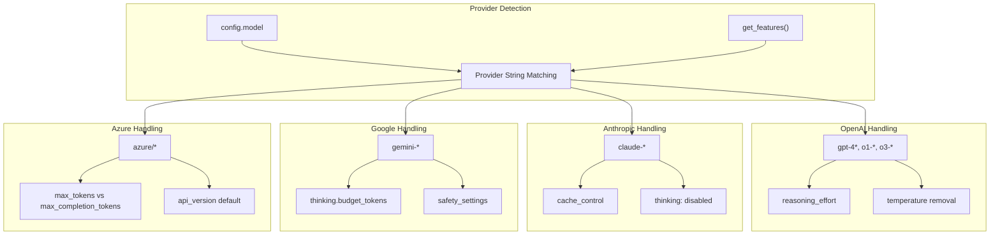
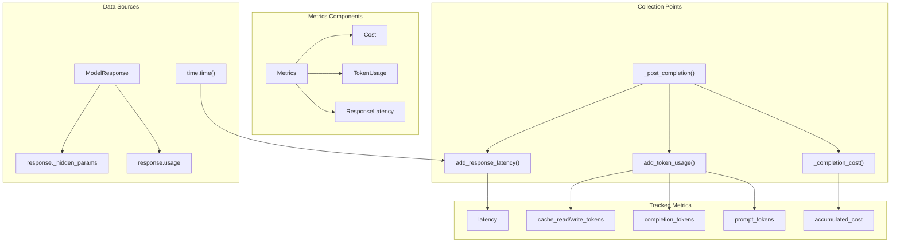

4-LLM Integration

# Page: LLM Integration

# LLM Integration

Relevant source files

The following files were used as context for generating this wiki page:

- [config.template.toml](config.template.toml)
- [frontend/src/state/metrics-slice.ts](frontend/src/state/metrics-slice.ts)
- [frontend/src/types/message.tsx](frontend/src/types/message.tsx)
- [openhands/agenthub/codeact_agent/codeact_agent.py](openhands/agenthub/codeact_agent/codeact_agent.py)
- [openhands/core/config/agent_config.py](openhands/core/config/agent_config.py)
- [openhands/core/config/llm_config.py](openhands/core/config/llm_config.py)
- [openhands/core/config/utils.py](openhands/core/config/utils.py)
- [openhands/core/exceptions.py](openhands/core/exceptions.py)
- [openhands/core/message.py](openhands/core/message.py)
- [openhands/llm/__init__.py](openhands/llm/__init__.py)
- [openhands/llm/async_llm.py](openhands/llm/async_llm.py)
- [openhands/llm/bedrock.py](openhands/llm/bedrock.py)
- [openhands/llm/debug_mixin.py](openhands/llm/debug_mixin.py)
- [openhands/llm/llm.py](openhands/llm/llm.py)
- [openhands/llm/metrics.py](openhands/llm/metrics.py)
- [openhands/llm/retry_mixin.py](openhands/llm/retry_mixin.py)
- [openhands/llm/streaming_llm.py](openhands/llm/streaming_llm.py)

## Purpose and Scope

This document covers OpenHands' Language Model (LLM) integration system, which provides a unified interface for interacting with multiple LLM providers through a centralized abstraction layer. The system handles model configuration, request processing, response formatting, metrics tracking, and provider-specific optimizations.

For information about how agents use LLMs for decision-making and action generation, see [Agent System](#3). For details about the runtime execution environment, see [Runtime & Execution Environment](#5).

## Architecture Overview

OpenHands implements a layered LLM integration architecture that abstracts provider-specific details while maintaining flexibility for advanced features.

**Sources:** [openhands/llm/llm.py:1-821](), [openhands/agenthub/codeact_agent/codeact_agent.py:1-300](), [openhands/core/config/llm_config.py:1-195]()

## Configuration System

The LLM configuration system supports both default and provider-specific settings through a hierarchical TOML-based approach.

### LLMConfig Structure

The `LLMConfig` class defines comprehensive LLM parameters:

| Parameter | Type | Description |
|-----------|------|-------------|
| `model` | `str` | Model identifier (e.g., "gpt-4o", "claude-sonnet-4") |
| `api_key` | `SecretStr` | Provider API key |
| `base_url` | `str` | Custom API endpoint |
| `temperature` | `float` | Sampling temperature (0.0-2.0) |
| `max_output_tokens` | `int` | Maximum response tokens |
| `num_retries` | `int` | Retry attempts for failed requests |
| `caching_prompt` | `bool` | Enable prompt caching when supported |
| `native_tool_calling` | `bool` | Use provider's native function calling |

**Sources:** [openhands/core/config/llm_config.py:12-96]()

### Configuration Loading Flow

**Sources:** [openhands/core/config/utils.py:138-212](), [openhands/core/config/llm_config.py:100-160]()

## LLM Class Hierarchy

OpenHands provides three LLM implementations to support different usage patterns:

### Core LLM Class

The base `LLM` class handles synchronous requests with comprehensive error handling and metrics:

**Sources:** [openhands/llm/llm.py:54-821](), [openhands/llm/retry_mixin.py:15-101](), [openhands/llm/debug_mixin.py:13-74]()

### Async and Streaming Variants

- **AsyncLLM**: Extends `LLM` for non-blocking operations with cancellation support
- **StreamingLLM**: Extends `AsyncLLM` for real-time token streaming

**Sources:** [openhands/llm/async_llm.py:17-131](), [openhands/llm/streaming_llm.py:11-114]()

## Message Processing Pipeline

Messages flow through a structured pipeline that handles formatting, caching, and provider-specific requirements.

### Message Structure and Serialization

**Sources:** [openhands/core/message.py:53-159]()

### Conversation Memory Integration

The `ConversationMemory` class processes events into properly formatted messages:

**Sources:** [openhands/agenthub/codeact_agent/codeact_agent.py:282-293]()

## Multi-Provider Support

OpenHands uses LiteLLM as the underlying abstraction for multiple LLM providers, with custom handling for provider-specific features.

### Provider-Specific Handling

**Sources:** [openhands/llm/llm.py:125-193](), [openhands/core/config/llm_config.py:175-184]()

## Advanced Features

### Function Calling Support

OpenHands supports both native function calling and mock function calling through prompt engineering:

| Feature | Native | Mock |
|---------|--------|------|
| Tool Schema | Sent as `tools` parameter | Embedded in prompt |
| Response Format | Structured tool calls | Text with function tags |
| Stop Words | Not used | Added to prevent overgeneration |
| Conversion | Direct processing | `fn_call_converter` module |

**Sources:** [openhands/llm/llm.py:226-293](), [openhands/llm/fn_call_converter.py:35-38]()

### Prompt Caching

When supported by the provider, OpenHands enables prompt caching to reduce costs:

- **Anthropic**: Uses `cache_control: ephemeral` markers
- **OpenAI**: Automatic for supported models
- **Configuration**: Controlled by `caching_prompt` setting

**Sources:** [openhands/core/message.py:34-36](), [openhands/llm/llm.py:101-102]()

### Vision Support

Multi-modal models can process images alongside text:

- **Detection**: Uses `litellm.supports_vision()` and model info
- **Content Format**: `ImageContent` with multiple image URLs
- **Provider Support**: Varies by model capabilities

**Sources:** [openhands/llm/llm.py:530-563]()

## Metrics and Monitoring

The metrics system tracks detailed usage statistics for cost analysis and performance monitoring.

### Metrics Collection Flow

**Sources:** [openhands/llm/llm.py:583-666](), [openhands/llm/metrics.py:47-274]()

## Error Handling and Retry Logic

The system implements sophisticated retry mechanisms for handling transient failures and rate limiting.

### Retry Strategy

The `RetryMixin` provides configurable exponential backoff with specific handling for different error types:

| Exception Type | Retry Behavior | Special Handling |
|---------------|----------------|------------------|
| `RateLimitError` | Exponential backoff | Standard retry |
| `APIConnectionError` | Exponential backoff | Standard retry |
| `LLMNoResponseError` | Exponential backoff | Temperature increase to 1.0 |
| `ServiceUnavailableError` | Exponential backoff | Standard retry |

**Sources:** [openhands/llm/llm.py:44-51](), [openhands/llm/retry_mixin.py:15-101]()

### Debug and Logging

The `DebugMixin` provides comprehensive logging for troubleshooting:

- **Prompt Logging**: Full conversation history with message formatting
- **Response Logging**: Model responses including tool calls
- **Content Formatting**: Handles both text and image content appropriately

**Sources:** [openhands/llm/debug_mixin.py:13-74]()