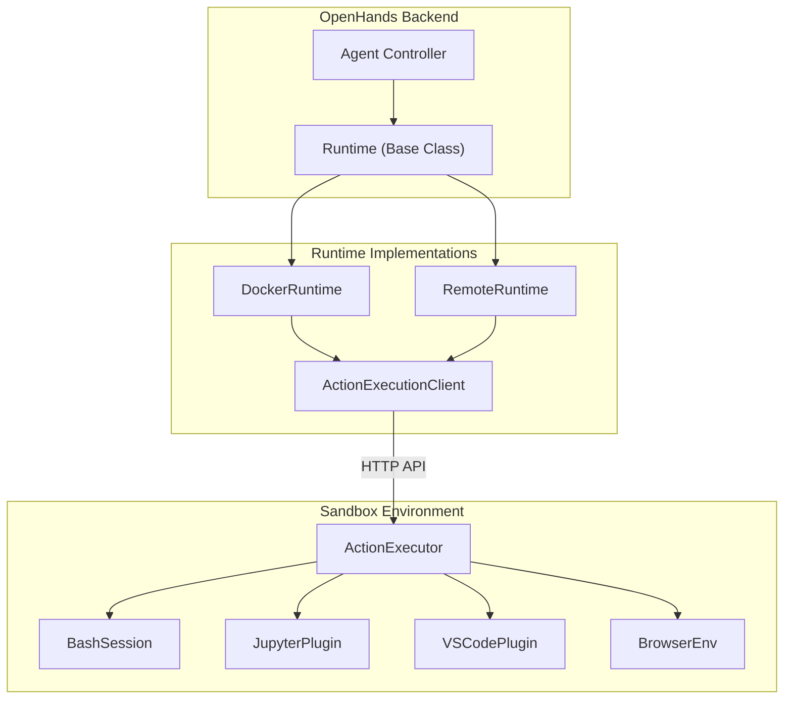
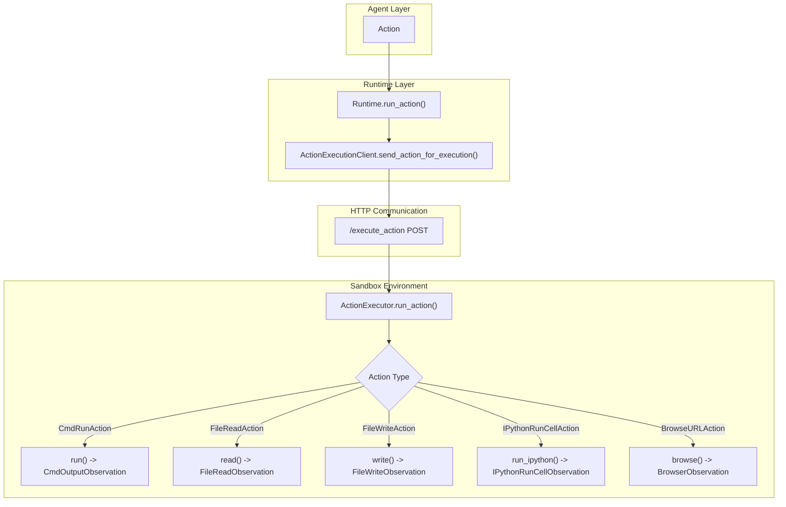
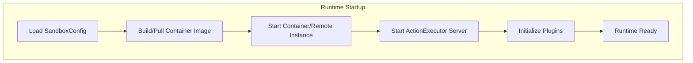

5-Runtime & Execution Environment

# Page: Runtime & Execution Environment

# Runtime & Execution Environment

Relevant source files

The following files were used as context for generating this wiki page:

- [containers/runtime/config.sh](containers/runtime/config.sh)
- [openhands/core/config/README.md](openhands/core/config/README.md)
- [openhands/core/config/config_utils.py](openhands/core/config/config_utils.py)
- [openhands/core/config/sandbox_config.py](openhands/core/config/sandbox_config.py)
- [openhands/core/config/security_config.py](openhands/core/config/security_config.py)
- [openhands/runtime/action_execution_server.py](openhands/runtime/action_execution_server.py)
- [openhands/runtime/base.py](openhands/runtime/base.py)
- [openhands/runtime/file_viewer_server.py](openhands/runtime/file_viewer_server.py)
- [openhands/runtime/impl/action_execution/action_execution_client.py](openhands/runtime/impl/action_execution/action_execution_client.py)
- [openhands/runtime/impl/docker/docker_runtime.py](openhands/runtime/impl/docker/docker_runtime.py)
- [openhands/runtime/impl/remote/remote_runtime.py](openhands/runtime/impl/remote/remote_runtime.py)
- [openhands/runtime/plugins/agent_skills/utils/dependency.py](openhands/runtime/plugins/agent_skills/utils/dependency.py)
- [openhands/runtime/utils/__init__.py](openhands/runtime/utils/__init__.py)
- [openhands/runtime/utils/command.py](openhands/runtime/utils/command.py)
- [openhands/runtime/utils/log_streamer.py](openhands/runtime/utils/log_streamer.py)
- [openhands/runtime/utils/memory_monitor.py](openhands/runtime/utils/memory_monitor.py)
- [openhands/runtime/utils/runtime_init.py](openhands/runtime/utils/runtime_init.py)
- [tests/unit/runtime/builder/test_runtime_build.py](tests/unit/runtime/builder/test_runtime_build.py)

The Runtime & Execution Environment provides secure, sandboxed execution of agent actions through various runtime implementations. This system handles the execution of bash commands, file operations, browser interactions, and Python code in isolated environments that can be local Docker containers, remote cloud instances, or other sandboxed environments.

For information about the agent system that sends actions to runtimes, see [Agent System](#3). For details about LLM integration within runtimes, see [LLM Integration](#4).

## Runtime Architecture Overview

The runtime system follows a client-server architecture where the OpenHands backend communicates with sandboxed execution environments through HTTP APIs.

## Runtime Architecture

Sources: [openhands/runtime/base.py:90-117](), [openhands/runtime/impl/docker/docker_runtime.py:75-86](), [openhands/runtime/impl/remote/remote_runtime.py:39-40](), [openhands/runtime/impl/action_execution/action_execution_client.py:61-66](), [openhands/runtime/action_execution_server.py:166-169]()

## Runtime Types and Implementations

OpenHands supports multiple runtime implementations, each suited for different deployment scenarios:

| Runtime Type | Class | Use Case | Environment |
|--------------|-------|----------|-------------|
| Docker | `DockerRuntime` | Local development | Docker containers |
| Remote | `RemoteRuntime` | Cloud deployment | Kubernetes pods |
| Local | `LocalRuntime` | Development testing | Host machine |
| CLI | `CLIRuntime` | Command-line interface | Terminal |

### DockerRuntime

`DockerRuntime` creates Docker containers with the runtime environment and communicates with an `ActionExecutor` running inside the container. It handles container lifecycle, port mapping, volume mounts, and network configuration.

Key features:
- Automatic container image building from base images
- Port allocation and forwarding for VSCode and application access
- Volume mounting for workspace persistence
- GPU support when enabled
- Network isolation and additional network connections

Sources: [openhands/runtime/impl/docker/docker_runtime.py:75-158]()

### RemoteRuntime

`RemoteRuntime` connects to remote execution environments managed by a Remote Runtime API. This enables cloud-based sandboxed execution with features like auto-scaling and resource management.

Key features:
- API-based runtime provisioning and management
- Automatic runtime resumption from paused state
- Resource scaling based on configuration
- Session persistence across connections

Sources: [openhands/runtime/impl/remote/remote_runtime.py:39-107]()

## Action Execution Flow

The action execution system processes agent actions through a well-defined pipeline from the agent to the sandboxed environment.

## Action Execution Pipeline

Sources: [openhands/runtime/base.py:890-950](), [openhands/runtime/impl/action_execution/action_execution_client.py:272-338](), [openhands/runtime/action_execution_server.py:379-383]()

### Action Types and Execution

The `ActionExecutor` handles different action types through specialized methods:

- **`CmdRunAction`**: Executes bash commands via `BashSession` or `WindowsPowershellSession`
- **`IPythonRunCellAction`**: Runs Python code through `JupyterPlugin`
- **`FileReadAction`** / **`FileWriteAction`**: File system operations with security checks
- **`FileEditAction`**: File editing using `OHEditor` with diff tracking
- **`BrowseURLAction`** / **`BrowseInteractiveAction`**: Web browsing through `BrowserEnv`

Sources: [openhands/runtime/action_execution_server.py:385-643]()

## Sandbox Environment Configuration

The sandbox environment is configured through `SandboxConfig` which controls execution parameters, security settings, and runtime behavior.

### Key Configuration Options

| Setting | Purpose | Default |
|---------|---------|---------|
| `timeout` | Action execution timeout | 120 seconds |
| `user_id` | Sandbox user ID | 1000 |
| `base_container_image` | Base Docker image | `nikolaik/python-nodejs` |
| `runtime_extra_deps` | Additional dependencies | None |
| `enable_auto_lint` | Auto-lint files after editing | False |
| `browsergym_eval_env` | Browser evaluation environment | None |
| `volumes` | Volume mount configuration | None |

Sources: [openhands/core/config/sandbox_config.py:8-95]()

### Runtime Initialization

Runtime initialization follows a consistent pattern across implementations:

1. **Environment Setup**: Configure environment variables and user settings
2. **Plugin Loading**: Initialize plugins like Jupyter, VSCode, and browser support
3. **Tool Preparation**: Set up bash session, file editor, and other tools
4. **Status Reporting**: Update runtime status through callback functions

Sources: [openhands/runtime/action_execution_server.py:291-323]()

## Runtime Lifecycle Management

### Startup Process

Sources: [openhands/runtime/impl/docker/docker_runtime.py:170-215](), [openhands/runtime/impl/remote/remote_runtime.py:125-172]()

### Runtime Status Management

The runtime system tracks execution state through `RuntimeStatus` enumeration:

- `STARTING_RUNTIME`: Runtime is being initialized
- `BUILDING_RUNTIME`: Container image is being built
- `RUNTIME_STARTED`: Runtime is active but not ready
- `READY`: Runtime is ready to execute actions
- `ERROR`: Runtime encountered an error
- `ERROR_RUNTIME_DISCONNECTED`: Communication lost with runtime

Status changes are communicated through callback functions to provide real-time feedback to users.

Sources: [openhands/runtime/runtime_status.py](), [openhands/runtime/base.py:235-241]()

### Connection Management and Recovery

The runtime system includes robust connection management:

- **Health Checks**: Regular `/alive` endpoint checks to verify runtime connectivity
- **Retry Logic**: Automatic retry with exponential backoff for recoverable errors
- **Runtime Resumption**: Automatic resumption of paused remote runtimes
- **Error Handling**: Graceful degradation and error reporting

Sources: [openhands/runtime/impl/action_execution/action_execution_client.py:131-138](), [openhands/runtime/impl/remote/remote_runtime.py:403-476]()