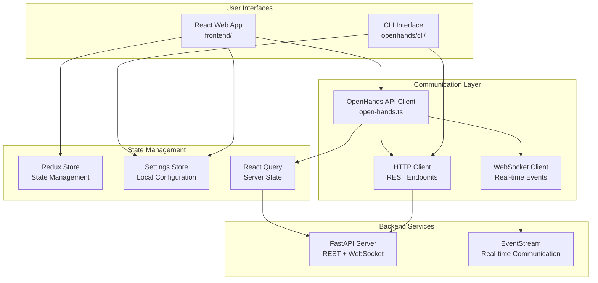
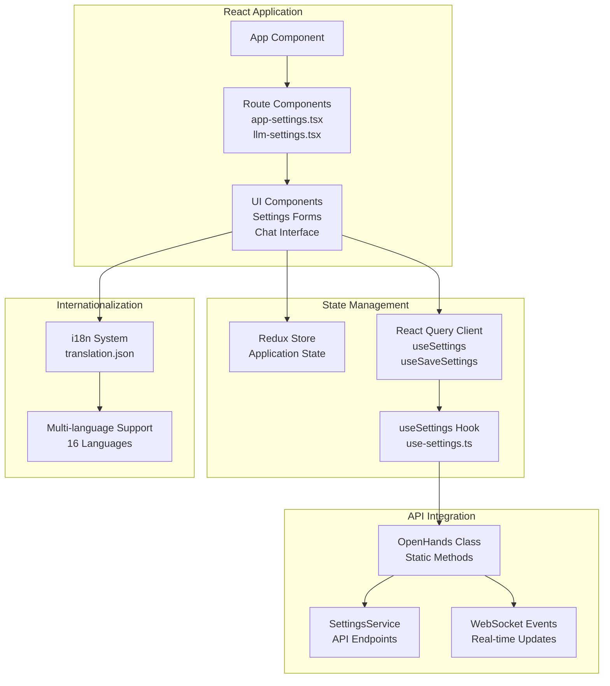
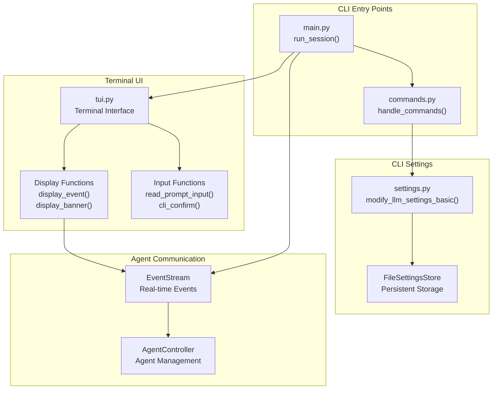
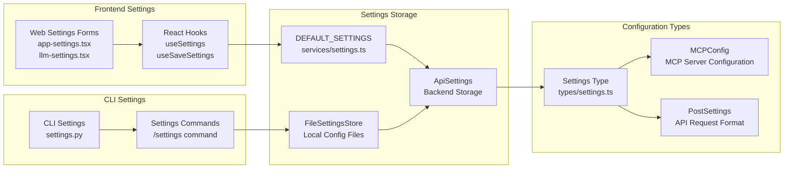

6-Frontend & User Interfaces

# Page: Frontend & User Interfaces

# Frontend & User Interfaces

Relevant source files

The following files were used as context for generating this wiki page:

- [frontend/src/api/open-hands.ts](frontend/src/api/open-hands.ts)
- [frontend/src/api/open-hands.types.ts](frontend/src/api/open-hands.types.ts)
- [frontend/src/hooks/mutation/use-save-settings.ts](frontend/src/hooks/mutation/use-save-settings.ts)
- [frontend/src/hooks/query/use-settings.ts](frontend/src/hooks/query/use-settings.ts)
- [frontend/src/i18n/declaration.ts](frontend/src/i18n/declaration.ts)
- [frontend/src/i18n/translation.json](frontend/src/i18n/translation.json)
- [frontend/src/mocks/handlers.ts](frontend/src/mocks/handlers.ts)
- [frontend/src/routes/app-settings.tsx](frontend/src/routes/app-settings.tsx)
- [frontend/src/routes/llm-settings.tsx](frontend/src/routes/llm-settings.tsx)
- [frontend/src/services/settings.ts](frontend/src/services/settings.ts)
- [frontend/src/types/settings.ts](frontend/src/types/settings.ts)
- [openhands/cli/commands.py](openhands/cli/commands.py)
- [openhands/cli/main.py](openhands/cli/main.py)
- [openhands/cli/pt_style.py](openhands/cli/pt_style.py)
- [openhands/cli/settings.py](openhands/cli/settings.py)
- [openhands/cli/tui.py](openhands/cli/tui.py)
- [openhands/core/schema/exit_reason.py](openhands/core/schema/exit_reason.py)
- [openhands/storage/data_models/settings.py](openhands/storage/data_models/settings.py)
- [tests/unit/cli/test_cli_tui.py](tests/unit/cli/test_cli_tui.py)

This page covers OpenHands' user interface systems, including the web-based React frontend, command-line interface (CLI), and the API communication layer that connects them to the backend services. This documentation focuses on the client-side architecture, user interaction patterns, and communication protocols.

For detailed information about the web interface implementation and API endpoints, see [Web Interface & API](#6.1). For comprehensive CLI usage and terminal interface details, see [Command Line Interface](#6.2).

## Architecture Overview

OpenHands provides multiple user interface options to accommodate different user preferences and use cases. The system supports both graphical and text-based interactions through a unified backend API.

## Frontend Architecture Components

**Sources:** [frontend/src/api/open-hands.ts:1-501](), [openhands/cli/main.py:1-644](), [openhands/cli/tui.py:1-1016](), [frontend/src/hooks/query/use-settings.ts:1-91]()

## Web Frontend System

The web frontend is a React-based single-page application that provides a graphical interface for interacting with OpenHands agents. It features real-time communication, internationalization support, and comprehensive settings management.

### Core Web Components

**Sources:** [frontend/src/api/open-hands.ts:24-500](), [frontend/src/hooks/query/use-settings.ts:10-91](), [frontend/src/hooks/mutation/use-save-settings.ts:1-78](), [frontend/src/routes/app-settings.tsx:1-265](), [frontend/src/i18n/translation.json:1-50]()

The web frontend uses React Query for server state management, with hooks like `useSettings()` and `useSaveSettings()` providing reactive data binding. The `OpenHands` class serves as the main API client, exposing static methods for all backend communication.

## Command Line Interface System

The CLI provides a text-based interface using prompt_toolkit for rich terminal interactions. It supports real-time agent communication, command processing, and comprehensive settings management through terminal prompts.

### CLI Architecture Components

**Sources:** [openhands/cli/main.py:91-644](), [openhands/cli/tui.py:79-1016](), [openhands/cli/commands.py:122-174](), [openhands/cli/settings.py:1-566]()

The CLI uses an event-driven architecture where `display_event()` handles real-time updates from the agent, while command processing through `handle_commands()` manages user interactions and system control.

## API Communication Layer

Both interfaces communicate with the backend through a unified API layer that handles HTTP requests, WebSocket connections, and session management.

### OpenHands API Client Structure

| Method Category | Key Methods | Purpose |
|---|---|---|
| **Conversation Management** | `createConversation()`, `getConversation()`, `updateConversation()` | CRUD operations for conversations |
| **Session Control** | `startConversation()`, `stopConversation()` | Agent lifecycle management |
| **File Operations** | `getFiles()`, `getFile()`, `uploadFiles()` | Workspace file management |
| **Real-time Communication** | `getConversationHeaders()`, WebSocket integration | Live agent interaction |
| **Feedback System** | `submitFeedback()`, `getBatchFeedback()` | User feedback collection |

**Sources:** [frontend/src/api/open-hands.ts:67-500](), [frontend/src/api/open-hands.types.ts:1-142]()

The `OpenHands` class provides static methods for all API operations, with automatic session management through `currentConversation` state and authentication headers via `getConversationHeaders()`.

## Settings and Configuration Management

Both interfaces share a unified settings system that persists user preferences and system configuration across sessions.

### Settings Architecture

**Sources:** [frontend/src/services/settings.ts:1-40](), [frontend/src/types/settings.ts:1-72](), [openhands/cli/settings.py:41-566](), [openhands/storage/data_models/settings.py:21-187]()

Settings are managed through a layered system where `DEFAULT_SETTINGS` provides fallback values, while user modifications are persisted via API endpoints or local file storage depending on the interface used.

## Internationalization System

The web frontend supports 16 languages through a comprehensive i18n system with over 3000 translation keys.

### Translation System Structure

| Component | File | Purpose |
|---|---|---|
| **Translation Data** | `frontend/src/i18n/translation.json` | Complete translation database |
| **Type Declarations** | `frontend/src/i18n/declaration.ts` | TypeScript enum for translation keys |
| **Language Support** | React i18next integration | Runtime language switching |

The i18n system uses a hierarchical key structure like `SETTINGS$LLM_API_KEY` and `MICROAGENT$ADD_TO_MICROAGENT`, providing type-safe access to translations through the `I18nKey` enum.

**Sources:** [frontend/src/i18n/translation.json:1-5986](), [frontend/src/i18n/declaration.ts:1-598]()

## Authentication and Session Management

Both interfaces handle authentication and session management through a unified system that supports conversation-based sessions and API key authentication.

### Session Management Components

- **Conversation Sessions**: Each conversation gets a unique `conversation_id` and optional `session_api_key`
- **Authentication Headers**: Managed through `getConversationHeaders()` in the API client
- **Session State**: Tracked through `currentConversation` in the OpenHands class
- **Settings Integration**: User authentication status affects settings availability

The system supports both authenticated and guest modes, with settings and conversation history persistence dependent on authentication status.

**Sources:** [frontend/src/api/open-hands.ts:57-64](), [frontend/src/hooks/query/use-settings.ts:45-58](), [openhands/cli/main.py:140-444]()