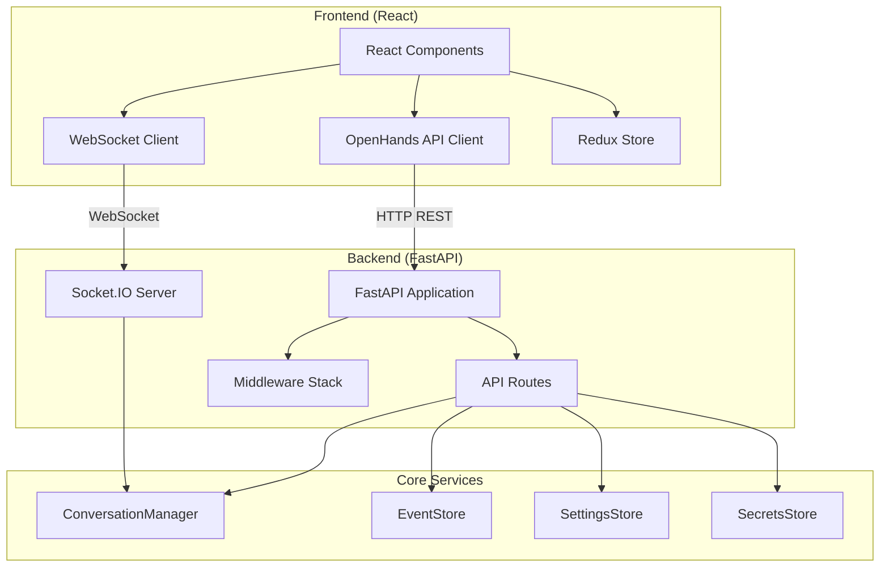
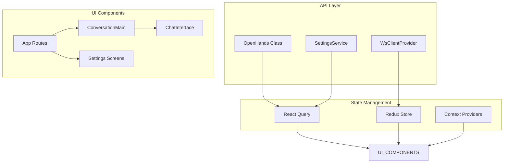
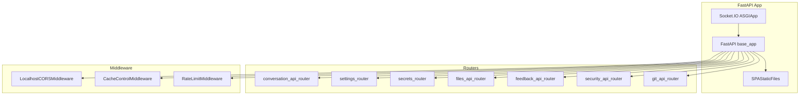
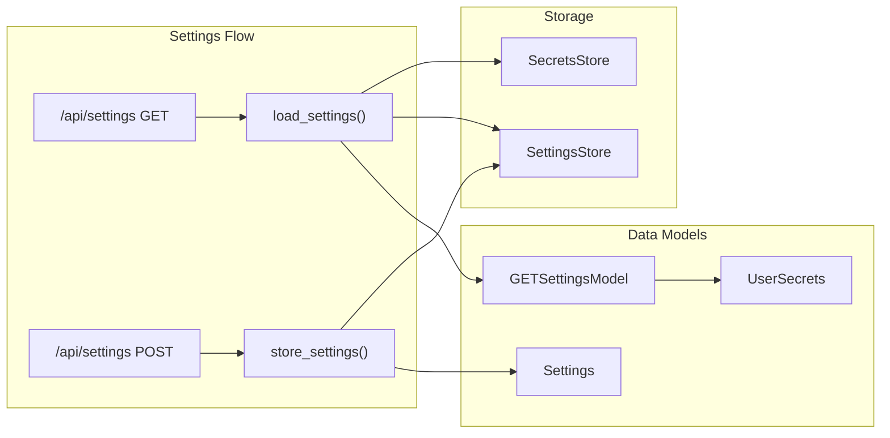
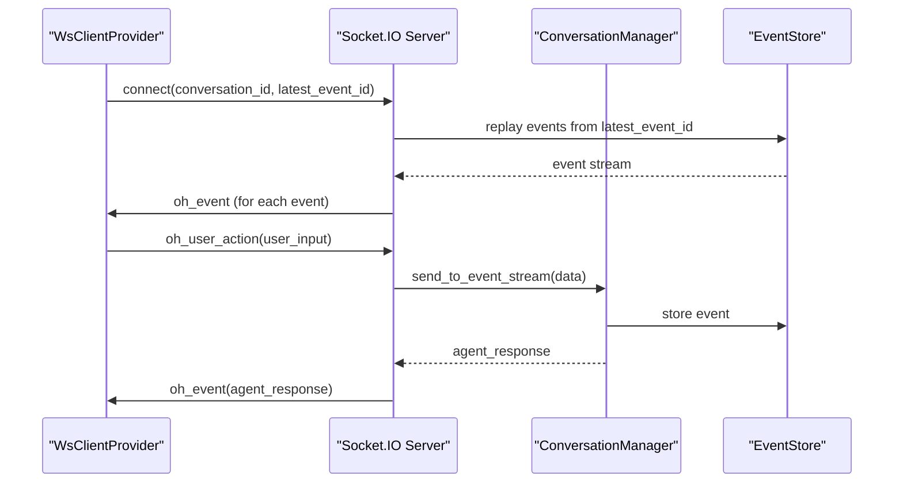
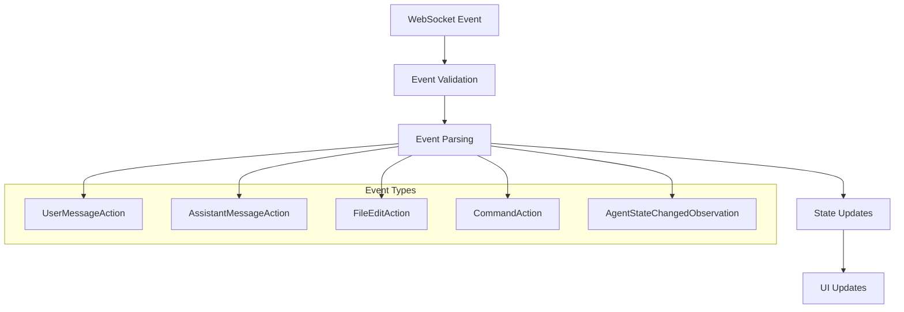
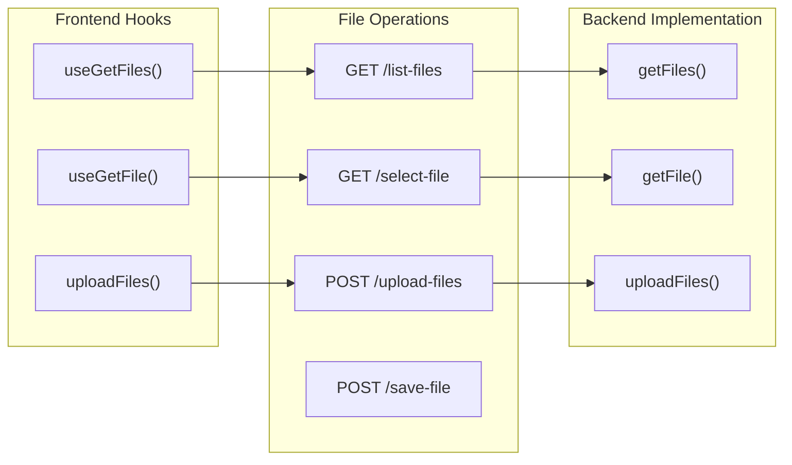

6.1-Web Interface & API

# Page: Web Interface & API

# Web Interface & API

Relevant source files

The following files were used as context for generating this wiki page:

- [frontend/__tests__/context/ws-client-provider.test.tsx](frontend/__tests__/context/ws-client-provider.test.tsx)
- [frontend/__tests__/hooks/query/use-active-host.test.tsx](frontend/__tests__/hooks/query/use-active-host.test.tsx)
- [frontend/src/api/open-hands.ts](frontend/src/api/open-hands.ts)
- [frontend/src/api/open-hands.types.ts](frontend/src/api/open-hands.types.ts)
- [frontend/src/components/features/tips/random-tip.tsx](frontend/src/components/features/tips/random-tip.tsx)
- [frontend/src/context/ws-client-provider.tsx](frontend/src/context/ws-client-provider.tsx)
- [frontend/src/hooks/mutation/use-save-settings.ts](frontend/src/hooks/mutation/use-save-settings.ts)
- [frontend/src/hooks/query/use-active-conversation.ts](frontend/src/hooks/query/use-active-conversation.ts)
- [frontend/src/hooks/query/use-active-host.ts](frontend/src/hooks/query/use-active-host.ts)
- [frontend/src/hooks/query/use-get-git-changes.ts](frontend/src/hooks/query/use-get-git-changes.ts)
- [frontend/src/hooks/query/use-settings.ts](frontend/src/hooks/query/use-settings.ts)
- [frontend/src/hooks/query/use-user-conversation.ts](frontend/src/hooks/query/use-user-conversation.ts)
- [frontend/src/hooks/query/use-vscode-url.ts](frontend/src/hooks/query/use-vscode-url.ts)
- [frontend/src/hooks/use-runtime-is-ready.ts](frontend/src/hooks/use-runtime-is-ready.ts)
- [frontend/src/i18n/declaration.ts](frontend/src/i18n/declaration.ts)
- [frontend/src/i18n/translation.json](frontend/src/i18n/translation.json)
- [frontend/src/mocks/handlers.ts](frontend/src/mocks/handlers.ts)
- [frontend/src/routes/app-settings.tsx](frontend/src/routes/app-settings.tsx)
- [frontend/src/routes/changes-tab.tsx](frontend/src/routes/changes-tab.tsx)
- [frontend/src/routes/conversation.tsx](frontend/src/routes/conversation.tsx)
- [frontend/src/routes/llm-settings.tsx](frontend/src/routes/llm-settings.tsx)
- [frontend/src/services/settings.ts](frontend/src/services/settings.ts)
- [frontend/src/types/agent-state.tsx](frontend/src/types/agent-state.tsx)
- [frontend/src/types/settings.ts](frontend/src/types/settings.ts)
- [openhands/core/schema/agent.py](openhands/core/schema/agent.py)
- [openhands/server/app.py](openhands/server/app.py)
- [openhands/server/config/server_config.py](openhands/server/config/server_config.py)
- [openhands/server/listen.py](openhands/server/listen.py)
- [openhands/server/listen_socket.py](openhands/server/listen_socket.py)
- [openhands/server/middleware.py](openhands/server/middleware.py)
- [openhands/server/routes/secrets.py](openhands/server/routes/secrets.py)
- [openhands/server/routes/settings.py](openhands/server/routes/settings.py)
- [openhands/server/settings.py](openhands/server/settings.py)
- [openhands/server/types.py](openhands/server/types.py)
- [openhands/server/user_auth/__init__.py](openhands/server/user_auth/__init__.py)
- [openhands/server/user_auth/default_user_auth.py](openhands/server/user_auth/default_user_auth.py)
- [openhands/server/user_auth/user_auth.py](openhands/server/user_auth/user_auth.py)
- [openhands/storage/data_models/settings.py](openhands/storage/data_models/settings.py)
- [openhands/storage/data_models/user_secrets.py](openhands/storage/data_models/user_secrets.py)

This document covers OpenHands' web-based user interface and the API layer that powers it. The system consists of a React frontend that communicates with a FastAPI backend through both HTTP REST endpoints and WebSocket connections for real-time interaction.

For information about the command-line interface, see [Command Line Interface](#6.2). For details about the underlying agent system that the API orchestrates, see [Agent System](#3).

## Architecture Overview

The web interface follows a client-server architecture with real-time communication capabilities:

Sources: [frontend/src/api/open-hands.ts](), [openhands/server/app.py](), [openhands/server/listen.py](), [frontend/src/context/ws-client-provider.tsx]()

## Frontend Architecture

The frontend is built with React and uses several key architectural patterns:

### Core Frontend Components

The `OpenHands` class in [frontend/src/api/open-hands.ts:24-500]() serves as the primary API client, providing methods for all backend communication. Key methods include:

- `createConversation()` - Creates new conversations
- `getConversation()` - Retrieves conversation details  
- `submitFeedback()` - Submits user feedback
- `getFiles()` - Lists workspace files
- `uploadFiles()` - Uploads files to workspace

The `WsClientProvider` in [frontend/src/context/ws-client-provider.tsx:130-397]() manages WebSocket connections and real-time event handling.

Sources: [frontend/src/api/open-hands.ts](), [frontend/src/context/ws-client-provider.tsx](), [frontend/src/routes/conversation.tsx]()

### Settings Management

The frontend handles user settings through a dedicated API layer:

| Setting Type | Frontend Hook | Backend Route |
|--------------|---------------|---------------|
| LLM Configuration | `useSettings()` | `/api/settings` |
| Provider Tokens | `useSaveSettings()` | `/api/add-git-providers` |
| Custom Secrets | Custom hooks | `/api/secrets/*` |
| MCP Configuration | Settings form | `/api/settings` |

Sources: [frontend/src/hooks/query/use-settings.ts](), [frontend/src/hooks/mutation/use-save-settings.ts](), [frontend/src/routes/app-settings.tsx]()

## Backend API Architecture  

The backend uses FastAPI with a modular router structure:

### FastAPI Application Structure

The main application is defined in [openhands/server/app.py:58-64]() and includes routers for different functional areas. The Socket.IO integration is handled in [openhands/server/listen.py:27]().

Sources: [openhands/server/app.py](), [openhands/server/listen.py](), [openhands/server/middleware.py]()

### Key API Endpoints

| Endpoint Pattern | Router | Purpose |
|------------------|--------|---------|
| `/api/conversations/*` | `conversation_api_router` | Conversation management |
| `/api/settings` | `settings_router` | User settings CRUD |
| `/api/secrets/*` | `secrets_router` | Secrets management |  
| `/api/files/*` | `files_api_router` | File operations |
| `/feedback/*` | `feedback_api_router` | User feedback |
| `/api/security/*` | `security_api_router` | Security analysis |

### Settings API Implementation

The settings system handles user configuration through multiple endpoints:

The `load_settings` function in [openhands/server/routes/settings.py:36-87]() handles GET requests and includes provider token validation. The `store_settings` function in [openhands/server/routes/settings.py:141-192]() processes POST requests and updates configuration.

Sources: [openhands/server/routes/settings.py](), [openhands/server/settings.py](), [openhands/storage/data_models/settings.py]()

## WebSocket Communication

Real-time communication between frontend and backend uses Socket.IO:

### WebSocket Event Flow

### Socket.IO Event Handlers

The main Socket.IO handlers are defined in [openhands/server/listen_socket.py]():

- `connect()` - Handles client connections and event replay from [openhands/server/listen_socket.py:36-141]()
- `oh_user_action()` - Processes user actions from [openhands/server/listen_socket.py:144-145]() 
- `disconnect()` - Handles client disconnections from [openhands/server/listen_socket.py:156-158]()

The frontend WebSocket client in [frontend/src/context/ws-client-provider.tsx:151-157]() sends events via the `send()` method using the `oh_user_action` event type.

Sources: [openhands/server/listen_socket.py](), [frontend/src/context/ws-client-provider.tsx]()

### Event Processing Pipeline

The frontend processes incoming WebSocket events through several stages:

Event processing is handled in the `handleMessage` function at [frontend/src/context/ws-client-provider.tsx:164-256](), which includes validation, state updates, and cache invalidation logic.

Sources: [frontend/src/context/ws-client-provider.tsx](), [frontend/src/types/core/guards.ts]()

## Authentication and Security

The API includes several security layers:

### Middleware Stack

| Middleware | Purpose | Implementation |
|------------|---------|----------------|
| `LocalhostCORSMiddleware` | CORS handling with localhost allowances | [openhands/server/middleware.py:16-48]() |
| `CacheControlMiddleware` | Cache control headers | [openhands/server/middleware.py:51-67]() |
| `RateLimitMiddleware` | Request rate limiting | [openhands/server/middleware.py:108-131]() |

### User Authentication

The authentication system is extensible through the `UserAuth` abstract base class in [openhands/server/user_auth/user_auth.py:23-89](). The default implementation `DefaultUserAuth` in [openhands/server/user_auth/default_user_auth.py:16-79]() provides basic single-user functionality.

Authentication helpers are provided through dependency injection:
- `get_user_settings()` - Retrieves user settings
- `get_provider_tokens()` - Gets provider authentication tokens  
- `get_secrets_store()` - Accesses user secrets

Sources: [openhands/server/middleware.py](), [openhands/server/user_auth/user_auth.py](), [openhands/server/user_auth/default_user_auth.py](), [openhands/server/user_auth/__init__.py]()

## File Operations and Workspace Management

The API provides comprehensive file management capabilities:

### File API Endpoints

The `OpenHands` class provides file operation methods:
- `getFiles()` at [frontend/src/api/open-hands.ts:442-453]() - Lists workspace files
- `getFile()` at [frontend/src/api/open-hands.ts:461-469]() - Retrieves file content
- `uploadFiles()` at [frontend/src/api/open-hands.ts:477-497]() - Uploads multiple files

Sources: [frontend/src/api/open-hands.ts](), [openhands/server/routes/files.py]()